# Introduction

## Objectif du projet

L'objectif du projet est de cataloguer des produits selon un code type désignant le type du produit. La prédiction du type doit se faire à partir de données textuelles (désignation et description du produit) ainsi que de données visuelles (image du produit).

## Contexte

Ce projet s’inscrit dans le challenge Rakuten France Multimodal Product Data Classification, les données et leur description sont disponibles à l’adresse : https://challengedata.ens.fr/challenges/35

* Les données textuelles : ~60 mb
* Données images : ~2.2 gb
* 99k données avec plus de 1000 classes.

## Fichiers fournis

* X_train.csv: Contient les variables explicatives destinées à l’entraînement des modèles.
  * index (nb entier): Index du produit.
  * designation (object: string): Designation courte du produit
  * description (object: string, optionnel): Description du produit. Ce champ est optionnel. Tous les produits n'ont pas de description
  * productid (int64): L'id du produit
  * imageid (int64): L'id de l'image du produit

* images.zip: Une fois extrait, un dossier contenant les images des produits. La nomenclature utilisée permet de faire la jonction avec les produits. Chaque fichier d'image se présente sous la forme: `image_<imageid>_product_<productid>.jpg`. Les images sont répartis en deux sous-dossiers:
  * image_train: Les images correspondants à X_train.csv
  * image_test: Les images correspondants à X_test.csv

* Y_train.csv: Contient la variable cible à prédire. A savoir le type du produit.
  * index (nb entier): Index du produit. Permet de faire la jonction avec X_train.csv
  * prdtypecode (nb entier): Le type du produit

* X_test.csv: Contient les variables explicatives destinées à l'évaluation des modèles. Sa structure est identique à celle de X_train.csv. Ce fichier étant fourni dans le contexte du challenge Rakuten, nous n'avons pas obtenu de fichier Y_test.csv qui nous permettrait de comparer nos performances à celles des participants au challenge. Il est probable qu'on doive se contenter de scinder le dataset d’entraînement en une partie entraînement et une partie test.

> **Note**: Nous avons légèrement modifié les entêtes des fichiers d'origine en y ajoutant le titre de colonne index pour la première colonne


## Métrique utilisée pour l'évaluation de la performance

La métrique **weighted-F1 score** a été choisie dans le cadre du challenge.

## Intérêts du projet

Étant réalisé dans le cadre de la formation datascientest, ça va aussi être l'opportunité pour nous de découvrir et mettre en applications des techniques de machine learning avancées telle que:

* Computer vision
  * réseaux de neurones convolutifs
* NLP
* Modèles multimodaux
* deep learning

Bien que ce projet utilise le dataset d'un site de vente, il est assez générique de par la nature de son sujet qui pourrait se résumer ainsi: Attribuer une classe à un objet à partir d'une description textuelle et d'une image. On pourrait imaginer toutes sortes de déclinaisons:

* Commerciales
  * Classification automatique de produits mis en vente sur un site de e-commerce (le but original du challenge).
    * Assister un utilisateur dans le choix d'une catégorie lors de la mise en vente de son produit. Quand on connaît le grand nombre de catégories typiquement proposées sur les sites de e-commerce, on peut imaginer la confusion des utilisateurs.
    * On pourrait même imaginer un système plus coercitif qui impose une catégorie en fonction du contenu pour éviter les erreurs de catégorisation.
    * Fournir une recherche intelligente des produits qui puisse automatiquement traduire une description de produit saisie en classe de produits et ainsi produire des résultats pertinents.   
* Génériques
  * Un moteur de recherche d'objets à partir de description ou même d'images.
  * Moteur de recherche d'image à partir d'une description et réciproquement (si les modèles individuels de nlp et de computer vision sont suffisamment performant)


## Equipe

* Mathis Poignet: TODO
* Karim Hadjar: TODO
* Julien Noel du Payrat ([GitHub](https://github.com/surfncode) / [LinkedIn](https://www.linkedin.com/in/julien-noel-du-payrat-01854558))
  * J'ai un background de développeur depuis plus de 15 ans, en revanche, je fais encore mes armes en data science. Malgré une curiosité naturelle pour ce domaine, c'est quelque chose que j'ai découvert pendant la formation.


# Initialisation

## Montage du projet
Accès au dossier du projet sur Google Drive


```python
import sys
import os
if 'google.colab' in sys.modules:
    from google.colab import drive
    drive.mount('/content/drive/', force_remount=True)
    %cd drive/MyDrive/nov23_bds_rakuten
else:
    root_files = os.listdir()
    if not "requirements.txt" in root_files:
        print("The jupyter server root should be set to root of git project")
        print("If you're on vscode add the following to your settings.json file")
        print('"jupyter.notebookFileRoot": "${workspaceFolder}"')
```

    Mounted at /content/drive/
    /content/drive/MyDrive/nov23_bds_rakuten


## Initialisation des variables globales


```python
random_state = 123
label2categorie = {
    10	:	"Livres",
    40	:	"Gaming",
    50	:	"Gaming",
    60	:	"Gaming",
    1140	:	"Jouets",
    1160	:	"Jouets",
    1180	:	"Jouets",
    1280	:	"Jouets",
    1281	:	"Jouets",
    1300	:	"Jouets",
    1301	:	"Bazar",
    1302	:	"Jouets",
    1320	:	"Equipement",
    1560	:	"Mobilier",
    1920	:	"Décoration",
    1940	:	"Bazar",
    2060	:	"Décoration",
    2220	:	"Equipement",
    2280	:	"Livres",
    2403	:	"Livres",
    2462	:	"Gaming",
    2522	:	"Livres",
    2582	:	"Mobilier",
    2583	:	"Equipement",
    2585	:	"Equipement",
    2705	:	"Livres",
    2905	:	"Gaming",
}


```

## Importation des librairies


```python
%pip install langdetect
```

    Collecting langdetect
      Downloading langdetect-1.0.9.tar.gz (981 kB)
         ━━━━━━━━━━━━━━━━━━━━━━━━━━━━━━━━━━━━━━━━ 981.5/981.5 kB 6.4 MB/s eta 0:00:00
    [?25h  Preparing metadata (setup.py) ... [?25l[?25hdone
    Requirement already satisfied: six in /usr/local/lib/python3.10/dist-packages (from langdetect) (1.16.0)
    Building wheels for collected packages: langdetect
      Building wheel for langdetect (setup.py) ... [?25l[?25hdone
      Created wheel for langdetect: filename=langdetect-1.0.9-py3-none-any.whl size=993225 sha256=21a2de4e09b515b7122695a26bf2747440fec3069cc62098b59178b2e52b6981
      Stored in directory: /root/.cache/pip/wheels/95/03/7d/59ea870c70ce4e5a370638b5462a7711ab78fba2f655d05106
    Successfully built langdetect
    Installing collected packages: langdetect
    Successfully installed langdetect-1.0.9


```python
import pandas as pd
import numpy as np
from pathlib import Path

import matplotlib.pyplot as plt
import seaborn as sns
import plotly.graph_objects as go
from plotly.subplots import make_subplots

from tqdm import tqdm
import html

from langdetect import detect_langs
# Force langdetect to have deterministic results
from langdetect import DetectorFactory
DetectorFactory.seed = random_state

# Télécharger et utiliser les stopwords français (STOPWORDS pour l'anglais)
from wordcloud import WordCloud #, STOPWORDS
from nltk.corpus import stopwords as nltk_stopwords
import re
import nltk
nltk.download('stopwords')

from collections import Counter


import zipfile
import cv2
import random
```

    [nltk_data] Downloading package stopwords to /root/nltk_data...
    [nltk_data]   Unzipping corpora/stopwords.zip.


## Chargement des données

Chargeons X_train.csv et affichons un premier aperçu des données


```python
X = pd.read_csv('data/X_train.csv', index_col=0)
X.head(10)
```


  <div id="df-f7b88d5c-226e-49a8-9d1e-33ce24d22852" class="colab-df-container">
    <div>
<style scoped>
    .dataframe tbody tr th:only-of-type {
        vertical-align: middle;
    }

    .dataframe tbody tr th {
        vertical-align: top;
    }

    .dataframe thead th {
        text-align: right;
    }
</style>
<table border="1" class="dataframe">
  <thead>
    <tr style="text-align: right;">
      <th></th>
      <th>designation</th>
      <th>description</th>
      <th>productid</th>
      <th>imageid</th>
    </tr>
    <tr>
      <th>index</th>
      <th></th>
      <th></th>
      <th></th>
      <th></th>
    </tr>
  </thead>
  <tbody>
    <tr>
      <th>0</th>
      <td>Olivia: Personalisiertes Notizbuch / 150 Seite...</td>
      <td>NaN</td>
      <td>3804725264</td>
      <td>1263597046</td>
    </tr>
    <tr>
      <th>1</th>
      <td>Journal Des Arts (Le) N° 133 Du 28/09/2001 - L...</td>
      <td>NaN</td>
      <td>436067568</td>
      <td>1008141237</td>
    </tr>
    <tr>
      <th>2</th>
      <td>Grand Stylet Ergonomique Bleu Gamepad Nintendo...</td>
      <td>PILOT STYLE Touch Pen de marque Speedlink est ...</td>
      <td>201115110</td>
      <td>938777978</td>
    </tr>
    <tr>
      <th>3</th>
      <td>Peluche Donald - Europe - Disneyland 2000 (Mar...</td>
      <td>NaN</td>
      <td>50418756</td>
      <td>457047496</td>
    </tr>
    <tr>
      <th>4</th>
      <td>La Guerre Des Tuques</td>
      <td>Luc a des id&amp;eacute;es de grandeur. Il veut or...</td>
      <td>278535884</td>
      <td>1077757786</td>
    </tr>
    <tr>
      <th>5</th>
      <td>Afrique Contemporaine N° 212 Hiver 2004 - Doss...</td>
      <td>NaN</td>
      <td>5862738</td>
      <td>393356830</td>
    </tr>
    <tr>
      <th>6</th>
      <td>Christof E: Bildungsprozessen Auf Der Spur</td>
      <td>NaN</td>
      <td>91920807</td>
      <td>907794536</td>
    </tr>
    <tr>
      <th>7</th>
      <td>Conquérant Sept Cahier Couverture Polypro 240 ...</td>
      <td>CONQUERANT CLASSIQUE Cahier 240 x 320 mm seyès...</td>
      <td>344240059</td>
      <td>999581347</td>
    </tr>
    <tr>
      <th>8</th>
      <td>Puzzle Scooby-Doo Avec Poster 2x35 Pieces</td>
      <td>NaN</td>
      <td>4239126071</td>
      <td>1325918866</td>
    </tr>
    <tr>
      <th>9</th>
      <td>Tente Pliante V3s5-Pro Pvc Blanc - 3 X 4m50 - ...</td>
      <td>Tente pliante V3S5 Pro PVC 500 gr/m² - 3 x 4m5...</td>
      <td>3793572222</td>
      <td>1245644185</td>
    </tr>
  </tbody>
</table>
</div>
    <div class="colab-df-buttons">

  <div class="colab-df-container">
    <button class="colab-df-convert" onclick="convertToInteractive('df-f7b88d5c-226e-49a8-9d1e-33ce24d22852')"
            title="Convert this dataframe to an interactive table."
            style="display:none;">

  <svg xmlns="http://www.w3.org/2000/svg" height="24px" viewBox="0 -960 960 960">
    <path d="M120-120v-720h720v720H120Zm60-500h600v-160H180v160Zm220 220h160v-160H400v160Zm0 220h160v-160H400v160ZM180-400h160v-160H180v160Zm440 0h160v-160H620v160ZM180-180h160v-160H180v160Zm440 0h160v-160H620v160Z"/>
  </svg>
    </button>

  <style>
    .colab-df-container {
      display:flex;
      gap: 12px;
    }

    .colab-df-convert {
      background-color: #E8F0FE;
      border: none;
      border-radius: 50%;
      cursor: pointer;
      display: none;
      fill: #1967D2;
      height: 32px;
      padding: 0 0 0 0;
      width: 32px;
    }

    .colab-df-convert:hover {
      background-color: #E2EBFA;
      box-shadow: 0px 1px 2px rgba(60, 64, 67, 0.3), 0px 1px 3px 1px rgba(60, 64, 67, 0.15);
      fill: #174EA6;
    }

    .colab-df-buttons div {
      margin-bottom: 4px;
    }

    [theme=dark] .colab-df-convert {
      background-color: #3B4455;
      fill: #D2E3FC;
    }

    [theme=dark] .colab-df-convert:hover {
      background-color: #434B5C;
      box-shadow: 0px 1px 3px 1px rgba(0, 0, 0, 0.15);
      filter: drop-shadow(0px 1px 2px rgba(0, 0, 0, 0.3));
      fill: #FFFFFF;
    }
  </style>

    <script>
      const buttonEl =
        document.querySelector('#df-f7b88d5c-226e-49a8-9d1e-33ce24d22852 button.colab-df-convert');
      buttonEl.style.display =
        google.colab.kernel.accessAllowed ? 'block' : 'none';

      async function convertToInteractive(key) {
        const element = document.querySelector('#df-f7b88d5c-226e-49a8-9d1e-33ce24d22852');
        const dataTable =
          await google.colab.kernel.invokeFunction('convertToInteractive',
                                                    [key], {});
        if (!dataTable) return;

        const docLinkHtml = 'Like what you see? Visit the ' +
          '<a target="_blank" href=https://colab.research.google.com/notebooks/data_table.ipynb>data table notebook</a>'
          + ' to learn more about interactive tables.';
        element.innerHTML = '';
        dataTable['output_type'] = 'display_data';
        await google.colab.output.renderOutput(dataTable, element);
        const docLink = document.createElement('div');
        docLink.innerHTML = docLinkHtml;
        element.appendChild(docLink);
      }
    </script>
  </div>


<div id="df-69855f02-a922-45ad-8c41-bbf7ab3042aa">
  <button class="colab-df-quickchart" onclick="quickchart('df-69855f02-a922-45ad-8c41-bbf7ab3042aa')"
            title="Suggest charts"
            style="display:none;">

<svg xmlns="http://www.w3.org/2000/svg" height="24px"viewBox="0 0 24 24"
     width="24px">
    <g>
        <path d="M19 3H5c-1.1 0-2 .9-2 2v14c0 1.1.9 2 2 2h14c1.1 0 2-.9 2-2V5c0-1.1-.9-2-2-2zM9 17H7v-7h2v7zm4 0h-2V7h2v10zm4 0h-2v-4h2v4z"/>
    </g>
</svg>
  </button>

<style>
  .colab-df-quickchart {
      --bg-color: #E8F0FE;
      --fill-color: #1967D2;
      --hover-bg-color: #E2EBFA;
      --hover-fill-color: #174EA6;
      --disabled-fill-color: #AAA;
      --disabled-bg-color: #DDD;
  }

  [theme=dark] .colab-df-quickchart {
      --bg-color: #3B4455;
      --fill-color: #D2E3FC;
      --hover-bg-color: #434B5C;
      --hover-fill-color: #FFFFFF;
      --disabled-bg-color: #3B4455;
      --disabled-fill-color: #666;
  }

  .colab-df-quickchart {
    background-color: var(--bg-color);
    border: none;
    border-radius: 50%;
    cursor: pointer;
    display: none;
    fill: var(--fill-color);
    height: 32px;
    padding: 0;
    width: 32px;
  }

  .colab-df-quickchart:hover {
    background-color: var(--hover-bg-color);
    box-shadow: 0 1px 2px rgba(60, 64, 67, 0.3), 0 1px 3px 1px rgba(60, 64, 67, 0.15);
    fill: var(--button-hover-fill-color);
  }

  .colab-df-quickchart-complete:disabled,
  .colab-df-quickchart-complete:disabled:hover {
    background-color: var(--disabled-bg-color);
    fill: var(--disabled-fill-color);
    box-shadow: none;
  }

  .colab-df-spinner {
    border: 2px solid var(--fill-color);
    border-color: transparent;
    border-bottom-color: var(--fill-color);
    animation:
      spin 1s steps(1) infinite;
  }

  @keyframes spin {
    0% {
      border-color: transparent;
      border-bottom-color: var(--fill-color);
      border-left-color: var(--fill-color);
    }
    20% {
      border-color: transparent;
      border-left-color: var(--fill-color);
      border-top-color: var(--fill-color);
    }
    30% {
      border-color: transparent;
      border-left-color: var(--fill-color);
      border-top-color: var(--fill-color);
      border-right-color: var(--fill-color);
    }
    40% {
      border-color: transparent;
      border-right-color: var(--fill-color);
      border-top-color: var(--fill-color);
    }
    60% {
      border-color: transparent;
      border-right-color: var(--fill-color);
    }
    80% {
      border-color: transparent;
      border-right-color: var(--fill-color);
      border-bottom-color: var(--fill-color);
    }
    90% {
      border-color: transparent;
      border-bottom-color: var(--fill-color);
    }
  }
</style>

  <script>
    async function quickchart(key) {
      const quickchartButtonEl =
        document.querySelector('#' + key + ' button');
      quickchartButtonEl.disabled = true;  // To prevent multiple clicks.
      quickchartButtonEl.classList.add('colab-df-spinner');
      try {
        const charts = await google.colab.kernel.invokeFunction(
            'suggestCharts', [key], {});
      } catch (error) {
        console.error('Error during call to suggestCharts:', error);
      }
      quickchartButtonEl.classList.remove('colab-df-spinner');
      quickchartButtonEl.classList.add('colab-df-quickchart-complete');
    }
    (() => {
      let quickchartButtonEl =
        document.querySelector('#df-69855f02-a922-45ad-8c41-bbf7ab3042aa button');
      quickchartButtonEl.style.display =
        google.colab.kernel.accessAllowed ? 'block' : 'none';
    })();
  </script>
</div>
    </div>
  </div>


```python
X.info()
```

    <class 'pandas.core.frame.DataFrame'>
    Int64Index: 84916 entries, 0 to 84915
    Data columns (total 4 columns):
     #   Column       Non-Null Count  Dtype 
    ---  ------       --------------  ----- 
     0   designation  84916 non-null  object
     1   description  55116 non-null  object
     2   productid    84916 non-null  int64 
     3   imageid      84916 non-null  int64 
    dtypes: int64(2), object(2)
    memory usage: 3.2+ MB


Ce premier coup d'œil nous montre que comme il fallait s'y attendre pour un champ optionnel, le champ **description** contient un grand nombre de valeurs nulles. Nous reviendrons là dessus...
Les autres colonnes ne contiennent pas de valeurs nulles.

Chargeons maintenant Y_train.csv


```python
Y = pd.read_csv("data/Y_train.csv",index_col=0)
display(Y.head(10))

display(Y.info())
```


  <div id="df-a42d5a3d-876f-4b68-bc99-7dc6a4fd5891" class="colab-df-container">
    <div>
<style scoped>
    .dataframe tbody tr th:only-of-type {
        vertical-align: middle;
    }

    .dataframe tbody tr th {
        vertical-align: top;
    }

    .dataframe thead th {
        text-align: right;
    }
</style>
<table border="1" class="dataframe">
  <thead>
    <tr style="text-align: right;">
      <th></th>
      <th>prdtypecode</th>
    </tr>
    <tr>
      <th>index</th>
      <th></th>
    </tr>
  </thead>
  <tbody>
    <tr>
      <th>0</th>
      <td>10</td>
    </tr>
    <tr>
      <th>1</th>
      <td>2280</td>
    </tr>
    <tr>
      <th>2</th>
      <td>50</td>
    </tr>
    <tr>
      <th>3</th>
      <td>1280</td>
    </tr>
    <tr>
      <th>4</th>
      <td>2705</td>
    </tr>
    <tr>
      <th>5</th>
      <td>2280</td>
    </tr>
    <tr>
      <th>6</th>
      <td>10</td>
    </tr>
    <tr>
      <th>7</th>
      <td>2522</td>
    </tr>
    <tr>
      <th>8</th>
      <td>1280</td>
    </tr>
    <tr>
      <th>9</th>
      <td>2582</td>
    </tr>
  </tbody>
</table>
</div>
    <div class="colab-df-buttons">

  <div class="colab-df-container">
    <button class="colab-df-convert" onclick="convertToInteractive('df-a42d5a3d-876f-4b68-bc99-7dc6a4fd5891')"
            title="Convert this dataframe to an interactive table."
            style="display:none;">

  <svg xmlns="http://www.w3.org/2000/svg" height="24px" viewBox="0 -960 960 960">
    <path d="M120-120v-720h720v720H120Zm60-500h600v-160H180v160Zm220 220h160v-160H400v160Zm0 220h160v-160H400v160ZM180-400h160v-160H180v160Zm440 0h160v-160H620v160ZM180-180h160v-160H180v160Zm440 0h160v-160H620v160Z"/>
  </svg>
    </button>

  <style>
    .colab-df-container {
      display:flex;
      gap: 12px;
    }

    .colab-df-convert {
      background-color: #E8F0FE;
      border: none;
      border-radius: 50%;
      cursor: pointer;
      display: none;
      fill: #1967D2;
      height: 32px;
      padding: 0 0 0 0;
      width: 32px;
    }

    .colab-df-convert:hover {
      background-color: #E2EBFA;
      box-shadow: 0px 1px 2px rgba(60, 64, 67, 0.3), 0px 1px 3px 1px rgba(60, 64, 67, 0.15);
      fill: #174EA6;
    }

    .colab-df-buttons div {
      margin-bottom: 4px;
    }

    [theme=dark] .colab-df-convert {
      background-color: #3B4455;
      fill: #D2E3FC;
    }

    [theme=dark] .colab-df-convert:hover {
      background-color: #434B5C;
      box-shadow: 0px 1px 3px 1px rgba(0, 0, 0, 0.15);
      filter: drop-shadow(0px 1px 2px rgba(0, 0, 0, 0.3));
      fill: #FFFFFF;
    }
  </style>

    <script>
      const buttonEl =
        document.querySelector('#df-a42d5a3d-876f-4b68-bc99-7dc6a4fd5891 button.colab-df-convert');
      buttonEl.style.display =
        google.colab.kernel.accessAllowed ? 'block' : 'none';

      async function convertToInteractive(key) {
        const element = document.querySelector('#df-a42d5a3d-876f-4b68-bc99-7dc6a4fd5891');
        const dataTable =
          await google.colab.kernel.invokeFunction('convertToInteractive',
                                                    [key], {});
        if (!dataTable) return;

        const docLinkHtml = 'Like what you see? Visit the ' +
          '<a target="_blank" href=https://colab.research.google.com/notebooks/data_table.ipynb>data table notebook</a>'
          + ' to learn more about interactive tables.';
        element.innerHTML = '';
        dataTable['output_type'] = 'display_data';
        await google.colab.output.renderOutput(dataTable, element);
        const docLink = document.createElement('div');
        docLink.innerHTML = docLinkHtml;
        element.appendChild(docLink);
      }
    </script>
  </div>


<div id="df-7ca632a3-d738-4686-9e78-1c1d2ac600cc">
  <button class="colab-df-quickchart" onclick="quickchart('df-7ca632a3-d738-4686-9e78-1c1d2ac600cc')"
            title="Suggest charts"
            style="display:none;">

<svg xmlns="http://www.w3.org/2000/svg" height="24px"viewBox="0 0 24 24"
     width="24px">
    <g>
        <path d="M19 3H5c-1.1 0-2 .9-2 2v14c0 1.1.9 2 2 2h14c1.1 0 2-.9 2-2V5c0-1.1-.9-2-2-2zM9 17H7v-7h2v7zm4 0h-2V7h2v10zm4 0h-2v-4h2v4z"/>
    </g>
</svg>
  </button>

<style>
  .colab-df-quickchart {
      --bg-color: #E8F0FE;
      --fill-color: #1967D2;
      --hover-bg-color: #E2EBFA;
      --hover-fill-color: #174EA6;
      --disabled-fill-color: #AAA;
      --disabled-bg-color: #DDD;
  }

  [theme=dark] .colab-df-quickchart {
      --bg-color: #3B4455;
      --fill-color: #D2E3FC;
      --hover-bg-color: #434B5C;
      --hover-fill-color: #FFFFFF;
      --disabled-bg-color: #3B4455;
      --disabled-fill-color: #666;
  }

  .colab-df-quickchart {
    background-color: var(--bg-color);
    border: none;
    border-radius: 50%;
    cursor: pointer;
    display: none;
    fill: var(--fill-color);
    height: 32px;
    padding: 0;
    width: 32px;
  }

  .colab-df-quickchart:hover {
    background-color: var(--hover-bg-color);
    box-shadow: 0 1px 2px rgba(60, 64, 67, 0.3), 0 1px 3px 1px rgba(60, 64, 67, 0.15);
    fill: var(--button-hover-fill-color);
  }

  .colab-df-quickchart-complete:disabled,
  .colab-df-quickchart-complete:disabled:hover {
    background-color: var(--disabled-bg-color);
    fill: var(--disabled-fill-color);
    box-shadow: none;
  }

  .colab-df-spinner {
    border: 2px solid var(--fill-color);
    border-color: transparent;
    border-bottom-color: var(--fill-color);
    animation:
      spin 1s steps(1) infinite;
  }

  @keyframes spin {
    0% {
      border-color: transparent;
      border-bottom-color: var(--fill-color);
      border-left-color: var(--fill-color);
    }
    20% {
      border-color: transparent;
      border-left-color: var(--fill-color);
      border-top-color: var(--fill-color);
    }
    30% {
      border-color: transparent;
      border-left-color: var(--fill-color);
      border-top-color: var(--fill-color);
      border-right-color: var(--fill-color);
    }
    40% {
      border-color: transparent;
      border-right-color: var(--fill-color);
      border-top-color: var(--fill-color);
    }
    60% {
      border-color: transparent;
      border-right-color: var(--fill-color);
    }
    80% {
      border-color: transparent;
      border-right-color: var(--fill-color);
      border-bottom-color: var(--fill-color);
    }
    90% {
      border-color: transparent;
      border-bottom-color: var(--fill-color);
    }
  }
</style>

  <script>
    async function quickchart(key) {
      const quickchartButtonEl =
        document.querySelector('#' + key + ' button');
      quickchartButtonEl.disabled = true;  // To prevent multiple clicks.
      quickchartButtonEl.classList.add('colab-df-spinner');
      try {
        const charts = await google.colab.kernel.invokeFunction(
            'suggestCharts', [key], {});
      } catch (error) {
        console.error('Error during call to suggestCharts:', error);
      }
      quickchartButtonEl.classList.remove('colab-df-spinner');
      quickchartButtonEl.classList.add('colab-df-quickchart-complete');
    }
    (() => {
      let quickchartButtonEl =
        document.querySelector('#df-7ca632a3-d738-4686-9e78-1c1d2ac600cc button');
      quickchartButtonEl.style.display =
        google.colab.kernel.accessAllowed ? 'block' : 'none';
    })();
  </script>
</div>
    </div>
  </div>


    <class 'pandas.core.frame.DataFrame'>
    Int64Index: 84916 entries, 0 to 84915
    Data columns (total 1 columns):
     #   Column       Non-Null Count  Dtype
    ---  ------       --------------  -----
     0   prdtypecode  84916 non-null  int64
    dtypes: int64(1)
    memory usage: 1.3 MB


    None


On voit qu'il n'y a pas de valeurs manquantes et que les deux fichiers **X_train.csv**, **Y_train.csv** ont bien le même nb d'entrées.

On va maintenant réunir les variables explicatives et la variable cible dans un même DataFrame **df** pour faciliter nos explorations. Au passage ça nous permettra de vérifier qu'on a bien une correspondance totale entre les deux indexes.


```python
df = X.join(Y,how='inner')
if df.shape[0] == X.shape[0] or df.shape[0] == Y.shape[0]:
  print("""
  Tous les fichiers ainsi que leur inner merge ont bien le même nombre
  d'entrées
  """)
display(df.head())
```

    
      Tous les fichiers ainsi que leur inner merge ont bien le même nombre
      d'entrées
      


  <div id="df-2392e3d3-162c-4067-a7aa-047b99a9180a" class="colab-df-container">
    <div>
<style scoped>
    .dataframe tbody tr th:only-of-type {
        vertical-align: middle;
    }

    .dataframe tbody tr th {
        vertical-align: top;
    }

    .dataframe thead th {
        text-align: right;
    }
</style>
<table border="1" class="dataframe">
  <thead>
    <tr style="text-align: right;">
      <th></th>
      <th>designation</th>
      <th>description</th>
      <th>productid</th>
      <th>imageid</th>
      <th>prdtypecode</th>
    </tr>
    <tr>
      <th>index</th>
      <th></th>
      <th></th>
      <th></th>
      <th></th>
      <th></th>
    </tr>
  </thead>
  <tbody>
    <tr>
      <th>0</th>
      <td>Olivia: Personalisiertes Notizbuch / 150 Seite...</td>
      <td>NaN</td>
      <td>3804725264</td>
      <td>1263597046</td>
      <td>10</td>
    </tr>
    <tr>
      <th>1</th>
      <td>Journal Des Arts (Le) N° 133 Du 28/09/2001 - L...</td>
      <td>NaN</td>
      <td>436067568</td>
      <td>1008141237</td>
      <td>2280</td>
    </tr>
    <tr>
      <th>2</th>
      <td>Grand Stylet Ergonomique Bleu Gamepad Nintendo...</td>
      <td>PILOT STYLE Touch Pen de marque Speedlink est ...</td>
      <td>201115110</td>
      <td>938777978</td>
      <td>50</td>
    </tr>
    <tr>
      <th>3</th>
      <td>Peluche Donald - Europe - Disneyland 2000 (Mar...</td>
      <td>NaN</td>
      <td>50418756</td>
      <td>457047496</td>
      <td>1280</td>
    </tr>
    <tr>
      <th>4</th>
      <td>La Guerre Des Tuques</td>
      <td>Luc a des id&amp;eacute;es de grandeur. Il veut or...</td>
      <td>278535884</td>
      <td>1077757786</td>
      <td>2705</td>
    </tr>
  </tbody>
</table>
</div>
    <div class="colab-df-buttons">

  <div class="colab-df-container">
    <button class="colab-df-convert" onclick="convertToInteractive('df-2392e3d3-162c-4067-a7aa-047b99a9180a')"
            title="Convert this dataframe to an interactive table."
            style="display:none;">

  <svg xmlns="http://www.w3.org/2000/svg" height="24px" viewBox="0 -960 960 960">
    <path d="M120-120v-720h720v720H120Zm60-500h600v-160H180v160Zm220 220h160v-160H400v160Zm0 220h160v-160H400v160ZM180-400h160v-160H180v160Zm440 0h160v-160H620v160ZM180-180h160v-160H180v160Zm440 0h160v-160H620v160Z"/>
  </svg>
    </button>

  <style>
    .colab-df-container {
      display:flex;
      gap: 12px;
    }

    .colab-df-convert {
      background-color: #E8F0FE;
      border: none;
      border-radius: 50%;
      cursor: pointer;
      display: none;
      fill: #1967D2;
      height: 32px;
      padding: 0 0 0 0;
      width: 32px;
    }

    .colab-df-convert:hover {
      background-color: #E2EBFA;
      box-shadow: 0px 1px 2px rgba(60, 64, 67, 0.3), 0px 1px 3px 1px rgba(60, 64, 67, 0.15);
      fill: #174EA6;
    }

    .colab-df-buttons div {
      margin-bottom: 4px;
    }

    [theme=dark] .colab-df-convert {
      background-color: #3B4455;
      fill: #D2E3FC;
    }

    [theme=dark] .colab-df-convert:hover {
      background-color: #434B5C;
      box-shadow: 0px 1px 3px 1px rgba(0, 0, 0, 0.15);
      filter: drop-shadow(0px 1px 2px rgba(0, 0, 0, 0.3));
      fill: #FFFFFF;
    }
  </style>

    <script>
      const buttonEl =
        document.querySelector('#df-2392e3d3-162c-4067-a7aa-047b99a9180a button.colab-df-convert');
      buttonEl.style.display =
        google.colab.kernel.accessAllowed ? 'block' : 'none';

      async function convertToInteractive(key) {
        const element = document.querySelector('#df-2392e3d3-162c-4067-a7aa-047b99a9180a');
        const dataTable =
          await google.colab.kernel.invokeFunction('convertToInteractive',
                                                    [key], {});
        if (!dataTable) return;

        const docLinkHtml = 'Like what you see? Visit the ' +
          '<a target="_blank" href=https://colab.research.google.com/notebooks/data_table.ipynb>data table notebook</a>'
          + ' to learn more about interactive tables.';
        element.innerHTML = '';
        dataTable['output_type'] = 'display_data';
        await google.colab.output.renderOutput(dataTable, element);
        const docLink = document.createElement('div');
        docLink.innerHTML = docLinkHtml;
        element.appendChild(docLink);
      }
    </script>
  </div>


<div id="df-187bf9e9-b002-4175-985d-b0d510461b80">
  <button class="colab-df-quickchart" onclick="quickchart('df-187bf9e9-b002-4175-985d-b0d510461b80')"
            title="Suggest charts"
            style="display:none;">

<svg xmlns="http://www.w3.org/2000/svg" height="24px"viewBox="0 0 24 24"
     width="24px">
    <g>
        <path d="M19 3H5c-1.1 0-2 .9-2 2v14c0 1.1.9 2 2 2h14c1.1 0 2-.9 2-2V5c0-1.1-.9-2-2-2zM9 17H7v-7h2v7zm4 0h-2V7h2v10zm4 0h-2v-4h2v4z"/>
    </g>
</svg>
  </button>

<style>
  .colab-df-quickchart {
      --bg-color: #E8F0FE;
      --fill-color: #1967D2;
      --hover-bg-color: #E2EBFA;
      --hover-fill-color: #174EA6;
      --disabled-fill-color: #AAA;
      --disabled-bg-color: #DDD;
  }

  [theme=dark] .colab-df-quickchart {
      --bg-color: #3B4455;
      --fill-color: #D2E3FC;
      --hover-bg-color: #434B5C;
      --hover-fill-color: #FFFFFF;
      --disabled-bg-color: #3B4455;
      --disabled-fill-color: #666;
  }

  .colab-df-quickchart {
    background-color: var(--bg-color);
    border: none;
    border-radius: 50%;
    cursor: pointer;
    display: none;
    fill: var(--fill-color);
    height: 32px;
    padding: 0;
    width: 32px;
  }

  .colab-df-quickchart:hover {
    background-color: var(--hover-bg-color);
    box-shadow: 0 1px 2px rgba(60, 64, 67, 0.3), 0 1px 3px 1px rgba(60, 64, 67, 0.15);
    fill: var(--button-hover-fill-color);
  }

  .colab-df-quickchart-complete:disabled,
  .colab-df-quickchart-complete:disabled:hover {
    background-color: var(--disabled-bg-color);
    fill: var(--disabled-fill-color);
    box-shadow: none;
  }

  .colab-df-spinner {
    border: 2px solid var(--fill-color);
    border-color: transparent;
    border-bottom-color: var(--fill-color);
    animation:
      spin 1s steps(1) infinite;
  }

  @keyframes spin {
    0% {
      border-color: transparent;
      border-bottom-color: var(--fill-color);
      border-left-color: var(--fill-color);
    }
    20% {
      border-color: transparent;
      border-left-color: var(--fill-color);
      border-top-color: var(--fill-color);
    }
    30% {
      border-color: transparent;
      border-left-color: var(--fill-color);
      border-top-color: var(--fill-color);
      border-right-color: var(--fill-color);
    }
    40% {
      border-color: transparent;
      border-right-color: var(--fill-color);
      border-top-color: var(--fill-color);
    }
    60% {
      border-color: transparent;
      border-right-color: var(--fill-color);
    }
    80% {
      border-color: transparent;
      border-right-color: var(--fill-color);
      border-bottom-color: var(--fill-color);
    }
    90% {
      border-color: transparent;
      border-bottom-color: var(--fill-color);
    }
  }
</style>

  <script>
    async function quickchart(key) {
      const quickchartButtonEl =
        document.querySelector('#' + key + ' button');
      quickchartButtonEl.disabled = true;  // To prevent multiple clicks.
      quickchartButtonEl.classList.add('colab-df-spinner');
      try {
        const charts = await google.colab.kernel.invokeFunction(
            'suggestCharts', [key], {});
      } catch (error) {
        console.error('Error during call to suggestCharts:', error);
      }
      quickchartButtonEl.classList.remove('colab-df-spinner');
      quickchartButtonEl.classList.add('colab-df-quickchart-complete');
    }
    (() => {
      let quickchartButtonEl =
        document.querySelector('#df-187bf9e9-b002-4175-985d-b0d510461b80 button');
      quickchartButtonEl.style.display =
        google.colab.kernel.accessAllowed ? 'block' : 'none';
    })();
  </script>
</div>
    </div>
  </div>


On constate que le merge s'est bien passé. On a maintenant un DataFrame **df** rattachant les variables de **X** et la colonne cible **prdtypecode**.


# Exploration des données

## Vérification des doublons

Vérifions que le dataset ne contient pas de doublons de lignes


```python
df.duplicated().sum()
```


    0


Il n'y a pas de lignes dupliquées.

Vérifions maintenant les doublons pour chaque variable explicative séparément


```python
print("doublons de designation : ",df['designation'].duplicated().sum())
print("doublons de description : ",df['description'].duplicated().sum())
print("doublons de productid : ", df['productid'].duplicated().sum())
print("doublons de imageid : ", df['imageid'].duplicated().sum())
```

    doublons de designation :  2651
    doublons de description :  37409
    doublons de productid :  0
    doublons de imageid :  0


2651 doublons apparaissent pour **designation**. Même si le nombre n'est pas anodin, il pourrait s'expliquer par le des copié collé de la désignation au moment de mettre un produit en vente sur le site de Rakuten.

Le nombre de doublons de **description** est plus préoccupant, il semble vraiment élevé pour un champ avec des textes aussi longs. Assurons nous que les na n'ont pas été comptés comme doublons


```python
df[df['description'].isna() == False]["description"].duplicated().sum()
```


    7610


Après avoir éliminé les na, il ne reste plus que 7610 doublons. C'est déjà mieux.

Tentons maintenant de repérer combien parmi ces doublons de **designation** et **description** sont communs aux deux variables réunies.


```python
des_descr_duplicates = df[['designation','description']][df['description'].isna() == False].duplicated().sum()
des_descr_duplicates
```


    1294


1294 produits, bien qu'ayant des productid distincts, ont des couples **designation**, **description** communs.

On peut donc obtenir maintenant le compte réel des doublons pour les colonnes traitées séparément.


```python
print("doublons des colonnes en enlevant les doublons communs")
print("designation : ",df['designation'].duplicated().sum() - des_descr_duplicates)
print("description : "
  ,df[df['description'].isna() == False]["description"].duplicated().sum() - des_descr_duplicates)
```

    doublons des colonnes en enlevant les doublons communs
    designation :  1357
    description :  6316


Le nombre de doublon est assez important et on ne peut pas les supprimer sans réfléchir. Il va falloir évaluer leur répartition en regard de la variable cible pour se décider

## Analyse de la variable cible (**prdtypecode**)

Commençons par compter le nombre de classes possibles que peut prendre la variable cible


```python
print("La variable cible compte %d classes possibles" % df["prdtypecode"].nunique())
```

    La variable cible compte 27 classes possibles


Regardons maintenant le nombre de produits de chaque type


```python
fig = plt.figure(figsize = (16, 4))
sns.countplot(x = df['prdtypecode'], order = df['prdtypecode'].value_counts().index)
plt.title('Nombre de produits par type')
plt.show();
```


    
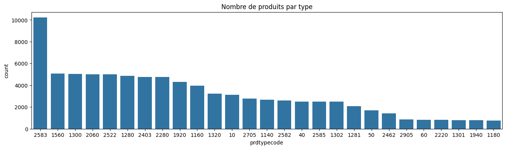
    


On constate que certaines classes (à droite du graphique) comme la classe **60** sont sous-représentées. Au contraire, la classe **2583** compte environ deux fois plus d'instances que les classes adjacentes à sa droite.


```python
fig = plt.figure(figsize = (16, 4))
# Identifier les doublons dans 'description' qui ne sont pas NaN
df_doublons = df[(df['description'].isna() == False) & (df[df['description'].isna() == False]["description"].duplicated(keep = False))]

# Compter et afficher le nombre de doublons par catégorie 'prdtypecode'
sns.countplot(x = df_doublons['prdtypecode'], order = df_doublons['prdtypecode'].value_counts().index)
plt.title('Nombre de doublons désignation / description par type')
plt.show();


print("\n Nombre de doublons par designation")
print(df_doublons['designation'].value_counts())
print("\n Nombre de doublons par description")
df_doublons['description'].value_counts()
```


    
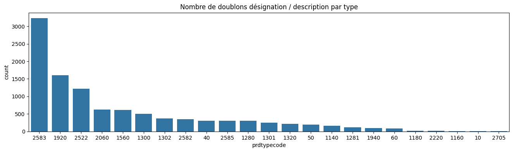
    


    
     Nombre de doublons par designation
    5d Broderie Peintures Strass Diamant Bricolage Pasted Peinture Point De Croix                            45
    Simple Linen Creative Belle Oreiller Taie D'oreiller Taie D'oreiller Car Cover                           25
    Imprimer Taie Polyester Canapé Coussin Car Cover Home Decor                                              19
    Joyeuse Saint-Valentin Jetez Taie D'oreiller Sweet Love Coussin Carré Couverture                         18
    Cotton Linen Place Décoratifs Pour La Maison Coussin Case Canapé Taille Coussin                          17
                                                                                                             ..
    2019 Joyeux Noël Salle De Ménage Wall Sticker Mural Décor Decal Amovible Décoration 7891                  1
    Prise balai 2&#34; - Liner de marque Hayward - Catégorie Pièce à sceller                                  1
    Joyeuse Saint-Valentin Jetez Taie D'oreiller Sweet Love Coussin Carré Couverture Taie D'oreiller 1754     1
    Enfants Alloy Mini Feu Ingénierie Véhicule Modèle Camion Inertie Classic Car Toy Quickio                  1
    Remplacement Bracelet En Cuir Véritable Bracelet Bracelet Pour Fitbit Alta Tracker Red Stream             1
    Name: designation, Length: 9157, dtype: int64
    
     Nombre de doublons par description


    <br>Attention !!! Ce produit est un import  si les informations 'langues' et 'sous-titres' n'apparaissent pas sur cette fiche produit c'est que l'éditeur ne nous les a pas fournies. Néanmoins dans la grande majorité de ces cas il n'existe ni langue ni sous titres en français sur ces imports.                                                                                                                                                                                                                                                                                                                                                                                                                                                                                                                                                                                                                                                                                                                                                                                                                                                                                                                                                                                                                                                                                                                                                                                                                                                                                                                                                                                                                                                                                                                                                                                                                                                                                                                                                                                                                                                                                                                                                                                                                                                                                                                                                                                                                                                                                                                                                                                                                                                                                                                                                                                                                                                                                                                                                                                                                                                                                                                                                                                                                                                                                                                                                                             252
    Taille: En format A5 (144 cm x 21 cm) Caractéistique: -Excellente durabilité avec couverture solide design. 96 pages jaune pale (recto et verso) -Texture de papier de haute qualitévous pouvez y érire facilement                                                                                                                                                                                                                                                                                                                                                                                                                                                                                                                                                                                                                                                                                                                                                                                                                                                                                                                                                                                                                                                                                                                                                                                                                                                                                                                                                                                                                                                                                                                                                                                                                                                                                                                                                                                                                                                                                                                                                                                                                                                                                                                                                                                                                                                                                                                                                                                                                                                                                                                                                                                                                                                                                                                                                                                                                                                                                                                                                                                                                                                                                                                                                                                                                                                               232
    Taille: En format A5 (144 cm x 21 cm) Caracteristique: -Excellente durabilite avec couverture solide design. 96 pages jaune pale (recto et verso) -Texture de papier de haute qualite:  ecrire facilement sur et assez epaisse.                                                                                                                                                                                                                                                                                                                                                                                                                                                                                                                                                                                                                                                                                                                                                                                                                                                                                                                                                                                                                                                                                                                                                                                                                                                                                                                                                                                                                                                                                                                                                                                                                                                                                                                                                                                                                                                                                                                                                                                                                                                                                                                                                                                                                                                                                                                                                                                                                                                                                                                                                                                                                                                                                                                                                                                                                                                                                                                                                                                                                                                                                                                                                                                                                                                  189
    Taille: En format A5 (144 cm x 21 cm) Caract?istique: -Excellente durabilit?avec couverture solide design. 96 pages jaune pale (recto et verso) -Texture de papier de haute qualit?  ?rire facilement sur et assez ?aisse.                                                                                                                                                                                                                                                                                                                                                                                                                                                                                                                                                                                                                                                                                                                                                                                                                                                                                                                                                                                                                                                                                                                                                                                                                                                                                                                                                                                                                                                                                                                                                                                                                                                                                                                                                                                                                                                                                                                                                                                                                                                                                                                                                                                                                                                                                                                                                                                                                                                                                                                                                                                                                                                                                                                                                                                                                                                                                                                                                                                                                                                                                                                                                                                                                                                       162
    Taille: En format A5 (144 cm x 21 cm) Caractéristique: -Excellente durabilit?avec couverture solide design. 96 pages jaune pale (recto et verso) -Texture de papier de haute qualit?  écrire facilement sur et assez épaisse.                                                                                                                                                                                                                                                                                                                                                                                                                                                                                                                                                                                                                                                                                                                                                                                                                                                                                                                                                                                                                                                                                                                                                                                                                                                                                                                                                                                                                                                                                                                                                                                                                                                                                                                                                                                                                                                                                                                                                                                                                                                                                                                                                                                                                                                                                                                                                                                                                                                                                                                                                                                                                                                                                                                                                                                                                                                                                                                                                                                                                                                                                                                                                                                                                                                     89
                                                                                                                                                                                                                                                                                                                                                                                                                                                                                                                                                                                                                                                                                                                                                                                                                                                                                                                                                                                                                                                                                                                                                                                                                                                                                                                                                                                                                                                                                                                                                                                                                                                                                                                                                                                                                                                                                                                                                                                                                                                                                                                                                                                                                                                                                                                                                                                                                                                                                                                                                                                                                                                                                                                                                                                                                                                                                                                                                                                                                                                                                                                                                                                                                                                                                                                                                                                                                                                                                    ... 
    EQUIPEMENT <br><br> La poussette<br><br> Conforme aux normes européennes de sécurité EN 1888:2003 + A1: 2005 + A2 2005 + A3 2005<br> Châssis solide et léger<br> Guidon réglable en hauteur<br> Frein de sécurité haute qualité<br> Facile à replier et peut encombrant<br> Systéme d amortisseurs réglable sur 2 roues<br> Grand panier (capacité de charge élevée = 3 kg)<br><br> Les roues<br><br> Roues en gomme dur<br> Roues pivotantes qui se bloque aussi<br> Roues pivotantes avec roulements é billes<br> Roues avant 9 pouces (environ 236 cm) et des roues arriére 117 pouces (environ 30 cm)<br><br> Nacelle<br><br> Couvre jambes <br> Dossier réglable<br> La nacelle fait rocking-chair<br> Utilisable dés la naissance position allongée é 180° <br> La nacelle peut étre clipser face parents et face é la route sur le châssis<br> Nacelle amovible avec un fond rigide intérieure lavable capote amovible peut étre utiliser comme un couffin <br><br> Siège auto groupe 0 avec ISOFIX et la base<br><br> Conforme à la norme européenne de sécurité EU R 44/04<br> Poignée réglable<br> Position assise é 138°<br> Reducteur pour nouveau né<br> Harnais de sécurité 2 points réglable<br> Le Siège auto/cosy fait rocking-chair<br> Le tissus est amovible et lavable é la main<br> Utilisable de la naissance (livré avec un réducteur) jusqu é 10 kg <br> Le Siège auto/cosy peut étre clipser face parents et face é la route sur le châssis<br> Fixation du siége grâce de la ceinture du véhicule qui offre une meilleure stabilité et évite une déplacement en cas de choc <br><br> Siége sport / Poussette canne<br><br> Conforme aux normes européennes de sécurité EN 1888<br>Couvre jambes <br>Dossier réglable<br> Harnais de sécurité 5 points<br> Facile à replier et peut encombrant<br> Couvre jambes Poignée de sécurité réglable<br> Repose jambes réglable sur plusieurs positions<br> Capote large pour protéger bébé des UV et des intempéries<br> Le siége sport peut étre clipser face parents et face é la route sur le châssis<br><br> Accessoires<br><br> Parasol<br> Chanceliére<br> Sac à langer<br> Moustiquaire<br> Habillage pluie<br> Adaptateurs pour fixer le Siège auto sur le châssis<br><br> Garantie légale : 24 mois<br> Service commerciale et SAV en France<br><br> nacelle dimensions intérieures: 77 x 35 x 20 cm<br> hauteur maximum poussette: 106 cm<br> poussette canne / siége: 24 x 33 cm<br> poussette canne repose-pied: 19 x 33 cm<br> poussette canne / dossier: 41 x 33 cm<br> poussette canne surface de couchage: 84 x 33 cm<br> dimensions de la poussette: 104 x 67 x 106 cm<br> châssis avec les roues plié: 91 x 67 x 31 cm<br> châssis sans les roues plié: 91 x 55 x 28 cm<br> poussette canne poids: 14 kg<br> roues (diamétre): roue pivotante 23 cm roue arriére 28 cm<br> guidon réglable en hauteur: 67 - 105 cm <br> nacelle hauteur couchée: 48 cm<br> nacelle poids: 44 kg<br> taille Sac à langer: 30 x 12 x 23 cm<br> Siège auto poids: 26 kg<br> panier é fermeture: non<br> groupe cible: unisexe<br> châssis plié: oui<br> roues (matiére): roues en gomme dur<br> nombre de siéges: 1 place<br> roues pivotantes blocable: oui<br> systéme de suspension réglable: 2 positions : oui<br> norme de sécurité: EN 1888 ECE R 44/04<br> poids poussette: 14 kg<br> poids châssis avec les roues: 10 kg<br> châssis sans les roues poids: 6 kg<br> modéle: poussette Matrix 2<br>      2
    Camping en plein air épais matelas de sol automatique Gonfler avec Description de Pillow Attaché: GRANDE ISOLATION &amp; amp; CONFORTABLE: Afin d&#39;améliorer le sentiment de confort de l&#39;utilisateur nous avons fait de grandes améliorations dans le choix des matériaux et l&#39;épaisseur des plaquettes de couchage. 2.5cm d&#39;épaisseur apportera une grande isolation entre vous et la dureté la froideur du sol. Le tissu de haute qualité peut améliorer le confort de couchage et d&#39;éliminer les coussinets du bruit causé par la friction la nuit veillant à ce que vous pouvez dormir tranquillement et bien. Ce coussin d&#39;air gonflable peut résister à l&#39;usure quotidienne. Jeter loin tous les tapis de couchage bon marché fait et perfore facilement. Investir dans cette beauté. Tous nos tapis de couchage sont étanches résistant à la chaleur de soutien ergonomique large et assez grand isolant résistant à l&#39;abrasion et à la déchirure légère compact et pliable. Robinet à deux voies OREILLER ATTACHÉ: deux voies de conception Valve ne vous inquiétez pas le problème des fuites. La libre circulation de l&#39;air dans le coussin couché sur la mousse de matelas de couchage vous vous sentirez à l&#39;aise et détendu. Attaché un oreiller avec valve plus commode de gonfler et de réduire le coût d&#39;en acheter un. La conception ergonomique peut se détendre le cou et le dos et le trou d&#39;air séparé du matelas d&#39;air avec l&#39;oreiller est plus pratique. Le pad est assez épaisse pour vous garder au chaud sans se sentir l&#39;inégale ou humide sous votre corps fonctionne parfaitement avec hamac tente dans / sous des sacs de couchage ou des surfaces dures pour un grand confort Livré avec un oreiller gonflable pas besoin de payer pour un oreiller chaque coussin gonflable sera équipé d&#39;un kit de réparation. Si elle est accidentellement la perforation il peut être réparé par lui-même et il ne sera pas affectée après la réparation. Méthode d&#39;ouverture: Après le coussin d&#39;air est ouvert d&#39;abord tourner la buse d&#39;air (vis) le coussin d&#39;air inhale automatiquement attendez l&#39;air pour saturer complètement (vis) la buse d&#39;air et vous pouvez vous allonger sur elle et le sommeil confortablement. . Méthode de stockage: Il est également très simple de fermer. Tout d&#39;abord la tuyère à gaz est vissée (vissée) enroulée à partir de l&#39;autre extrémité de la buse de gaz et le gaz est pressé tout en étant roulée le gaz est évacué vers l&#39;extérieur et le gaz est déchargé à la position du gaz ajutage. Terminer cette fois vous pouvez visser (serrer) la buse de gaz. Caractéristiques: 185 x 55 x 25 cm Poids: 900 g Tissu: polyester 190T remplissage: éponge élastique élevé Composition: simple coussin d&#39;air le sac extérieur voies de charge: ouvrir la vanne de charge la taille de l&#39;emballage: 58 X 12 cm Remarque: le coussin d&#39;air est pas apte à souffler trop plein sinon il va éclater. Inclure: 1 x Coussin gonflable 1 X extérieur sac                                                                                                                                                                                                                                                                                                                                                  2
    IDU Drone Caméra HD 1280 x 720P U31W Quadcopter Avec Altitude Tenir Caractéristiques du mode sans tête: matériau ABS capable de supporter l&#39;impact avec la conception caméra dernier système de contrôle de vol avec la sensibilité du gyroscope réglable intégré Gyroscope Fonction Fonction: vers le haut vers le bas vers l&#39;avant vers l&#39;arrière mouche côté gauche et à droite Indicateur d&#39;alimentation 3 vitesses commande (lent / mid / rapide) photographie enregistrer des vidéos en 720p 30fps (1280x720) le mode sans tête alarme de batterie faible maintien d&#39;altitude en temps réel FPV contrôle WIFI bouton Un décollage / atterrissage d&#39;arrêt d&#39;urgence hors alarme Range mode itinéraire de vol personnalisé Motors bloqué la protection le contrôle d&#39;induction App Temps de vol: 6-8minutes au sujet Temps de charge: 60 minutes contrôle à distance: 2.4G télécommande distance à distance: 50-80meters WIFI FPV Distance de transmission: 20-30 mètres conduite Quantité moteur: 4 pièces Drone batterie: 7.4v350Ah Batterie au lithium avec protection contre la surcharge et la décharge de contrôleur de batterie: 4x1.5AA (non inclus) Taille: 18.3x19.85x4.3cm / 7.2x7.8x1.69 pouces Poids total: environ 610g resoultion Appareil photo: 1280x72030fps paquet 720P comprend: 1 x U31 WIFI Quadcopter avec caméra HD 1 x 2.4G Transmetteur 4 x Lames 1 x piles au lithium pour Quadcopter 1 x Chargeur USB 1 x 1 x Tournevis manuel anglais                                                                                                                                                                                                                                                                                                                                                                                                                                                                                                                                                                                                                                                                                                                                                                                                                                                                                                                                                                                                                                                                                                                                                                                                                                                                                                                                                                                                                                                                                                                                                                                                                                                                                                                                                                                                                                                                                                                                                                             2
    <p><b>La description:</b></p><br /><p> Cartouches filtrantes de remplacement de haute qualité <br /> Comprend un matériau filtrant facile à nettoyer <br /> Pour de meilleurs résultats de filtrage remplacez votre cartouche filtrante toutes les deux semaines. <br /> Taille (diamètre extérieur x hauteur x diamètre intérieur): 68mmx251mmx28mm / 2.67x9.9x1.10 pouces <br /> Taille: montrée sur la photo. </p><br /><p><b>Le forfait comprend:</b></p><br /><p> Filtre de piscine 1 pièce <br /></p><br />                                                                                                                                                                                                                                                                                                                                                                                                                                                                                                                                                                                                                                                                                                                                                                                                                                                                                                                                                                                                                                                                                                                                                                                                                                                                                                                                                                                                                                                                                                                                                                                                                                                                                                                                                                                                                                                                                                                                                                                                                                                                                                                                                                                                                                                                                                                                                                                                                                                                                                                                                                                                                                                                                                                                                                                                                                                                                                                                                                  2
    POUR DJI Mavic Pro Mavic 2 / Zoom / Air Spark Signal Booster Range Antenne Extender Description du signal de télécommande Extender Amplificateur d&#39;antenne série Booster POUR DJI Mavic Pro Mavic Air Spark Caractéristiques: carte d&#39;extension du signal à distance le matériel d&#39;aluminium qui est une antenne radar idéalisée et produit un faisceau de crayons. Si le réflecteur a une forme ovale il génère un faisceau en éventail. Pour éviter les problèmes de signal en raison de la perte ou de la situation de la machine frite. amélioration du signal vol plus de sécurité. Le film de la surface est arraché avant l&#39;installation avec la feuille métallique tournée vers l&#39;extérieur. Condition: Neuf Couleur: Comme par images montrées) Poids: 40g modèles applicables: POUR DJI Mavic Pro 2 / Zoom Mavic Air / Spark Inclure: 1 carte d&#39;extension du signal xremote Remarque: En plus de ce qui précède ces choses et pas d&#39;autres choses.                                                                                                                                                                                                                                                                                                                                                                                                                                                                                                                                                                                                                                                                                                                                                                                                                                                                                                                                                                                                                                                                                                                                                                                                                                                                                                                                                                                                                                                                                                                                                                                                                                                                                                                                                                                                                                                                                                                                                                                                                                                                                                                                                                                                                                                                                                                                                                                                                                                                                           2
    Name: description, Length: 3001, dtype: int64


La répartition des doublons est assez similaire à la répartition des produits par rapport à la variable cible.

On pourrait donc décider de supprimer les doublons sans casser la répartition initiale. Cependant, il faudrait pouvoir vérifier au préalable, que les images associées aux doublons de couple (**designation**,**description**) sont identiques. Etant donné le faible nombre de doublons (1294 pour rappel) et la charge de travail supplémentaire que leur suppression impliquerait, nous prenons le parti de les laisser pour le moment.

Les type codes ne sont pas très parlants si on veut se faire une idée du contenu des classes. Nous sommes parvenus à trouver sur (TODO: lien vers la source) les labels correspondants aux différents codes.

Pour la suite, nous allons construire un dictionnaire nous permettant d'associer les codes à leurs labels respectifs afin que les visuels gagnent en clarté.


```python
prdcodetype2label = {
    10 : "Livre occasion",
    40 : "Jeu vidéo, accessoire tech.",
    50 : "Accessoire Console",
    60 : "Console de jeu",
    1140 : "Figurine",
    1160 : "Carte Collection",
    1180 : "Jeu Plateau",
    1280 : "Jouet enfant, déguisement",
    1281 : "Jeu de société",
    1300 : "Jouet tech",
    1301 : "Paire de chaussettes",
    1302 : "Jeu extérieur, vêtement",
    1320 : "Autour du bébé",
    1560 : "Mobilier intérieur",
    1920 : "Chambre",
    1940 : "Cuisine",
    2060 : "Décoration intérieure",
    2220 : "Animal",
    2280 : "Revues et journaux",
    2403 : "Magazines, livres et BDs",
    2462 : "Jeu occasion",
    2522 : "Bureautique et papeterie",
    2582 : "Mobilier extérieur",
    2583 : "Autour de la piscine",
    2585 : "Bricolage",
    2705 : "Livre neuf",
    2905 : "Jeu PC",
}
```

Ajoutons une colonne **categorie** à **df**. Celle ci va contenir le label associé au **prdtypecode**


```python
df['categorie'] = df['prdtypecode'].map(prdcodetype2label)
df.head()
```


  <div id="df-9b8226b2-a686-4fe0-ada8-8a3689cb719c" class="colab-df-container">
    <div>
<style scoped>
    .dataframe tbody tr th:only-of-type {
        vertical-align: middle;
    }

    .dataframe tbody tr th {
        vertical-align: top;
    }

    .dataframe thead th {
        text-align: right;
    }
</style>
<table border="1" class="dataframe">
  <thead>
    <tr style="text-align: right;">
      <th></th>
      <th>designation</th>
      <th>description</th>
      <th>productid</th>
      <th>imageid</th>
      <th>prdtypecode</th>
      <th>categorie</th>
    </tr>
    <tr>
      <th>index</th>
      <th></th>
      <th></th>
      <th></th>
      <th></th>
      <th></th>
      <th></th>
    </tr>
  </thead>
  <tbody>
    <tr>
      <th>0</th>
      <td>Olivia: Personalisiertes Notizbuch / 150 Seite...</td>
      <td>NaN</td>
      <td>3804725264</td>
      <td>1263597046</td>
      <td>10</td>
      <td>Livre occasion</td>
    </tr>
    <tr>
      <th>1</th>
      <td>Journal Des Arts (Le) N° 133 Du 28/09/2001 - L...</td>
      <td>NaN</td>
      <td>436067568</td>
      <td>1008141237</td>
      <td>2280</td>
      <td>Revues et journaux</td>
    </tr>
    <tr>
      <th>2</th>
      <td>Grand Stylet Ergonomique Bleu Gamepad Nintendo...</td>
      <td>PILOT STYLE Touch Pen de marque Speedlink est ...</td>
      <td>201115110</td>
      <td>938777978</td>
      <td>50</td>
      <td>Accessoire Console</td>
    </tr>
    <tr>
      <th>3</th>
      <td>Peluche Donald - Europe - Disneyland 2000 (Mar...</td>
      <td>NaN</td>
      <td>50418756</td>
      <td>457047496</td>
      <td>1280</td>
      <td>Jouet enfant, déguisement</td>
    </tr>
    <tr>
      <th>4</th>
      <td>La Guerre Des Tuques</td>
      <td>Luc a des id&amp;eacute;es de grandeur. Il veut or...</td>
      <td>278535884</td>
      <td>1077757786</td>
      <td>2705</td>
      <td>Livre neuf</td>
    </tr>
  </tbody>
</table>
</div>
    <div class="colab-df-buttons">

  <div class="colab-df-container">
    <button class="colab-df-convert" onclick="convertToInteractive('df-9b8226b2-a686-4fe0-ada8-8a3689cb719c')"
            title="Convert this dataframe to an interactive table."
            style="display:none;">

  <svg xmlns="http://www.w3.org/2000/svg" height="24px" viewBox="0 -960 960 960">
    <path d="M120-120v-720h720v720H120Zm60-500h600v-160H180v160Zm220 220h160v-160H400v160Zm0 220h160v-160H400v160ZM180-400h160v-160H180v160Zm440 0h160v-160H620v160ZM180-180h160v-160H180v160Zm440 0h160v-160H620v160Z"/>
  </svg>
    </button>

  <style>
    .colab-df-container {
      display:flex;
      gap: 12px;
    }

    .colab-df-convert {
      background-color: #E8F0FE;
      border: none;
      border-radius: 50%;
      cursor: pointer;
      display: none;
      fill: #1967D2;
      height: 32px;
      padding: 0 0 0 0;
      width: 32px;
    }

    .colab-df-convert:hover {
      background-color: #E2EBFA;
      box-shadow: 0px 1px 2px rgba(60, 64, 67, 0.3), 0px 1px 3px 1px rgba(60, 64, 67, 0.15);
      fill: #174EA6;
    }

    .colab-df-buttons div {
      margin-bottom: 4px;
    }

    [theme=dark] .colab-df-convert {
      background-color: #3B4455;
      fill: #D2E3FC;
    }

    [theme=dark] .colab-df-convert:hover {
      background-color: #434B5C;
      box-shadow: 0px 1px 3px 1px rgba(0, 0, 0, 0.15);
      filter: drop-shadow(0px 1px 2px rgba(0, 0, 0, 0.3));
      fill: #FFFFFF;
    }
  </style>

    <script>
      const buttonEl =
        document.querySelector('#df-9b8226b2-a686-4fe0-ada8-8a3689cb719c button.colab-df-convert');
      buttonEl.style.display =
        google.colab.kernel.accessAllowed ? 'block' : 'none';

      async function convertToInteractive(key) {
        const element = document.querySelector('#df-9b8226b2-a686-4fe0-ada8-8a3689cb719c');
        const dataTable =
          await google.colab.kernel.invokeFunction('convertToInteractive',
                                                    [key], {});
        if (!dataTable) return;

        const docLinkHtml = 'Like what you see? Visit the ' +
          '<a target="_blank" href=https://colab.research.google.com/notebooks/data_table.ipynb>data table notebook</a>'
          + ' to learn more about interactive tables.';
        element.innerHTML = '';
        dataTable['output_type'] = 'display_data';
        await google.colab.output.renderOutput(dataTable, element);
        const docLink = document.createElement('div');
        docLink.innerHTML = docLinkHtml;
        element.appendChild(docLink);
      }
    </script>
  </div>


<div id="df-b4a87bd7-c4b8-4329-8c33-115782d1d0ee">
  <button class="colab-df-quickchart" onclick="quickchart('df-b4a87bd7-c4b8-4329-8c33-115782d1d0ee')"
            title="Suggest charts"
            style="display:none;">

<svg xmlns="http://www.w3.org/2000/svg" height="24px"viewBox="0 0 24 24"
     width="24px">
    <g>
        <path d="M19 3H5c-1.1 0-2 .9-2 2v14c0 1.1.9 2 2 2h14c1.1 0 2-.9 2-2V5c0-1.1-.9-2-2-2zM9 17H7v-7h2v7zm4 0h-2V7h2v10zm4 0h-2v-4h2v4z"/>
    </g>
</svg>
  </button>

<style>
  .colab-df-quickchart {
      --bg-color: #E8F0FE;
      --fill-color: #1967D2;
      --hover-bg-color: #E2EBFA;
      --hover-fill-color: #174EA6;
      --disabled-fill-color: #AAA;
      --disabled-bg-color: #DDD;
  }

  [theme=dark] .colab-df-quickchart {
      --bg-color: #3B4455;
      --fill-color: #D2E3FC;
      --hover-bg-color: #434B5C;
      --hover-fill-color: #FFFFFF;
      --disabled-bg-color: #3B4455;
      --disabled-fill-color: #666;
  }

  .colab-df-quickchart {
    background-color: var(--bg-color);
    border: none;
    border-radius: 50%;
    cursor: pointer;
    display: none;
    fill: var(--fill-color);
    height: 32px;
    padding: 0;
    width: 32px;
  }

  .colab-df-quickchart:hover {
    background-color: var(--hover-bg-color);
    box-shadow: 0 1px 2px rgba(60, 64, 67, 0.3), 0 1px 3px 1px rgba(60, 64, 67, 0.15);
    fill: var(--button-hover-fill-color);
  }

  .colab-df-quickchart-complete:disabled,
  .colab-df-quickchart-complete:disabled:hover {
    background-color: var(--disabled-bg-color);
    fill: var(--disabled-fill-color);
    box-shadow: none;
  }

  .colab-df-spinner {
    border: 2px solid var(--fill-color);
    border-color: transparent;
    border-bottom-color: var(--fill-color);
    animation:
      spin 1s steps(1) infinite;
  }

  @keyframes spin {
    0% {
      border-color: transparent;
      border-bottom-color: var(--fill-color);
      border-left-color: var(--fill-color);
    }
    20% {
      border-color: transparent;
      border-left-color: var(--fill-color);
      border-top-color: var(--fill-color);
    }
    30% {
      border-color: transparent;
      border-left-color: var(--fill-color);
      border-top-color: var(--fill-color);
      border-right-color: var(--fill-color);
    }
    40% {
      border-color: transparent;
      border-right-color: var(--fill-color);
      border-top-color: var(--fill-color);
    }
    60% {
      border-color: transparent;
      border-right-color: var(--fill-color);
    }
    80% {
      border-color: transparent;
      border-right-color: var(--fill-color);
      border-bottom-color: var(--fill-color);
    }
    90% {
      border-color: transparent;
      border-bottom-color: var(--fill-color);
    }
  }
</style>

  <script>
    async function quickchart(key) {
      const quickchartButtonEl =
        document.querySelector('#' + key + ' button');
      quickchartButtonEl.disabled = true;  // To prevent multiple clicks.
      quickchartButtonEl.classList.add('colab-df-spinner');
      try {
        const charts = await google.colab.kernel.invokeFunction(
            'suggestCharts', [key], {});
      } catch (error) {
        console.error('Error during call to suggestCharts:', error);
      }
      quickchartButtonEl.classList.remove('colab-df-spinner');
      quickchartButtonEl.classList.add('colab-df-quickchart-complete');
    }
    (() => {
      let quickchartButtonEl =
        document.querySelector('#df-b4a87bd7-c4b8-4329-8c33-115782d1d0ee button');
      quickchartButtonEl.style.display =
        google.colab.kernel.accessAllowed ? 'block' : 'none';
    })();
  </script>
</div>
    </div>
  </div>


## Valeurs nulles de **description**

Intéressons nous maintenant aux valeurs nulles de la variable **description** que nous avons remarqué lors du chargement des données.

Calculons déjà leur proportion par rapport aux données totales.


```python
print("Les nan de descriptions représentent %d%% des données" \
      % (df['description'].isna().sum() * 100 / df.shape[0]))
```

    Les nan de descriptions représentent 35% des données


Commençons à réfléchir à que faire de ces nans. On peut déjà envisager plusieurs options:
* On pourrait simplement supprimer les lignes qui en contiennent même si ça représente tout de même une part importante des données. De plus, cela viendrait en quelque sorte à l'encontre de l'objectif du projet qui spécifie bien que la colonne **description** est optionnelle. On doit donc prendre ça en compte dans notre approche
* On pourrait les remplacer par des chaînes de caractères vides. Bien que cette possibilité semble simple, nous avons beaucoup d'incertitudes quant à l'impact que ça aurait sur les modèles de prédictions.
* Sachant que le champ **designation** n'est jamais vide, on pourrait ajouter une troisième variable qui soit la concaténation des champs **designation** et **description**. Ainsi, cette nouvelle variable contiendrait au moins le contenu du champ **designation** nous ôtant ce problème de nan.

A première vue, c'est la troisième option qui semble la plus judicieuse, toutefois, pour essayer d'y voir plus clair, affichons un graphique en barre qui permettent de voir la proportion de nan pour chaque type de produit

Maintenant que nous avons des labels, on peut s'en servir plutôt que d'afficher des codes.


```python
# Transforme la colonne categorie en string
df.categorie = df.categorie.astype(str)

# Calcul du nombre d'apparitions de chaque catégorie
category_counts = df['categorie'].value_counts()

# Calcul des pourcentages de NaN et non-NaN pour chaque catégorie
category_nan_counts = df.groupby('categorie')['description'].apply(lambda x: x.isna().sum())
category_non_nan_counts = df.groupby('categorie')['description'].apply(lambda x: x.notna().sum())


# Tri des catégories par nombre d'apparitions
sorted_categories = category_counts.index.tolist()

# Tri des pourcentages de NaN et non-NaN selon l'ordre des catégories
sorted_nan_counts = category_nan_counts.reindex(sorted_categories)
sorted_non_nan_counts = category_non_nan_counts.reindex(sorted_categories)

# Création du graphique en barres
fig = go.Figure()

# Ajout des barres pour les valeurs non-NaN
fig.add_trace(go.Bar(
    name='Non-NaN',
    x=sorted_categories,
    y=sorted_non_nan_counts,
    marker_color='green'
))

# Ajout des barres pour les valeurs NaN
fig.add_trace(go.Bar(
    name='NaN',
    x=sorted_categories,
    y=sorted_nan_counts,
    marker_color='red'
))

# Mise à jour des paramètres du layout
fig.update_layout(
    barmode='stack',
    title='Répartition des NaN dans la Description par Catégorie',
    xaxis_title='Catégorie',
    yaxis_title='Pourcentage'
)

fig.update_xaxes(tickangle=60)

fig.show()


```


<html>
<head><meta charset="utf-8" /></head>
<body>
    <div>            <script src="https://cdnjs.cloudflare.com/ajax/libs/mathjax/2.7.5/MathJax.js?config=TeX-AMS-MML_SVG"></script><script type="text/javascript">if (window.MathJax && window.MathJax.Hub && window.MathJax.Hub.Config) {window.MathJax.Hub.Config({SVG: {font: "STIX-Web"}});}</script>                <script type="text/javascript">window.PlotlyConfig = {MathJaxConfig: 'local'};</script>
        <script charset="utf-8" src="https://cdn.plot.ly/plotly-2.24.1.min.js"></script>                <div id="591a0546-029a-40d6-b583-5e3247b2f5b4" class="plotly-graph-div" style="height:525px; width:100%;"></div>            <script type="text/javascript">                                    window.PLOTLYENV=window.PLOTLYENV || {};                                    if (document.getElementById("591a0546-029a-40d6-b583-5e3247b2f5b4")) {                    Plotly.newPlot(                        "591a0546-029a-40d6-b583-5e3247b2f5b4",                        [{"marker":{"color":"green"},"name":"Non-NaN","x":["Autour de la piscine","Mobilier int\u00e9rieur","Jouet tech","D\u00e9coration int\u00e9rieure","Bureautique et papeterie","Jouet enfant, d\u00e9guisement","Magazines, livres et BDs","Revues et journaux","Chambre","Carte Collection","Autour du b\u00e9b\u00e9","Livre occasion","Livre neuf","Figurine","Mobilier ext\u00e9rieur","Jeu vid\u00e9o, accessoire tech.","Bricolage","Jeu ext\u00e9rieur, v\u00eatement","Jeu de soci\u00e9t\u00e9","Accessoire Console","Jeu occasion","Jeu PC","Console de jeu","Animal","Paire de chaussettes","Cuisine","Jeu Plateau"],"y":[9306,4896,3872,4707,3800,3802,126,320,4096,349,2140,338,1736,945,2527,866,2298,2214,1578,1205,53,872,699,758,702,758,153],"type":"bar"},{"marker":{"color":"red"},"name":"NaN","x":["Autour de la piscine","Mobilier int\u00e9rieur","Jouet tech","D\u00e9coration int\u00e9rieure","Bureautique et papeterie","Jouet enfant, d\u00e9guisement","Magazines, livres et BDs","Revues et journaux","Chambre","Carte Collection","Autour du b\u00e9b\u00e9","Livre occasion","Livre neuf","Figurine","Mobilier ext\u00e9rieur","Jeu vid\u00e9o, accessoire tech.","Bricolage","Jeu ext\u00e9rieur, v\u00eatement","Jeu de soci\u00e9t\u00e9","Accessoire Console","Jeu occasion","Jeu PC","Console de jeu","Animal","Paire de chaussettes","Cuisine","Jeu Plateau"],"y":[903,177,1173,286,1189,1068,4648,4440,207,3604,1101,2778,1025,1726,62,1642,198,277,492,476,1368,0,133,66,105,45,611],"type":"bar"}],                        {"template":{"data":{"histogram2dcontour":[{"type":"histogram2dcontour","colorbar":{"outlinewidth":0,"ticks":""},"colorscale":[[0.0,"#0d0887"],[0.1111111111111111,"#46039f"],[0.2222222222222222,"#7201a8"],[0.3333333333333333,"#9c179e"],[0.4444444444444444,"#bd3786"],[0.5555555555555556,"#d8576b"],[0.6666666666666666,"#ed7953"],[0.7777777777777778,"#fb9f3a"],[0.8888888888888888,"#fdca26"],[1.0,"#f0f921"]]}],"choropleth":[{"type":"choropleth","colorbar":{"outlinewidth":0,"ticks":""}}],"histogram2d":[{"type":"histogram2d","colorbar":{"outlinewidth":0,"ticks":""},"colorscale":[[0.0,"#0d0887"],[0.1111111111111111,"#46039f"],[0.2222222222222222,"#7201a8"],[0.3333333333333333,"#9c179e"],[0.4444444444444444,"#bd3786"],[0.5555555555555556,"#d8576b"],[0.6666666666666666,"#ed7953"],[0.7777777777777778,"#fb9f3a"],[0.8888888888888888,"#fdca26"],[1.0,"#f0f921"]]}],"heatmap":[{"type":"heatmap","colorbar":{"outlinewidth":0,"ticks":""},"colorscale":[[0.0,"#0d0887"],[0.1111111111111111,"#46039f"],[0.2222222222222222,"#7201a8"],[0.3333333333333333,"#9c179e"],[0.4444444444444444,"#bd3786"],[0.5555555555555556,"#d8576b"],[0.6666666666666666,"#ed7953"],[0.7777777777777778,"#fb9f3a"],[0.8888888888888888,"#fdca26"],[1.0,"#f0f921"]]}],"heatmapgl":[{"type":"heatmapgl","colorbar":{"outlinewidth":0,"ticks":""},"colorscale":[[0.0,"#0d0887"],[0.1111111111111111,"#46039f"],[0.2222222222222222,"#7201a8"],[0.3333333333333333,"#9c179e"],[0.4444444444444444,"#bd3786"],[0.5555555555555556,"#d8576b"],[0.6666666666666666,"#ed7953"],[0.7777777777777778,"#fb9f3a"],[0.8888888888888888,"#fdca26"],[1.0,"#f0f921"]]}],"contourcarpet":[{"type":"contourcarpet","colorbar":{"outlinewidth":0,"ticks":""}}],"contour":[{"type":"contour","colorbar":{"outlinewidth":0,"ticks":""},"colorscale":[[0.0,"#0d0887"],[0.1111111111111111,"#46039f"],[0.2222222222222222,"#7201a8"],[0.3333333333333333,"#9c179e"],[0.4444444444444444,"#bd3786"],[0.5555555555555556,"#d8576b"],[0.6666666666666666,"#ed7953"],[0.7777777777777778,"#fb9f3a"],[0.8888888888888888,"#fdca26"],[1.0,"#f0f921"]]}],"surface":[{"type":"surface","colorbar":{"outlinewidth":0,"ticks":""},"colorscale":[[0.0,"#0d0887"],[0.1111111111111111,"#46039f"],[0.2222222222222222,"#7201a8"],[0.3333333333333333,"#9c179e"],[0.4444444444444444,"#bd3786"],[0.5555555555555556,"#d8576b"],[0.6666666666666666,"#ed7953"],[0.7777777777777778,"#fb9f3a"],[0.8888888888888888,"#fdca26"],[1.0,"#f0f921"]]}],"mesh3d":[{"type":"mesh3d","colorbar":{"outlinewidth":0,"ticks":""}}],"scatter":[{"fillpattern":{"fillmode":"overlay","size":10,"solidity":0.2},"type":"scatter"}],"parcoords":[{"type":"parcoords","line":{"colorbar":{"outlinewidth":0,"ticks":""}}}],"scatterpolargl":[{"type":"scatterpolargl","marker":{"colorbar":{"outlinewidth":0,"ticks":""}}}],"bar":[{"error_x":{"color":"#2a3f5f"},"error_y":{"color":"#2a3f5f"},"marker":{"line":{"color":"#E5ECF6","width":0.5},"pattern":{"fillmode":"overlay","size":10,"solidity":0.2}},"type":"bar"}],"scattergeo":[{"type":"scattergeo","marker":{"colorbar":{"outlinewidth":0,"ticks":""}}}],"scatterpolar":[{"type":"scatterpolar","marker":{"colorbar":{"outlinewidth":0,"ticks":""}}}],"histogram":[{"marker":{"pattern":{"fillmode":"overlay","size":10,"solidity":0.2}},"type":"histogram"}],"scattergl":[{"type":"scattergl","marker":{"colorbar":{"outlinewidth":0,"ticks":""}}}],"scatter3d":[{"type":"scatter3d","line":{"colorbar":{"outlinewidth":0,"ticks":""}},"marker":{"colorbar":{"outlinewidth":0,"ticks":""}}}],"scattermapbox":[{"type":"scattermapbox","marker":{"colorbar":{"outlinewidth":0,"ticks":""}}}],"scatterternary":[{"type":"scatterternary","marker":{"colorbar":{"outlinewidth":0,"ticks":""}}}],"scattercarpet":[{"type":"scattercarpet","marker":{"colorbar":{"outlinewidth":0,"ticks":""}}}],"carpet":[{"aaxis":{"endlinecolor":"#2a3f5f","gridcolor":"white","linecolor":"white","minorgridcolor":"white","startlinecolor":"#2a3f5f"},"baxis":{"endlinecolor":"#2a3f5f","gridcolor":"white","linecolor":"white","minorgridcolor":"white","startlinecolor":"#2a3f5f"},"type":"carpet"}],"table":[{"cells":{"fill":{"color":"#EBF0F8"},"line":{"color":"white"}},"header":{"fill":{"color":"#C8D4E3"},"line":{"color":"white"}},"type":"table"}],"barpolar":[{"marker":{"line":{"color":"#E5ECF6","width":0.5},"pattern":{"fillmode":"overlay","size":10,"solidity":0.2}},"type":"barpolar"}],"pie":[{"automargin":true,"type":"pie"}]},"layout":{"autotypenumbers":"strict","colorway":["#636efa","#EF553B","#00cc96","#ab63fa","#FFA15A","#19d3f3","#FF6692","#B6E880","#FF97FF","#FECB52"],"font":{"color":"#2a3f5f"},"hovermode":"closest","hoverlabel":{"align":"left"},"paper_bgcolor":"white","plot_bgcolor":"#E5ECF6","polar":{"bgcolor":"#E5ECF6","angularaxis":{"gridcolor":"white","linecolor":"white","ticks":""},"radialaxis":{"gridcolor":"white","linecolor":"white","ticks":""}},"ternary":{"bgcolor":"#E5ECF6","aaxis":{"gridcolor":"white","linecolor":"white","ticks":""},"baxis":{"gridcolor":"white","linecolor":"white","ticks":""},"caxis":{"gridcolor":"white","linecolor":"white","ticks":""}},"coloraxis":{"colorbar":{"outlinewidth":0,"ticks":""}},"colorscale":{"sequential":[[0.0,"#0d0887"],[0.1111111111111111,"#46039f"],[0.2222222222222222,"#7201a8"],[0.3333333333333333,"#9c179e"],[0.4444444444444444,"#bd3786"],[0.5555555555555556,"#d8576b"],[0.6666666666666666,"#ed7953"],[0.7777777777777778,"#fb9f3a"],[0.8888888888888888,"#fdca26"],[1.0,"#f0f921"]],"sequentialminus":[[0.0,"#0d0887"],[0.1111111111111111,"#46039f"],[0.2222222222222222,"#7201a8"],[0.3333333333333333,"#9c179e"],[0.4444444444444444,"#bd3786"],[0.5555555555555556,"#d8576b"],[0.6666666666666666,"#ed7953"],[0.7777777777777778,"#fb9f3a"],[0.8888888888888888,"#fdca26"],[1.0,"#f0f921"]],"diverging":[[0,"#8e0152"],[0.1,"#c51b7d"],[0.2,"#de77ae"],[0.3,"#f1b6da"],[0.4,"#fde0ef"],[0.5,"#f7f7f7"],[0.6,"#e6f5d0"],[0.7,"#b8e186"],[0.8,"#7fbc41"],[0.9,"#4d9221"],[1,"#276419"]]},"xaxis":{"gridcolor":"white","linecolor":"white","ticks":"","title":{"standoff":15},"zerolinecolor":"white","automargin":true,"zerolinewidth":2},"yaxis":{"gridcolor":"white","linecolor":"white","ticks":"","title":{"standoff":15},"zerolinecolor":"white","automargin":true,"zerolinewidth":2},"scene":{"xaxis":{"backgroundcolor":"#E5ECF6","gridcolor":"white","linecolor":"white","showbackground":true,"ticks":"","zerolinecolor":"white","gridwidth":2},"yaxis":{"backgroundcolor":"#E5ECF6","gridcolor":"white","linecolor":"white","showbackground":true,"ticks":"","zerolinecolor":"white","gridwidth":2},"zaxis":{"backgroundcolor":"#E5ECF6","gridcolor":"white","linecolor":"white","showbackground":true,"ticks":"","zerolinecolor":"white","gridwidth":2}},"shapedefaults":{"line":{"color":"#2a3f5f"}},"annotationdefaults":{"arrowcolor":"#2a3f5f","arrowhead":0,"arrowwidth":1},"geo":{"bgcolor":"white","landcolor":"#E5ECF6","subunitcolor":"white","showland":true,"showlakes":true,"lakecolor":"white"},"title":{"x":0.05},"mapbox":{"style":"light"}}},"barmode":"stack","title":{"text":"R\u00e9partition des NaN dans la Description par Cat\u00e9gorie"},"xaxis":{"title":{"text":"Cat\u00e9gorie"},"tickangle":60},"yaxis":{"title":{"text":"Pourcentage"}}},                        {"responsive": true}                    ).then(function(){

var gd = document.getElementById('591a0546-029a-40d6-b583-5e3247b2f5b4');
var x = new MutationObserver(function (mutations, observer) {{
        var display = window.getComputedStyle(gd).display;
        if (!display || display === 'none') {{
            console.log([gd, 'removed!']);
            Plotly.purge(gd);
            observer.disconnect();
        }}
}});

// Listen for the removal of the full notebook cells
var notebookContainer = gd.closest('#notebook-container');
if (notebookContainer) {{
    x.observe(notebookContainer, {childList: true});
}}

// Listen for the clearing of the current output cell
var outputEl = gd.closest('.output');
if (outputEl) {{
    x.observe(outputEl, {childList: true});
}}

                        })                };                            </script>        </div>
</body>
</html>


Cela nous confirme que l'option 1 est inenvisageable. Supprimer les lignes dont la **description** est vide revient presque à supprimer certaines catégories.
On préférera l'option 3: concaténer les champs **designation** et **description**.

## Longueur des textes

Nous n'avons pas encore parlé du type de texte qu'on peut trouver dans **designation** et **description**.

Penchons-nous sur la longueur des textes qu'on peut y trouver.


```python
plt.figure(figsize=(10,5))
plt.subplot(121)
sns.boxplot(df['designation'].str.len().values)
plt.xlabel("designation")
plt.xticks([])
plt.subplot(122)
# On pense à enlever les na de description pour ne pas fausser les stats
sns.boxplot(data=df['description'][df['description'].isna()==False].str.len().values)
plt.xlabel("description")
plt.xticks([])
plt.suptitle("Distribution des longueurs de texte (en nb de caractères)")
plt.show()
```


    
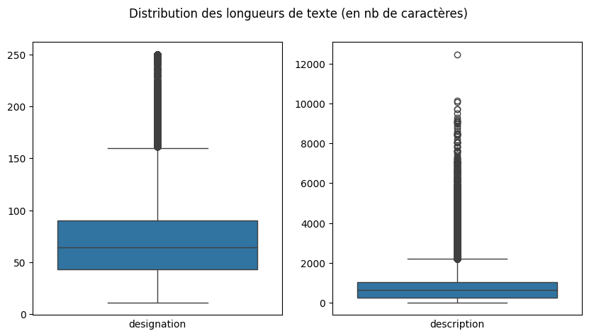
    


Comme il fallait s'y attendre, on constate que les longueurs de texte dans **description** sont largement supérieures à celles qu'on trouve dans **designation**.

Dans les deux cas, on note un grand nombre d'outliers au dessus de l'interval interquartile `q3 + (q3 - q1 * 1.5)`. La distribution des outliers pour **description** est particulièrement étendue vers le haut puisqu'elle monte jusqu'à plus de 12,000 caractères alors que la valeur la plus haute située dans la fourchette *typique* se situe vers 2000.

Un autre information importante apparaît. Il semble qu'il y ait un certain nombre de valeurs proches de zéro caractères. Pour tenter d'y voir plus clair affichons le nombre de d’occurrences de **description** ayant une longueur inférieure à 5.


```python
df[df['description'].str.len() < 5]['description'].shape[0]
```


    70


Seules 70 **descriptions** ont une longueur inférieure à 5. Ce cas reste minoritaire.

## HTML dans les données textuelles

En parcourant les données tabulaires de **X_train.csv**, on s'aperçoit qu'un grand nombre de textes contiennent du HTML, soit sous forme de tags, soit sous forme d'entités. Par exemple, on trouve des **description** comme ceci:


```python
df.iloc[36]['description']
```


    '<b>Lot de 30 Spots encastrable orientable BLANC avec GU10 LED de 5W &#61; 40W</b> <p><b>Kit contenant: x30 Douilles GU10 &#43; x30 Ampoules GU10 5W &#43; x30 Colerettes Blanche</b></p> <p></p> <p><b>L&#39;Ampoules LED 5W GU10 </b>fait partie d une vaste gamme de lampes d ambiance à LED de longue durée faible consommation et brillamment conçues avec un <b>culot GU10</b> sans avoir à changer votre installation.</p> <p>Avec une remarquable combinaison de technologie haute efficacité et une forme innovante <b>L&#39;Ampoules LED GU10 5W </b>fournit la qualité de lumière que vous attendez.</p> <p>Elle dure jusqu à 25 fois plus longtemps et fournit jusqu à 82 % d économies d énergie.</p> <p>De plus d êtres design <b>l&#39;Ampoules LED GU10 5W </b>à une efficacité de rayonnement pouvant s&#39;étendre jusqu&#39;a 150°. <b>L&#39;Ampoules LED GU10 5W</b> sont les mêmes ou meilleures que les <b>Ampoules E27</b> standards mais elles consomment moins d&#39;énergie.</p> <p>Solution économique et écologique de nouvelle génération utilisation dans les maisons bureaux restaurants hôtels et bâtiments publics.Elle remplace entièrement la lampe incandescence ou halogène standard. </p> <p>Installation facile longue durée de vie.</p> <p></p> <p><b>Avantage:</b></p> <p>- Durée de vie : 25.000 heures<br />- Consomme jusqu à 85 % moins d énergie<br />- Ampoule LED omnidirectionnelle homogène et équilibrée<br />- Allumage instantané</p> <p>L&#39;efficacité énergétique et une longue durée de vie des <b>Ampoules LED GU10</b> engendrent moins de remplacements de lampe en comparaison avec les sources incandescentes et halogènes standards.</p> <p></p> <p></p> <b>Douille en céramique GU10 avec câble gainé 230 Volts - Classe 2</b> <p>Connecteur électrique automatique (pas de vis) avec double connexion pour un montage en parallèle (arrivée pour le spot et départ pour le spot suivant) &#34;Sucre&#34; de protection clipsable Dimensions (longueur x diamètre) &#61; 175 x 30 mm. </p> <p>Conforme aux Normes CE - RoHS - EMC <br /><br />Douille pour ampoule à culot GU10/GZ10 automatique<br />Corps isolant en steatite<br />Fil silicone 075mm²<br />Câble gainé<br />Sucre de protection avec fermeture à clipser ( pas besoin de vis ) amovible.<br />Double connexion pour montage en série clipsable sans besoin de s&#39;aider d&#39;un outil.<br />Longueur 15cm <br />Résistant à 250°C</p> <p></p> <p></p> <b>Collerette Orientable Ronde Blanche </b> <p>Dimensions : diamètre 65mm Perçage d&#39;encastrement : pour 90mm de diamètre total </p> <p>Ce support encastrable blanc est idéale grâce à son centre orientable. Cela permet de diffuser la lumière dans une direction choisie. Son diamètre de 90 mm et le trou de coupe de 65 mm. L&#39;ampoule se place par l&#39;avant très pratique lorsque l&#39;on veut la changer. </p> <p>Sa couleur blanche permet de l&#39;intégrer sans problème à votre plafond blanc ou coloré.</p> <p></p>  <p>Puissance</p>  <p>5W</p>  <p>Douille</p>  <p>GU10</p>  <p>Alimentation</p>  <p>AC175-265V</p>  <p>Flux lumineux</p>  <p>400 Lm</p>  <p>Puissance des LEDs</p>  <p>5W</p>  <p>Fréquence de fonctionnement</p>  <p>50-60Hz</p>  <p>Couleur de la lumière</p>  <p>4500K</p>  <p>Angle de la lumière</p>  <p>110°</p>  <p>Ra</p>  <p>&gt;80</p>  <p>Consommation</p>  <p>5KWh/1000h</p>  <p>Température de fonctionnement</p>  <p>-30°C / &#43;50°C</p>  <p>Matériel</p>  <p>Thermoplastic &#43; Aluminium</p>  <p>Degré de protection</p>  <p>IP20</p>  <p>Taille</p>  <p>?50x57 mm</p>  <p>Poids</p>  <p>0.077 kg</p>  <p>Exploitation</p>  <p>&gt; 25 000 Heures</p> '


On constate la présence de plusieurs tags HTML dans le texte notamment `<b></b>` et `<p></p>`

En outre, le texte contient également des caractères encodés sous la forme d'entités html `&#xx;` où xx représente deux digits en base hexadécimal. Par exemple `&#39;` représente une apostrophe. D'autres exemples dans le dataset contiennent des entités au format: `&<symbol-name>;` comme `&amp;` qui représente le caractère `&`.

Tentons, d'en savoir plus sur la fréquence de **description** contenant du HTML et/ou des entités


```python
regex_tags = re.compile('<.*?>')
regex_entities = re.compile('&(?:#\d+|\w+);')

description_without_na = df['description'][df['description'].isna() == False]
has_entities = description_without_na.str.contains(regex_entities)
has_html = description_without_na.str.contains(regex_tags)

plt.figure(figsize=(10,5))
plt.suptitle("Proportion de descriptions avec des tags ou des entités HTML (hors NA)")

plt.subplot(121)
plt.pie([has_html.sum(),description_without_na.shape[0]]
        ,labels=['Avec tags','Sans tags']
       ,explode=[0.2,0]
       ,autopct = lambda p : ("%.2f%%" % p)
       ,pctdistance = 0.7
       ,labeldistance=1.2
       ,shadow=True)

plt.subplot(122)
plt.pie([has_entities.sum(),description_without_na.shape[0]]
        ,labels=['Avec entités','Sans entités']
       ,explode=[0.2,0]
       ,autopct = lambda p : ("%.2f%%" % p)
       ,pctdistance = 0.7
       ,labeldistance=1.2
       ,shadow=True)

plt.show()


```


    
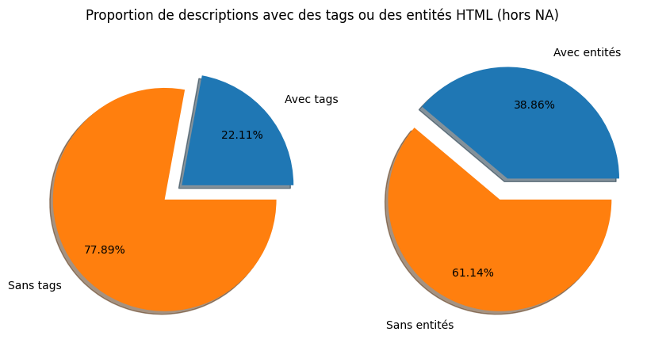
    


Ici, on peut voir qu'une proportion significative de **descriptions** contient des tag ou entités HTML.

**designation** contient-il, lui aussi du HTML ? Tentons de répondre à cette question.


```python
has_html = df['designation'].str.contains(regex_tags)
has_html.sum()
```


    1


Seule une **designation** semble contenir des tags HTML. Cela semble curieux. Examinons son contenu:


```python
print(df.iloc[has_html[has_html].index[0]]['designation'])
```

    Excelsior N° 2362 Du 04/05/1917 - Les Anglais Enlevent D'importantes Positions De La Ligne Hindenburg - Un Camp De 10000 Prisonniers En - Ensemble De Camp D'i En <Att> Contenant 10000 Hommes Le Comandant Du Camp Est A Droite Dans Le Groupe D'offic...


La ligne est assez longue mais on peut voir que ce qu'on prenait pour un tag HTML n'est est pas un: `<Att>`

Maintenant, regardons si *designation* contient des entités HTML.


```python
has_entities = df['designation'].str.contains(regex_entities)
has_entities.sum()
```


    990


990 occurrences de **designation** contiennent des entités html. C'est relativement peu.

Nous désirons commencer à examiner les langues ainsi que la fréquence des mots. Les éléments HTML que nous avons trouvés risquent de nous gêner dans ces tâches. Pour nous faciliter la tâche nous allons les supprimer.

Créons une fonction qui va permettre de supprimer les tags HTML et remplacer les entités par leur caractères normaux.


```python


def clean_html_stuff(col):
  regex_tags_nl = re.compile('<\s*(?:br|p|li)\s?.*?>',flags=re.IGNORECASE)
  regex_tags_space = re.compile('<.*?>')

  new_col = []
  for text in tqdm(col):
    if not pd.isnull(text):
      # remplacement de certains tags par '\n'
      # Ca permet de conserver un peu de la structure du texte au cas
      # où les modèles de nlp et/ou deep learning y soit sensibles
      # (c'est aussi plus agréable à l'oeil)
      text = re.sub(regex_tags_nl,'\n',text)
      # remplacement des tags restants par des espaces
      # J'ai choisi un espace plutôt qu'une chaine vide
      # pour éviter de concaténer des mots par erreur.
      # Ex remplacement par chaine vide:
      # "info<span>importante</span>" => "infoimportante"
      # Ex remplacement par espace
      # "info<span>importante</span>" => "info importante "
      # Ca produit quelques espaces en plus mais ça ne devrait pas poser
      # de problèmes
      text = re.sub(regex_tags_space,' ',text)
      # J'ai choisi de faire le remplacement des entité html après celui des tags
      # pour eviter le scenario ci-dessous
      # Remplacement avant tags:
      # "Enceinte &lt; 5kg et &gt; 8DB" => "Enceinte 8DB"
      # Remplacement après tags:
      # "Enceinte &lt; 5kg et &gt; 8DB" => "Enceinte < 5kg et > 8DB"
      # L'inconvénient en revanche, c'est que quelques tag qui étaient
      # encodés avec des &lt; &gt; subsitent mais ils sont peu
      # nombreux sur le volume des données
      text = html.unescape(text)
    new_col.append(text)

  return new_col
```

Nous pouvons maintenant appliquer cette fonction aux variables **designation** et **description**


```python
df['designation'] = clean_html_stuff(df['designation'])
df['description'] = clean_html_stuff(df['description'])
```

    100%|██████████| 84916/84916 [00:01<00:00, 55075.18it/s]
    100%|██████████| 84916/84916 [00:03<00:00, 22884.43it/s]


## Analyse des langues

En parcourant les données, on peut constater qu'hormis du HTML les données textes semblent être dans plusieurs langues. Beaucoup semblent rédigées en français mais on trouve également de l'anglais et de l'allemand dans des proportions non négligeables. Il pourrait aussi y avoir d'autres langues que nous n'avons pas remarqué, le volume de données étant important.

Pour tenter d'y voir plus clair, on peut recourir à la librairie **langdetect** qui permet de détecter la langue la plus probable d'un texte. Selon la documentation, plus le texte est long, plus la fiabilité de la détection augmente. Commençons donc par créer ajouter une variable **text** qui sera la concaténation de **designation** et **description**


```python
df['description'] = df['description'].fillna('')
df['text'] = df['designation'] + " - " + df['description']
```

Nous pouvons maintenant procéder à la détection des langues sur cette la variable **text**. Nous allons ajouter deux colonnes: **lang** et **lang_prob** contenant respectivement le code à 2 lettres du langage (fr,en,de etc...) et la probabilité que cette langue ait été détectée correctement.

Comme cette détection est lente, nous sauvegardons son résultat dans un fichier csv **Output/data-exploration/lang.csv**. Ainsi, si ce fichier est présent, les executions suivantes de cette cellule n'auront pas à refaire la détection.


```python
if 'lang' in df.columns:
  df.drop(['lang'],axis=1,inplace=True)
if 'lang_prob' in df.columns:
  df.drop(['lang_prob'],axis=1,inplace=True)

output_dir = "output/data-exploration"
lang_file_path = output_dir + "/lang.csv"
lang_file = Path(lang_file_path)
if lang_file.exists():
  print("chargement du fichier existant:",lang_file_path)
  lang_df = pd.read_csv(lang_file_path,index_col=0)

else :
  print("detection des langues")
  lang_text = []
  lang_text_prob = []
  for text in tqdm(df['text']):
    detected_langs = detect_langs(text)
    if len(detected_langs) > 0:
      lang_text.append(detected_langs[0].lang)
      lang_text_prob.append(detected_langs[0].prob)
    else:
      lang_text.append(np.NaN)
      lang_text_prob.append(np.NaN)

  lang_df = pd.DataFrame(index=df.index,columns=['lang','lang_prob'])
  lang_df['lang'] = lang_text
  lang_df['lang_prob'] = lang_text_prob
  print("sauvgarde dans le fichier:",lang_file_path)
  Path(output_dir).mkdir(parents=True, exist_ok=True)
  lang_df.to_csv(lang_file_path)


df = df.join(lang_df,how="inner")
```

    chargement du fichier existant: output/data-exploration/lang.csv


Affichons maintenant **df** avec les nouvelles colonnes issues de la détection


```python
df.head()
```


  <div id="df-0e316519-8737-42d3-a628-0b09a2534343" class="colab-df-container">
    <div>
<style scoped>
    .dataframe tbody tr th:only-of-type {
        vertical-align: middle;
    }

    .dataframe tbody tr th {
        vertical-align: top;
    }

    .dataframe thead th {
        text-align: right;
    }
</style>
<table border="1" class="dataframe">
  <thead>
    <tr style="text-align: right;">
      <th></th>
      <th>designation</th>
      <th>description</th>
      <th>productid</th>
      <th>imageid</th>
      <th>prdtypecode</th>
      <th>categorie</th>
      <th>text</th>
      <th>lang</th>
      <th>lang_prob</th>
    </tr>
    <tr>
      <th>index</th>
      <th></th>
      <th></th>
      <th></th>
      <th></th>
      <th></th>
      <th></th>
      <th></th>
      <th></th>
      <th></th>
    </tr>
  </thead>
  <tbody>
    <tr>
      <th>0</th>
      <td>Olivia: Personalisiertes Notizbuch / 150 Seite...</td>
      <td></td>
      <td>3804725264</td>
      <td>1263597046</td>
      <td>10</td>
      <td>Livre occasion</td>
      <td>Olivia: Personalisiertes Notizbuch / 150 Seite...</td>
      <td>de</td>
      <td>0.999995</td>
    </tr>
    <tr>
      <th>1</th>
      <td>Journal Des Arts (Le) N° 133 Du 28/09/2001 - L...</td>
      <td></td>
      <td>436067568</td>
      <td>1008141237</td>
      <td>2280</td>
      <td>Revues et journaux</td>
      <td>Journal Des Arts (Le) N° 133 Du 28/09/2001 - L...</td>
      <td>fr</td>
      <td>0.999998</td>
    </tr>
    <tr>
      <th>2</th>
      <td>Grand Stylet Ergonomique Bleu Gamepad Nintendo...</td>
      <td>PILOT STYLE Touch Pen de marque Speedlink est ...</td>
      <td>201115110</td>
      <td>938777978</td>
      <td>50</td>
      <td>Accessoire Console</td>
      <td>Grand Stylet Ergonomique Bleu Gamepad Nintendo...</td>
      <td>fr</td>
      <td>0.999995</td>
    </tr>
    <tr>
      <th>3</th>
      <td>Peluche Donald - Europe - Disneyland 2000 (Mar...</td>
      <td></td>
      <td>50418756</td>
      <td>457047496</td>
      <td>1280</td>
      <td>Jouet enfant, déguisement</td>
      <td>Peluche Donald - Europe - Disneyland 2000 (Mar...</td>
      <td>de</td>
      <td>0.857137</td>
    </tr>
    <tr>
      <th>4</th>
      <td>La Guerre Des Tuques</td>
      <td>Luc a des idées de grandeur. Il veut organiser...</td>
      <td>278535884</td>
      <td>1077757786</td>
      <td>2705</td>
      <td>Livre neuf</td>
      <td>La Guerre Des Tuques - Luc a des idées de gran...</td>
      <td>fr</td>
      <td>0.999999</td>
    </tr>
  </tbody>
</table>
</div>
    <div class="colab-df-buttons">

  <div class="colab-df-container">
    <button class="colab-df-convert" onclick="convertToInteractive('df-0e316519-8737-42d3-a628-0b09a2534343')"
            title="Convert this dataframe to an interactive table."
            style="display:none;">

  <svg xmlns="http://www.w3.org/2000/svg" height="24px" viewBox="0 -960 960 960">
    <path d="M120-120v-720h720v720H120Zm60-500h600v-160H180v160Zm220 220h160v-160H400v160Zm0 220h160v-160H400v160ZM180-400h160v-160H180v160Zm440 0h160v-160H620v160ZM180-180h160v-160H180v160Zm440 0h160v-160H620v160Z"/>
  </svg>
    </button>

  <style>
    .colab-df-container {
      display:flex;
      gap: 12px;
    }

    .colab-df-convert {
      background-color: #E8F0FE;
      border: none;
      border-radius: 50%;
      cursor: pointer;
      display: none;
      fill: #1967D2;
      height: 32px;
      padding: 0 0 0 0;
      width: 32px;
    }

    .colab-df-convert:hover {
      background-color: #E2EBFA;
      box-shadow: 0px 1px 2px rgba(60, 64, 67, 0.3), 0px 1px 3px 1px rgba(60, 64, 67, 0.15);
      fill: #174EA6;
    }

    .colab-df-buttons div {
      margin-bottom: 4px;
    }

    [theme=dark] .colab-df-convert {
      background-color: #3B4455;
      fill: #D2E3FC;
    }

    [theme=dark] .colab-df-convert:hover {
      background-color: #434B5C;
      box-shadow: 0px 1px 3px 1px rgba(0, 0, 0, 0.15);
      filter: drop-shadow(0px 1px 2px rgba(0, 0, 0, 0.3));
      fill: #FFFFFF;
    }
  </style>

    <script>
      const buttonEl =
        document.querySelector('#df-0e316519-8737-42d3-a628-0b09a2534343 button.colab-df-convert');
      buttonEl.style.display =
        google.colab.kernel.accessAllowed ? 'block' : 'none';

      async function convertToInteractive(key) {
        const element = document.querySelector('#df-0e316519-8737-42d3-a628-0b09a2534343');
        const dataTable =
          await google.colab.kernel.invokeFunction('convertToInteractive',
                                                    [key], {});
        if (!dataTable) return;

        const docLinkHtml = 'Like what you see? Visit the ' +
          '<a target="_blank" href=https://colab.research.google.com/notebooks/data_table.ipynb>data table notebook</a>'
          + ' to learn more about interactive tables.';
        element.innerHTML = '';
        dataTable['output_type'] = 'display_data';
        await google.colab.output.renderOutput(dataTable, element);
        const docLink = document.createElement('div');
        docLink.innerHTML = docLinkHtml;
        element.appendChild(docLink);
      }
    </script>
  </div>


<div id="df-048fca84-7b0d-4e13-9ed2-54aa40589280">
  <button class="colab-df-quickchart" onclick="quickchart('df-048fca84-7b0d-4e13-9ed2-54aa40589280')"
            title="Suggest charts"
            style="display:none;">

<svg xmlns="http://www.w3.org/2000/svg" height="24px"viewBox="0 0 24 24"
     width="24px">
    <g>
        <path d="M19 3H5c-1.1 0-2 .9-2 2v14c0 1.1.9 2 2 2h14c1.1 0 2-.9 2-2V5c0-1.1-.9-2-2-2zM9 17H7v-7h2v7zm4 0h-2V7h2v10zm4 0h-2v-4h2v4z"/>
    </g>
</svg>
  </button>

<style>
  .colab-df-quickchart {
      --bg-color: #E8F0FE;
      --fill-color: #1967D2;
      --hover-bg-color: #E2EBFA;
      --hover-fill-color: #174EA6;
      --disabled-fill-color: #AAA;
      --disabled-bg-color: #DDD;
  }

  [theme=dark] .colab-df-quickchart {
      --bg-color: #3B4455;
      --fill-color: #D2E3FC;
      --hover-bg-color: #434B5C;
      --hover-fill-color: #FFFFFF;
      --disabled-bg-color: #3B4455;
      --disabled-fill-color: #666;
  }

  .colab-df-quickchart {
    background-color: var(--bg-color);
    border: none;
    border-radius: 50%;
    cursor: pointer;
    display: none;
    fill: var(--fill-color);
    height: 32px;
    padding: 0;
    width: 32px;
  }

  .colab-df-quickchart:hover {
    background-color: var(--hover-bg-color);
    box-shadow: 0 1px 2px rgba(60, 64, 67, 0.3), 0 1px 3px 1px rgba(60, 64, 67, 0.15);
    fill: var(--button-hover-fill-color);
  }

  .colab-df-quickchart-complete:disabled,
  .colab-df-quickchart-complete:disabled:hover {
    background-color: var(--disabled-bg-color);
    fill: var(--disabled-fill-color);
    box-shadow: none;
  }

  .colab-df-spinner {
    border: 2px solid var(--fill-color);
    border-color: transparent;
    border-bottom-color: var(--fill-color);
    animation:
      spin 1s steps(1) infinite;
  }

  @keyframes spin {
    0% {
      border-color: transparent;
      border-bottom-color: var(--fill-color);
      border-left-color: var(--fill-color);
    }
    20% {
      border-color: transparent;
      border-left-color: var(--fill-color);
      border-top-color: var(--fill-color);
    }
    30% {
      border-color: transparent;
      border-left-color: var(--fill-color);
      border-top-color: var(--fill-color);
      border-right-color: var(--fill-color);
    }
    40% {
      border-color: transparent;
      border-right-color: var(--fill-color);
      border-top-color: var(--fill-color);
    }
    60% {
      border-color: transparent;
      border-right-color: var(--fill-color);
    }
    80% {
      border-color: transparent;
      border-right-color: var(--fill-color);
      border-bottom-color: var(--fill-color);
    }
    90% {
      border-color: transparent;
      border-bottom-color: var(--fill-color);
    }
  }
</style>

  <script>
    async function quickchart(key) {
      const quickchartButtonEl =
        document.querySelector('#' + key + ' button');
      quickchartButtonEl.disabled = true;  // To prevent multiple clicks.
      quickchartButtonEl.classList.add('colab-df-spinner');
      try {
        const charts = await google.colab.kernel.invokeFunction(
            'suggestCharts', [key], {});
      } catch (error) {
        console.error('Error during call to suggestCharts:', error);
      }
      quickchartButtonEl.classList.remove('colab-df-spinner');
      quickchartButtonEl.classList.add('colab-df-quickchart-complete');
    }
    (() => {
      let quickchartButtonEl =
        document.querySelector('#df-048fca84-7b0d-4e13-9ed2-54aa40589280 button');
      quickchartButtonEl.style.display =
        google.colab.kernel.accessAllowed ? 'block' : 'none';
    })();
  </script>
</div>
    </div>
  </div>


On voit que la détection semble avoir fonctionné. A première vue, la fiabilité de la détection est excellente mais vérifions tout de même sur l'ensemble des données.


```python
df['lang_prob'].describe()
```


    count    84916.000000
    mean         0.953951
    std          0.119477
    min          0.285713
    25%          0.999995
    50%          0.999996
    75%          0.999997
    max          1.000000
    Name: lang_prob, dtype: float64


On observe que les probabilités de détection correctes sont en général très bonnes. Dès le premier quartile (25%), on a déjà une probabilité d'à peu près 0.99. La moyenne de 95% et la médiane de 99.9% nous confirme qu'on peut avoir confiance en la détection.

Le code de la détection peut produire des valeurs nulles si aucune langue n'a pu être détectée par **langdetect**, vérifions que ce n'est pas le cas.


```python
df[['lang','lang_prob']].info()

```

    <class 'pandas.core.frame.DataFrame'>
    Int64Index: 84916 entries, 0 to 84915
    Data columns (total 2 columns):
     #   Column     Non-Null Count  Dtype  
    ---  ------     --------------  -----  
     0   lang       84916 non-null  object 
     1   lang_prob  84916 non-null  float64
    dtypes: float64(1), object(1)
    memory usage: 4.0+ MB


On voit que ni **lang**, ni **lang_prob**  ne contiennent de valeurs manquantes.

On peut supprimer la colonne **lang_prob** maintenant que nous sommes rassurés sur la qualité de la détection


```python
df.drop('lang_prob',axis=1,inplace=True)
```

Maintenant que nous avons une langue pour chaque observation, on peut examiner la répartition des contenus par langue. Observons ça sur un graphique en barres.


```python
# Calcul du nombre de valeurs
total = df['lang'].value_counts().sum()
# Calcul du cumul des valeurs
cumul = df['lang'].value_counts().cumsum() / total *100

# graphique en barres avec les comptes par langue
fig, ax1 = plt.subplots(figsize = (12, 4))
sns.countplot(x = df.lang, order = df.lang.value_counts().index, ax = ax1)

# Création d'un deuxième axe y pour le cumul
ax2 = ax1.twinx()
# Ligne de cumul sur le deuxième axe y
ax2.plot(cumul.index, cumul.values, color='red', marker='o', linestyle='-', linewidth=2)
ax2.set_ylabel('Cumul')
# Ajustement de l'échelle du deuxième axe
ax2.set_ylim(0, cumul.values[-1])

plt.title('Nombre de contenus par langues détectés')
# Afficher la grille seulement pour le deuxième axe y
ax2.grid(None)
ax1.grid(None)
ax1.yaxis.grid(None)
ax2.yaxis.grid(True)
# Ajout annotations
plt.text(cumul.index[2], cumul.values[2] - 10, str(round(cumul.values[2],1)), ha='center', va='bottom')
plt.text(cumul.index[4], cumul.values[4] - 10, str(round(cumul.values[4],1)), ha='center', va='bottom')
plt.text(cumul.index[6], cumul.values[6] - 10, str(round(cumul.values[6],1)), ha='center', va='bottom')
plt.show();
```


    
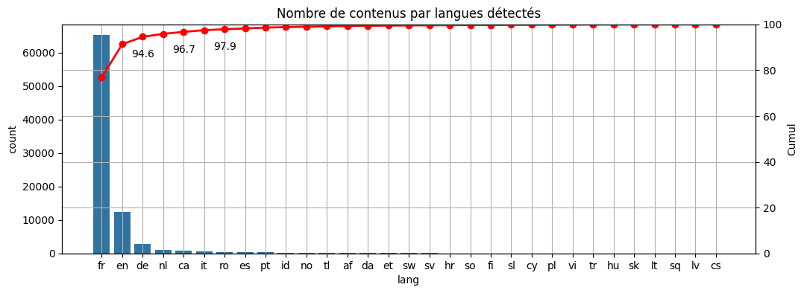
    


On observe que le dataset ne compte pas moins de 16 langues. Cependant la plupart sont extrêmement minoritaires. Trois langues sont largement majoritaires: Le français, l'anglais puis l'allemand. A elles seules, elles représentent plus de 95% du contenu.

La répartition parmi ces trois langues est également hétéroclite puisque le français compte déjà pour plus de 75% suivi de très loin par l'anglais qui compte pour 5 fois moins et enfin de l'allemand représentant à peu près 1/3 du contenu anglais.

Pour se faire une idée plus juste des proportions. Observons la répartition des langues sur un camembert. On considérera que les langues qui ne font pas partie d'une des trois plus fréquentes peuvent être reléguées dans une catégorie autre afin de ne pas nuire à la lisibilité du graphique.


```python
lang_simple = df['lang']
# On obtients la liste des langues minoritaires en excluant les trois
# majoritaires puis on les remplace par "other" pour ne pas surcharger le graph
other_langs = df['lang'].value_counts().index[3:]
lang_simple = lang_simple.replace(other_langs,"other")
lang_counts = lang_simple.value_counts()

# Créer le diagramme en camembert avec Plotly
fig = go.Figure(data=[go.Pie(labels=lang_counts.index, values=lang_counts.values)])
fig.show()
```


<html>
<head><meta charset="utf-8" /></head>
<body>
    <div>            <script src="https://cdnjs.cloudflare.com/ajax/libs/mathjax/2.7.5/MathJax.js?config=TeX-AMS-MML_SVG"></script><script type="text/javascript">if (window.MathJax && window.MathJax.Hub && window.MathJax.Hub.Config) {window.MathJax.Hub.Config({SVG: {font: "STIX-Web"}});}</script>                <script type="text/javascript">window.PlotlyConfig = {MathJaxConfig: 'local'};</script>
        <script charset="utf-8" src="https://cdn.plot.ly/plotly-2.24.1.min.js"></script>                <div id="9c31f737-b874-4bb1-a463-226685850a39" class="plotly-graph-div" style="height:525px; width:100%;"></div>            <script type="text/javascript">                                    window.PLOTLYENV=window.PLOTLYENV || {};                                    if (document.getElementById("9c31f737-b874-4bb1-a463-226685850a39")) {                    Plotly.newPlot(                        "9c31f737-b874-4bb1-a463-226685850a39",                        [{"labels":["fr","en","other","de"],"values":[65207,12328,4624,2757],"type":"pie"}],                        {"template":{"data":{"histogram2dcontour":[{"type":"histogram2dcontour","colorbar":{"outlinewidth":0,"ticks":""},"colorscale":[[0.0,"#0d0887"],[0.1111111111111111,"#46039f"],[0.2222222222222222,"#7201a8"],[0.3333333333333333,"#9c179e"],[0.4444444444444444,"#bd3786"],[0.5555555555555556,"#d8576b"],[0.6666666666666666,"#ed7953"],[0.7777777777777778,"#fb9f3a"],[0.8888888888888888,"#fdca26"],[1.0,"#f0f921"]]}],"choropleth":[{"type":"choropleth","colorbar":{"outlinewidth":0,"ticks":""}}],"histogram2d":[{"type":"histogram2d","colorbar":{"outlinewidth":0,"ticks":""},"colorscale":[[0.0,"#0d0887"],[0.1111111111111111,"#46039f"],[0.2222222222222222,"#7201a8"],[0.3333333333333333,"#9c179e"],[0.4444444444444444,"#bd3786"],[0.5555555555555556,"#d8576b"],[0.6666666666666666,"#ed7953"],[0.7777777777777778,"#fb9f3a"],[0.8888888888888888,"#fdca26"],[1.0,"#f0f921"]]}],"heatmap":[{"type":"heatmap","colorbar":{"outlinewidth":0,"ticks":""},"colorscale":[[0.0,"#0d0887"],[0.1111111111111111,"#46039f"],[0.2222222222222222,"#7201a8"],[0.3333333333333333,"#9c179e"],[0.4444444444444444,"#bd3786"],[0.5555555555555556,"#d8576b"],[0.6666666666666666,"#ed7953"],[0.7777777777777778,"#fb9f3a"],[0.8888888888888888,"#fdca26"],[1.0,"#f0f921"]]}],"heatmapgl":[{"type":"heatmapgl","colorbar":{"outlinewidth":0,"ticks":""},"colorscale":[[0.0,"#0d0887"],[0.1111111111111111,"#46039f"],[0.2222222222222222,"#7201a8"],[0.3333333333333333,"#9c179e"],[0.4444444444444444,"#bd3786"],[0.5555555555555556,"#d8576b"],[0.6666666666666666,"#ed7953"],[0.7777777777777778,"#fb9f3a"],[0.8888888888888888,"#fdca26"],[1.0,"#f0f921"]]}],"contourcarpet":[{"type":"contourcarpet","colorbar":{"outlinewidth":0,"ticks":""}}],"contour":[{"type":"contour","colorbar":{"outlinewidth":0,"ticks":""},"colorscale":[[0.0,"#0d0887"],[0.1111111111111111,"#46039f"],[0.2222222222222222,"#7201a8"],[0.3333333333333333,"#9c179e"],[0.4444444444444444,"#bd3786"],[0.5555555555555556,"#d8576b"],[0.6666666666666666,"#ed7953"],[0.7777777777777778,"#fb9f3a"],[0.8888888888888888,"#fdca26"],[1.0,"#f0f921"]]}],"surface":[{"type":"surface","colorbar":{"outlinewidth":0,"ticks":""},"colorscale":[[0.0,"#0d0887"],[0.1111111111111111,"#46039f"],[0.2222222222222222,"#7201a8"],[0.3333333333333333,"#9c179e"],[0.4444444444444444,"#bd3786"],[0.5555555555555556,"#d8576b"],[0.6666666666666666,"#ed7953"],[0.7777777777777778,"#fb9f3a"],[0.8888888888888888,"#fdca26"],[1.0,"#f0f921"]]}],"mesh3d":[{"type":"mesh3d","colorbar":{"outlinewidth":0,"ticks":""}}],"scatter":[{"fillpattern":{"fillmode":"overlay","size":10,"solidity":0.2},"type":"scatter"}],"parcoords":[{"type":"parcoords","line":{"colorbar":{"outlinewidth":0,"ticks":""}}}],"scatterpolargl":[{"type":"scatterpolargl","marker":{"colorbar":{"outlinewidth":0,"ticks":""}}}],"bar":[{"error_x":{"color":"#2a3f5f"},"error_y":{"color":"#2a3f5f"},"marker":{"line":{"color":"#E5ECF6","width":0.5},"pattern":{"fillmode":"overlay","size":10,"solidity":0.2}},"type":"bar"}],"scattergeo":[{"type":"scattergeo","marker":{"colorbar":{"outlinewidth":0,"ticks":""}}}],"scatterpolar":[{"type":"scatterpolar","marker":{"colorbar":{"outlinewidth":0,"ticks":""}}}],"histogram":[{"marker":{"pattern":{"fillmode":"overlay","size":10,"solidity":0.2}},"type":"histogram"}],"scattergl":[{"type":"scattergl","marker":{"colorbar":{"outlinewidth":0,"ticks":""}}}],"scatter3d":[{"type":"scatter3d","line":{"colorbar":{"outlinewidth":0,"ticks":""}},"marker":{"colorbar":{"outlinewidth":0,"ticks":""}}}],"scattermapbox":[{"type":"scattermapbox","marker":{"colorbar":{"outlinewidth":0,"ticks":""}}}],"scatterternary":[{"type":"scatterternary","marker":{"colorbar":{"outlinewidth":0,"ticks":""}}}],"scattercarpet":[{"type":"scattercarpet","marker":{"colorbar":{"outlinewidth":0,"ticks":""}}}],"carpet":[{"aaxis":{"endlinecolor":"#2a3f5f","gridcolor":"white","linecolor":"white","minorgridcolor":"white","startlinecolor":"#2a3f5f"},"baxis":{"endlinecolor":"#2a3f5f","gridcolor":"white","linecolor":"white","minorgridcolor":"white","startlinecolor":"#2a3f5f"},"type":"carpet"}],"table":[{"cells":{"fill":{"color":"#EBF0F8"},"line":{"color":"white"}},"header":{"fill":{"color":"#C8D4E3"},"line":{"color":"white"}},"type":"table"}],"barpolar":[{"marker":{"line":{"color":"#E5ECF6","width":0.5},"pattern":{"fillmode":"overlay","size":10,"solidity":0.2}},"type":"barpolar"}],"pie":[{"automargin":true,"type":"pie"}]},"layout":{"autotypenumbers":"strict","colorway":["#636efa","#EF553B","#00cc96","#ab63fa","#FFA15A","#19d3f3","#FF6692","#B6E880","#FF97FF","#FECB52"],"font":{"color":"#2a3f5f"},"hovermode":"closest","hoverlabel":{"align":"left"},"paper_bgcolor":"white","plot_bgcolor":"#E5ECF6","polar":{"bgcolor":"#E5ECF6","angularaxis":{"gridcolor":"white","linecolor":"white","ticks":""},"radialaxis":{"gridcolor":"white","linecolor":"white","ticks":""}},"ternary":{"bgcolor":"#E5ECF6","aaxis":{"gridcolor":"white","linecolor":"white","ticks":""},"baxis":{"gridcolor":"white","linecolor":"white","ticks":""},"caxis":{"gridcolor":"white","linecolor":"white","ticks":""}},"coloraxis":{"colorbar":{"outlinewidth":0,"ticks":""}},"colorscale":{"sequential":[[0.0,"#0d0887"],[0.1111111111111111,"#46039f"],[0.2222222222222222,"#7201a8"],[0.3333333333333333,"#9c179e"],[0.4444444444444444,"#bd3786"],[0.5555555555555556,"#d8576b"],[0.6666666666666666,"#ed7953"],[0.7777777777777778,"#fb9f3a"],[0.8888888888888888,"#fdca26"],[1.0,"#f0f921"]],"sequentialminus":[[0.0,"#0d0887"],[0.1111111111111111,"#46039f"],[0.2222222222222222,"#7201a8"],[0.3333333333333333,"#9c179e"],[0.4444444444444444,"#bd3786"],[0.5555555555555556,"#d8576b"],[0.6666666666666666,"#ed7953"],[0.7777777777777778,"#fb9f3a"],[0.8888888888888888,"#fdca26"],[1.0,"#f0f921"]],"diverging":[[0,"#8e0152"],[0.1,"#c51b7d"],[0.2,"#de77ae"],[0.3,"#f1b6da"],[0.4,"#fde0ef"],[0.5,"#f7f7f7"],[0.6,"#e6f5d0"],[0.7,"#b8e186"],[0.8,"#7fbc41"],[0.9,"#4d9221"],[1,"#276419"]]},"xaxis":{"gridcolor":"white","linecolor":"white","ticks":"","title":{"standoff":15},"zerolinecolor":"white","automargin":true,"zerolinewidth":2},"yaxis":{"gridcolor":"white","linecolor":"white","ticks":"","title":{"standoff":15},"zerolinecolor":"white","automargin":true,"zerolinewidth":2},"scene":{"xaxis":{"backgroundcolor":"#E5ECF6","gridcolor":"white","linecolor":"white","showbackground":true,"ticks":"","zerolinecolor":"white","gridwidth":2},"yaxis":{"backgroundcolor":"#E5ECF6","gridcolor":"white","linecolor":"white","showbackground":true,"ticks":"","zerolinecolor":"white","gridwidth":2},"zaxis":{"backgroundcolor":"#E5ECF6","gridcolor":"white","linecolor":"white","showbackground":true,"ticks":"","zerolinecolor":"white","gridwidth":2}},"shapedefaults":{"line":{"color":"#2a3f5f"}},"annotationdefaults":{"arrowcolor":"#2a3f5f","arrowhead":0,"arrowwidth":1},"geo":{"bgcolor":"white","landcolor":"#E5ECF6","subunitcolor":"white","showland":true,"showlakes":true,"lakecolor":"white"},"title":{"x":0.05},"mapbox":{"style":"light"}}}},                        {"responsive": true}                    ).then(function(){

var gd = document.getElementById('9c31f737-b874-4bb1-a463-226685850a39');
var x = new MutationObserver(function (mutations, observer) {{
        var display = window.getComputedStyle(gd).display;
        if (!display || display === 'none') {{
            console.log([gd, 'removed!']);
            Plotly.purge(gd);
            observer.disconnect();
        }}
}});

// Listen for the removal of the full notebook cells
var notebookContainer = gd.closest('#notebook-container');
if (notebookContainer) {{
    x.observe(notebookContainer, {childList: true});
}}

// Listen for the clearing of the current output cell
var outputEl = gd.closest('.output');
if (outputEl) {{
    x.observe(outputEl, {childList: true});
}}

                        })                };                            </script>        </div>
</body>
</html>


On retrouve d'une façon plus explicite les chiffres qu'on a vu sur le graphique en barres. Le français en tête avec 77% suivi de l'anglais comptant pour 15% puis de l'allemand avec 3%. Quant au cumul des autres langues, il atteint à peine 5%.

La plupart des modèles ne NLP fonctionnent avec l'anglais. Bien qu'il y ait des versions adaptées pour le français, ça reste des modèles différents. Admettons qu'on veuille résoudre ce problème de classification pour le français et l'anglais séparément en omettant les autres langues minoritaires, ça pourrait impliquer de doubler la charge de travail.

Une autre technique consisterait à ne conserver que le contenu français cependant ça représenterait tout de même une perte de données de 25% environ. Avant de considérer cette alternative, vérifions la répartition des langues par type de produit. On ne peut se permettre de supprimer une langue si celle-ci représente une part importante des observations pour un type de produit.  


```python


plt.figure(figsize=(12,12))
sns.displot(y=df['categorie'],hue=lang_simple,multiple="stack",aspect=1.7,binwidth=2)
plt.title("Repartition des langues par types de produit")
plt.show()
```


    <Figure size 1200x1200 with 0 Axes>


    
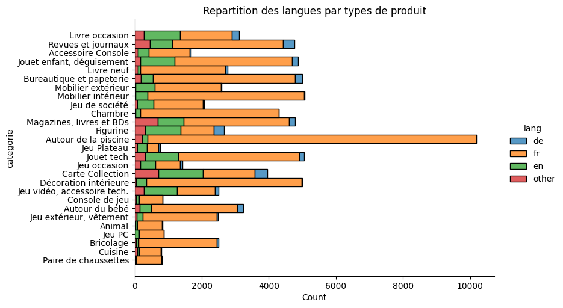
    


Un point rassurant est que le français constitue la majorité (relative et non absolue) dans chaque type de produit. Cependant on observe quand même que pour certains types comme *jeu de plateau* cette majorité relative est ténue. Retirer les autres langues alors que le nombre de produits y est déjà faible pourrait produire un déséquilibre dans la distribution des classes de produits et compromettre la fiabilité de la classification.

Une autre technique qui éviterait ces écueils consisterait à traduire toutes les langues vers le français. La faisabilité reste encore à expérimenter sur un dataset de cette taille mais ça vaudra la peine de s'y pencher pendant la phase de pre-processing

## Fréquence des mots sur **designation** et **text**

Une façon d'approfondir notre analyse des données consiste à observer la fréquence des mots contenus dans les variables textuelles.

Ajoutons deux colonnes **mots_designation** et **mots_text** qui vont contenir la liste des mots extraits depuis leur colonne respective **designation** et **text**. Étudier séparément chacune de ces colonnes devrait nous permettre de souligner les différences entre la fréquence globale des mots et celle de **designation**.

On procède à l'extraction des mots par une *tokenization maison* à base d'expressions régulières tout en étant vigilant à exclure les mots qui apportent peu d'informations à notre analyse fréquentielle.  


```python
# Création d'une liste personnalisée de stopwords français, anglais et allemends
french_stopwords = set(nltk_stopwords.words('french'))
english_stopwords = set(nltk_stopwords.words('english'))
dutch_stopwords = set(nltk_stopwords.words('dutch'))
combined_stopwords = french_stopwords.union(english_stopwords)

# Fonction pour nettoyer et extraire les mots, en excluant les stopwords
def extract_words(text):
    # Utilisation d'une expression régulière pour ne conserver que les mots
    words = re.findall(r'\w+', text.lower())
    # Filtrage des mots en excluant les stopwords, les chiffres et les mots de moins de 3 lettres, et suppression des doublons
    unique_words = {word for word in words if word not in combined_stopwords and not word.isdigit() and len(word) > 2}
    return list(unique_words)

# Ajout colonne mots_designation contenant les mots de la colonne designation
df['mots_designation'] = df['designation'].apply(extract_words)
# Ajout colonne text contenant les mots de la colonne description
df['mots_text'] = df['text'].apply(extract_words)

# Affichage du résultat
display(df.head())
display(df['text'][0])
df['mots_text'][0]
```


  <div id="df-4fabe6ef-79c2-4acf-908b-ae9fe2f01a03" class="colab-df-container">
    <div>
<style scoped>
    .dataframe tbody tr th:only-of-type {
        vertical-align: middle;
    }

    .dataframe tbody tr th {
        vertical-align: top;
    }

    .dataframe thead th {
        text-align: right;
    }
</style>
<table border="1" class="dataframe">
  <thead>
    <tr style="text-align: right;">
      <th></th>
      <th>designation</th>
      <th>description</th>
      <th>productid</th>
      <th>imageid</th>
      <th>prdtypecode</th>
      <th>categorie</th>
      <th>text</th>
      <th>lang</th>
      <th>mots_designation</th>
      <th>mots_text</th>
    </tr>
    <tr>
      <th>index</th>
      <th></th>
      <th></th>
      <th></th>
      <th></th>
      <th></th>
      <th></th>
      <th></th>
      <th></th>
      <th></th>
      <th></th>
    </tr>
  </thead>
  <tbody>
    <tr>
      <th>0</th>
      <td>Olivia: Personalisiertes Notizbuch / 150 Seite...</td>
      <td></td>
      <td>3804725264</td>
      <td>1263597046</td>
      <td>10</td>
      <td>Livre occasion</td>
      <td>Olivia: Personalisiertes Notizbuch / 150 Seite...</td>
      <td>de</td>
      <td>[seiten, personalisiertes, design, din, olivia...</td>
      <td>[seiten, personalisiertes, design, din, olivia...</td>
    </tr>
    <tr>
      <th>1</th>
      <td>Journal Des Arts (Le) N° 133 Du 28/09/2001 - L...</td>
      <td></td>
      <td>436067568</td>
      <td>1008141237</td>
      <td>2280</td>
      <td>Revues et journaux</td>
      <td>Journal Des Arts (Le) N° 133 Du 28/09/2001 - L...</td>
      <td>fr</td>
      <td>[art, paris, barrere, fete, journal, encheres,...</td>
      <td>[art, paris, barrere, fete, journal, encheres,...</td>
    </tr>
    <tr>
      <th>2</th>
      <td>Grand Stylet Ergonomique Bleu Gamepad Nintendo...</td>
      <td>PILOT STYLE Touch Pen de marque Speedlink est ...</td>
      <td>201115110</td>
      <td>938777978</td>
      <td>50</td>
      <td>Accessoire Console</td>
      <td>Grand Stylet Ergonomique Bleu Gamepad Nintendo...</td>
      <td>fr</td>
      <td>[nintendo, bleu, gamepad, wii, style, speedlin...</td>
      <td>[pointe, écran, bonus, wii, fabricant, très, p...</td>
    </tr>
    <tr>
      <th>3</th>
      <td>Peluche Donald - Europe - Disneyland 2000 (Mar...</td>
      <td></td>
      <td>50418756</td>
      <td>457047496</td>
      <td>1280</td>
      <td>Jouet enfant, déguisement</td>
      <td>Peluche Donald - Europe - Disneyland 2000 (Mar...</td>
      <td>de</td>
      <td>[disneyland, europe, peluche, marionnette, don...</td>
      <td>[disneyland, europe, peluche, marionnette, don...</td>
    </tr>
    <tr>
      <th>4</th>
      <td>La Guerre Des Tuques</td>
      <td>Luc a des idées de grandeur. Il veut organiser...</td>
      <td>278535884</td>
      <td>1077757786</td>
      <td>2705</td>
      <td>Livre neuf</td>
      <td>La Guerre Des Tuques - Luc a des idées de gran...</td>
      <td>fr</td>
      <td>[guerre, tuques]</td>
      <td>[veut, idées, luc, jeu, chambarde, sophie, tou...</td>
    </tr>
  </tbody>
</table>
</div>
    <div class="colab-df-buttons">

  <div class="colab-df-container">
    <button class="colab-df-convert" onclick="convertToInteractive('df-4fabe6ef-79c2-4acf-908b-ae9fe2f01a03')"
            title="Convert this dataframe to an interactive table."
            style="display:none;">

  <svg xmlns="http://www.w3.org/2000/svg" height="24px" viewBox="0 -960 960 960">
    <path d="M120-120v-720h720v720H120Zm60-500h600v-160H180v160Zm220 220h160v-160H400v160Zm0 220h160v-160H400v160ZM180-400h160v-160H180v160Zm440 0h160v-160H620v160ZM180-180h160v-160H180v160Zm440 0h160v-160H620v160Z"/>
  </svg>
    </button>

  <style>
    .colab-df-container {
      display:flex;
      gap: 12px;
    }

    .colab-df-convert {
      background-color: #E8F0FE;
      border: none;
      border-radius: 50%;
      cursor: pointer;
      display: none;
      fill: #1967D2;
      height: 32px;
      padding: 0 0 0 0;
      width: 32px;
    }

    .colab-df-convert:hover {
      background-color: #E2EBFA;
      box-shadow: 0px 1px 2px rgba(60, 64, 67, 0.3), 0px 1px 3px 1px rgba(60, 64, 67, 0.15);
      fill: #174EA6;
    }

    .colab-df-buttons div {
      margin-bottom: 4px;
    }

    [theme=dark] .colab-df-convert {
      background-color: #3B4455;
      fill: #D2E3FC;
    }

    [theme=dark] .colab-df-convert:hover {
      background-color: #434B5C;
      box-shadow: 0px 1px 3px 1px rgba(0, 0, 0, 0.15);
      filter: drop-shadow(0px 1px 2px rgba(0, 0, 0, 0.3));
      fill: #FFFFFF;
    }
  </style>

    <script>
      const buttonEl =
        document.querySelector('#df-4fabe6ef-79c2-4acf-908b-ae9fe2f01a03 button.colab-df-convert');
      buttonEl.style.display =
        google.colab.kernel.accessAllowed ? 'block' : 'none';

      async function convertToInteractive(key) {
        const element = document.querySelector('#df-4fabe6ef-79c2-4acf-908b-ae9fe2f01a03');
        const dataTable =
          await google.colab.kernel.invokeFunction('convertToInteractive',
                                                    [key], {});
        if (!dataTable) return;

        const docLinkHtml = 'Like what you see? Visit the ' +
          '<a target="_blank" href=https://colab.research.google.com/notebooks/data_table.ipynb>data table notebook</a>'
          + ' to learn more about interactive tables.';
        element.innerHTML = '';
        dataTable['output_type'] = 'display_data';
        await google.colab.output.renderOutput(dataTable, element);
        const docLink = document.createElement('div');
        docLink.innerHTML = docLinkHtml;
        element.appendChild(docLink);
      }
    </script>
  </div>


<div id="df-394f6d23-dfca-4749-81a4-9153340ccfac">
  <button class="colab-df-quickchart" onclick="quickchart('df-394f6d23-dfca-4749-81a4-9153340ccfac')"
            title="Suggest charts"
            style="display:none;">

<svg xmlns="http://www.w3.org/2000/svg" height="24px"viewBox="0 0 24 24"
     width="24px">
    <g>
        <path d="M19 3H5c-1.1 0-2 .9-2 2v14c0 1.1.9 2 2 2h14c1.1 0 2-.9 2-2V5c0-1.1-.9-2-2-2zM9 17H7v-7h2v7zm4 0h-2V7h2v10zm4 0h-2v-4h2v4z"/>
    </g>
</svg>
  </button>

<style>
  .colab-df-quickchart {
      --bg-color: #E8F0FE;
      --fill-color: #1967D2;
      --hover-bg-color: #E2EBFA;
      --hover-fill-color: #174EA6;
      --disabled-fill-color: #AAA;
      --disabled-bg-color: #DDD;
  }

  [theme=dark] .colab-df-quickchart {
      --bg-color: #3B4455;
      --fill-color: #D2E3FC;
      --hover-bg-color: #434B5C;
      --hover-fill-color: #FFFFFF;
      --disabled-bg-color: #3B4455;
      --disabled-fill-color: #666;
  }

  .colab-df-quickchart {
    background-color: var(--bg-color);
    border: none;
    border-radius: 50%;
    cursor: pointer;
    display: none;
    fill: var(--fill-color);
    height: 32px;
    padding: 0;
    width: 32px;
  }

  .colab-df-quickchart:hover {
    background-color: var(--hover-bg-color);
    box-shadow: 0 1px 2px rgba(60, 64, 67, 0.3), 0 1px 3px 1px rgba(60, 64, 67, 0.15);
    fill: var(--button-hover-fill-color);
  }

  .colab-df-quickchart-complete:disabled,
  .colab-df-quickchart-complete:disabled:hover {
    background-color: var(--disabled-bg-color);
    fill: var(--disabled-fill-color);
    box-shadow: none;
  }

  .colab-df-spinner {
    border: 2px solid var(--fill-color);
    border-color: transparent;
    border-bottom-color: var(--fill-color);
    animation:
      spin 1s steps(1) infinite;
  }

  @keyframes spin {
    0% {
      border-color: transparent;
      border-bottom-color: var(--fill-color);
      border-left-color: var(--fill-color);
    }
    20% {
      border-color: transparent;
      border-left-color: var(--fill-color);
      border-top-color: var(--fill-color);
    }
    30% {
      border-color: transparent;
      border-left-color: var(--fill-color);
      border-top-color: var(--fill-color);
      border-right-color: var(--fill-color);
    }
    40% {
      border-color: transparent;
      border-right-color: var(--fill-color);
      border-top-color: var(--fill-color);
    }
    60% {
      border-color: transparent;
      border-right-color: var(--fill-color);
    }
    80% {
      border-color: transparent;
      border-right-color: var(--fill-color);
      border-bottom-color: var(--fill-color);
    }
    90% {
      border-color: transparent;
      border-bottom-color: var(--fill-color);
    }
  }
</style>

  <script>
    async function quickchart(key) {
      const quickchartButtonEl =
        document.querySelector('#' + key + ' button');
      quickchartButtonEl.disabled = true;  // To prevent multiple clicks.
      quickchartButtonEl.classList.add('colab-df-spinner');
      try {
        const charts = await google.colab.kernel.invokeFunction(
            'suggestCharts', [key], {});
      } catch (error) {
        console.error('Error during call to suggestCharts:', error);
      }
      quickchartButtonEl.classList.remove('colab-df-spinner');
      quickchartButtonEl.classList.add('colab-df-quickchart-complete');
    }
    (() => {
      let quickchartButtonEl =
        document.querySelector('#df-394f6d23-dfca-4749-81a4-9153340ccfac button');
      quickchartButtonEl.style.display =
        google.colab.kernel.accessAllowed ? 'block' : 'none';
    })();
  </script>
</div>
    </div>
  </div>


    'Olivia: Personalisiertes Notizbuch / 150 Seiten / Punktraster / Ca Din A5 / Rosen-Design - '


    ['seiten',
     'personalisiertes',
     'design',
     'din',
     'olivia',
     'notizbuch',
     'rosen',
     'punktraster']


L'extraction s'est bien déroulée, on constate l'apparition des deux nouvelles colonnes **mots_designation** et **mots_text**.

On peut désormais afficher un premier nuage de mots qui représente la fréquence des mots contenus dans **designation**


```python
# Génération du nuage de mots
# Création de la chaine all_word_designation en combinant toutes les listes de mots
all_word_designation = ' '.join([word for words_list in df['mots_designation'] for word in words_list])

wordcloud_designation = WordCloud(width = 800, height = 800, max_words = 1000, background_color = 'black',
                      colormap = "nipy_spectral").generate(all_word_designation)

plt.imshow(wordcloud_designation)
plt.axis("off")
plt.title('Mots contenus dans la designation')
plt.tight_layout(pad=0)
```


    
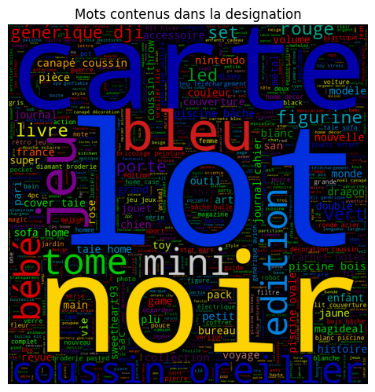
    


On observe une nette prédominance des mots français en accord avec nos observations sur la répartition des langues. On a peine à distinguer quelques mots d'anglais en arrière-plan.

Quelques mots se distinguent clairement: lot, noir, piscine. A ce stade on peut s'interroger sur une possible correspondance entre fréquence d'un mot et appartenance à une catégorie de produit. Nous aurons l'occasion de creuser la question lorsqu'on affichera les fréquences de mots par catégories.

Examinons maintenant la fréquence globale des mots, c'est à dire la fréquence des mots contenus dans la variable **text**, qui pour rappel est issue de la concaténation de **designation** et **description**


```python
# Génération du nuage de mots
# Création de la chaine all_word_texte en combinant toutes les listes de mots
all_word_texte = ' '.join([word for words_list in df['mots_text'] for word in words_list])

wordcloud_texte = WordCloud(width = 800, height = 800, max_words = 1000, background_color = 'black',
                      colormap = "nipy_spectral").generate(all_word_texte)

plt.imshow(wordcloud_texte)
plt.axis("off")
plt.title('Mots contenus dans le texte designation + description')
plt.tight_layout(pad=0)
```


    
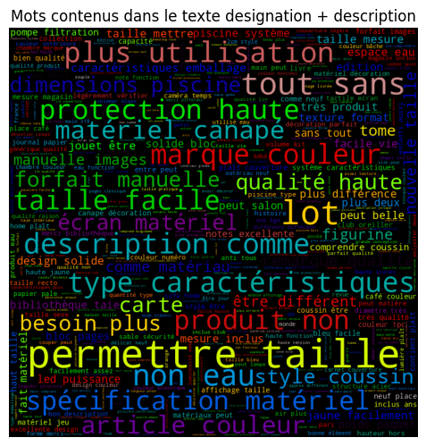
    


La prédominance du français est encore plus nette. Les rares mots anglais qu'on pouvait encore distinguer sont probablement encore plus en arrière-plan. On constate aussi que hormis *lot*, les mots les plus identifiables ont changé. C'est plutôt rassurant car ça signifie que le champ **description** apporte une information qui n'est pas redondante par rapport au champ **designation**.

Plusieurs mots en évidence ont une consonance plutôt marketing que descriptive. Notamment *neuf*, *haute*, *qualité*. C'est attendu dans du texte destiné à inciter à la vente de produits.

## Fréquence des mots dans le texte pour chaque catégorie

Penchons nous maintenant sur la fréquence des mots au sein de chaque catégorie. On voudrait afficher pour chaque catégorie la fréquence des 10 mots les plus courants.

Pour cela, on crée un DataFrame **df_plot** qui contient trois colonnes: **categorie**, **word** et **count**. Ce DataFrame aura donc 10 lignes par catégorie, chaque ligne correspondant à un des 10 mots les plus fréquents.


```python
# Attention 2/3 min de calcul si effectué sur mots_texte
# Calculer la fréquence des mots pour chaque catégorie
word_counts_by_category = {}
for category in df['categorie'].unique():
    # Filtrer les lignes par catégorie
    filtered_df = df[df['categorie'] == category]
    # Combiner tous les mots de cette catégorie
    all_words = sum(filtered_df['mots_text'], [])
    # Compter les mots et stocker dans le dictionnaire
    word_counts_by_category[category] = Counter(all_words)
```


```python
# Préparation des données pour Plotly
data = []
for category, counter in word_counts_by_category.items():
    for word, count in counter.most_common(10):  # Top 10 mots pour chaque catégorie
        data.append({'categorie': category, 'word': word, 'count': count})

df_plot = pd.DataFrame(data)
df_plot.head()
```


  <div id="df-2083eaa7-dede-42d7-b8ae-872252bd3ca8" class="colab-df-container">
    <div>
<style scoped>
    .dataframe tbody tr th:only-of-type {
        vertical-align: middle;
    }

    .dataframe tbody tr th {
        vertical-align: top;
    }

    .dataframe thead th {
        text-align: right;
    }
</style>
<table border="1" class="dataframe">
  <thead>
    <tr style="text-align: right;">
      <th></th>
      <th>categorie</th>
      <th>word</th>
      <th>count</th>
    </tr>
  </thead>
  <tbody>
    <tr>
      <th>0</th>
      <td>Livre occasion</td>
      <td>tome</td>
      <td>153</td>
    </tr>
    <tr>
      <th>1</th>
      <td>Livre occasion</td>
      <td>edition</td>
      <td>145</td>
    </tr>
    <tr>
      <th>2</th>
      <td>Livre occasion</td>
      <td>histoire</td>
      <td>92</td>
    </tr>
    <tr>
      <th>3</th>
      <td>Livre occasion</td>
      <td>édition</td>
      <td>87</td>
    </tr>
    <tr>
      <th>4</th>
      <td>Livre occasion</td>
      <td>guide</td>
      <td>86</td>
    </tr>
  </tbody>
</table>
</div>
    <div class="colab-df-buttons">

  <div class="colab-df-container">
    <button class="colab-df-convert" onclick="convertToInteractive('df-2083eaa7-dede-42d7-b8ae-872252bd3ca8')"
            title="Convert this dataframe to an interactive table."
            style="display:none;">

  <svg xmlns="http://www.w3.org/2000/svg" height="24px" viewBox="0 -960 960 960">
    <path d="M120-120v-720h720v720H120Zm60-500h600v-160H180v160Zm220 220h160v-160H400v160Zm0 220h160v-160H400v160ZM180-400h160v-160H180v160Zm440 0h160v-160H620v160ZM180-180h160v-160H180v160Zm440 0h160v-160H620v160Z"/>
  </svg>
    </button>

  <style>
    .colab-df-container {
      display:flex;
      gap: 12px;
    }

    .colab-df-convert {
      background-color: #E8F0FE;
      border: none;
      border-radius: 50%;
      cursor: pointer;
      display: none;
      fill: #1967D2;
      height: 32px;
      padding: 0 0 0 0;
      width: 32px;
    }

    .colab-df-convert:hover {
      background-color: #E2EBFA;
      box-shadow: 0px 1px 2px rgba(60, 64, 67, 0.3), 0px 1px 3px 1px rgba(60, 64, 67, 0.15);
      fill: #174EA6;
    }

    .colab-df-buttons div {
      margin-bottom: 4px;
    }

    [theme=dark] .colab-df-convert {
      background-color: #3B4455;
      fill: #D2E3FC;
    }

    [theme=dark] .colab-df-convert:hover {
      background-color: #434B5C;
      box-shadow: 0px 1px 3px 1px rgba(0, 0, 0, 0.15);
      filter: drop-shadow(0px 1px 2px rgba(0, 0, 0, 0.3));
      fill: #FFFFFF;
    }
  </style>

    <script>
      const buttonEl =
        document.querySelector('#df-2083eaa7-dede-42d7-b8ae-872252bd3ca8 button.colab-df-convert');
      buttonEl.style.display =
        google.colab.kernel.accessAllowed ? 'block' : 'none';

      async function convertToInteractive(key) {
        const element = document.querySelector('#df-2083eaa7-dede-42d7-b8ae-872252bd3ca8');
        const dataTable =
          await google.colab.kernel.invokeFunction('convertToInteractive',
                                                    [key], {});
        if (!dataTable) return;

        const docLinkHtml = 'Like what you see? Visit the ' +
          '<a target="_blank" href=https://colab.research.google.com/notebooks/data_table.ipynb>data table notebook</a>'
          + ' to learn more about interactive tables.';
        element.innerHTML = '';
        dataTable['output_type'] = 'display_data';
        await google.colab.output.renderOutput(dataTable, element);
        const docLink = document.createElement('div');
        docLink.innerHTML = docLinkHtml;
        element.appendChild(docLink);
      }
    </script>
  </div>


<div id="df-5c41c330-b491-4747-8bdf-c2d788b83429">
  <button class="colab-df-quickchart" onclick="quickchart('df-5c41c330-b491-4747-8bdf-c2d788b83429')"
            title="Suggest charts"
            style="display:none;">

<svg xmlns="http://www.w3.org/2000/svg" height="24px"viewBox="0 0 24 24"
     width="24px">
    <g>
        <path d="M19 3H5c-1.1 0-2 .9-2 2v14c0 1.1.9 2 2 2h14c1.1 0 2-.9 2-2V5c0-1.1-.9-2-2-2zM9 17H7v-7h2v7zm4 0h-2V7h2v10zm4 0h-2v-4h2v4z"/>
    </g>
</svg>
  </button>

<style>
  .colab-df-quickchart {
      --bg-color: #E8F0FE;
      --fill-color: #1967D2;
      --hover-bg-color: #E2EBFA;
      --hover-fill-color: #174EA6;
      --disabled-fill-color: #AAA;
      --disabled-bg-color: #DDD;
  }

  [theme=dark] .colab-df-quickchart {
      --bg-color: #3B4455;
      --fill-color: #D2E3FC;
      --hover-bg-color: #434B5C;
      --hover-fill-color: #FFFFFF;
      --disabled-bg-color: #3B4455;
      --disabled-fill-color: #666;
  }

  .colab-df-quickchart {
    background-color: var(--bg-color);
    border: none;
    border-radius: 50%;
    cursor: pointer;
    display: none;
    fill: var(--fill-color);
    height: 32px;
    padding: 0;
    width: 32px;
  }

  .colab-df-quickchart:hover {
    background-color: var(--hover-bg-color);
    box-shadow: 0 1px 2px rgba(60, 64, 67, 0.3), 0 1px 3px 1px rgba(60, 64, 67, 0.15);
    fill: var(--button-hover-fill-color);
  }

  .colab-df-quickchart-complete:disabled,
  .colab-df-quickchart-complete:disabled:hover {
    background-color: var(--disabled-bg-color);
    fill: var(--disabled-fill-color);
    box-shadow: none;
  }

  .colab-df-spinner {
    border: 2px solid var(--fill-color);
    border-color: transparent;
    border-bottom-color: var(--fill-color);
    animation:
      spin 1s steps(1) infinite;
  }

  @keyframes spin {
    0% {
      border-color: transparent;
      border-bottom-color: var(--fill-color);
      border-left-color: var(--fill-color);
    }
    20% {
      border-color: transparent;
      border-left-color: var(--fill-color);
      border-top-color: var(--fill-color);
    }
    30% {
      border-color: transparent;
      border-left-color: var(--fill-color);
      border-top-color: var(--fill-color);
      border-right-color: var(--fill-color);
    }
    40% {
      border-color: transparent;
      border-right-color: var(--fill-color);
      border-top-color: var(--fill-color);
    }
    60% {
      border-color: transparent;
      border-right-color: var(--fill-color);
    }
    80% {
      border-color: transparent;
      border-right-color: var(--fill-color);
      border-bottom-color: var(--fill-color);
    }
    90% {
      border-color: transparent;
      border-bottom-color: var(--fill-color);
    }
  }
</style>

  <script>
    async function quickchart(key) {
      const quickchartButtonEl =
        document.querySelector('#' + key + ' button');
      quickchartButtonEl.disabled = true;  // To prevent multiple clicks.
      quickchartButtonEl.classList.add('colab-df-spinner');
      try {
        const charts = await google.colab.kernel.invokeFunction(
            'suggestCharts', [key], {});
      } catch (error) {
        console.error('Error during call to suggestCharts:', error);
      }
      quickchartButtonEl.classList.remove('colab-df-spinner');
      quickchartButtonEl.classList.add('colab-df-quickchart-complete');
    }
    (() => {
      let quickchartButtonEl =
        document.querySelector('#df-5c41c330-b491-4747-8bdf-c2d788b83429 button');
      quickchartButtonEl.style.display =
        google.colab.kernel.accessAllowed ? 'block' : 'none';
    })();
  </script>
</div>
    </div>
  </div>


On peut maintenant utiliser **df_plot** pour afficher un ensemble de graphique en barre (un par catégorie) qui vont représenter les occurrences des dix mots les plus courants dans leur catégorie respective


```python
# Obtenir les catégories uniques
categories = df_plot['categorie'].unique()

# Créer un ensemble de subplots (3 colonnes, 9 lignes)
fig = make_subplots(rows=9, cols=3, subplot_titles=[f'Catégorie: {category}' for category in categories])

# Fonction pour ajouter des barres horizontales pour chaque catégorie
def add_bars(fig, df, category, row, col):
    filtered_df = df[df['categorie'] == category].sort_values(by='count')
    fig.add_trace(
        go.Bar(y=filtered_df['word'], x=filtered_df['count'], name=str(category), orientation='h'),
        row=row, col=col
    )

# Ajouter des barres pour chaque catégorie dans son subplot respectif
row = 1
col = 1
for category in categories:
    add_bars(fig, df_plot, category, row, col)
    col += 1
    if col > 3:
        col = 1
        row += 1

# Mise à jour de la mise en page
fig.update_layout(height=3000, width=1200, title_text="Fréquence des mots par catégorie de produit", showlegend=False)
fig.show()
```


<html>
<head><meta charset="utf-8" /></head>
<body>
    <div>            <script src="https://cdnjs.cloudflare.com/ajax/libs/mathjax/2.7.5/MathJax.js?config=TeX-AMS-MML_SVG"></script><script type="text/javascript">if (window.MathJax && window.MathJax.Hub && window.MathJax.Hub.Config) {window.MathJax.Hub.Config({SVG: {font: "STIX-Web"}});}</script>                <script type="text/javascript">window.PlotlyConfig = {MathJaxConfig: 'local'};</script>
        <script charset="utf-8" src="https://cdn.plot.ly/plotly-2.24.1.min.js"></script>                <div id="e65a9214-3d7c-4176-817d-7366927427bd" class="plotly-graph-div" style="height:3000px; width:1200px;"></div>            <script type="text/javascript">                                    window.PLOTLYENV=window.PLOTLYENV || {};                                    if (document.getElementById("e65a9214-3d7c-4176-817d-7366927427bd")) {                    Plotly.newPlot(                        "e65a9214-3d7c-4176-817d-7366927427bd",                        [{"name":"Livre occasion","orientation":"h","x":[59,62,63,67,83,86,87,92,145,153],"y":["ann\u00e9e","vie","collection","france","livre","guide","\u00e9dition","histoire","edition","tome"],"type":"bar","xaxis":"x","yaxis":"y"},{"name":"Revues et journaux","orientation":"h","x":[119,152,159,170,205,222,257,294,340,389],"y":["presse","jean","vie","petit","magazine","monde","revue","paris","journal","france"],"type":"bar","xaxis":"x2","yaxis":"y2"},{"name":"Accessoire Console","orientation":"h","x":[272,272,275,278,287,320,357,402,410,456],"y":["facile","manette","produit","protection","compatible","haute","sans","console","nintendo","jeu"],"type":"bar","xaxis":"x3","yaxis":"y3"},{"name":"Jouet enfant, d\u00e9guisement","orientation":"h","x":[927,1018,1051,1101,1107,1114,1119,1177,1401,1459],"y":["\u00eatre","qualit\u00e9","couleur","peut","plus","jouet","mat\u00e9riel","haute","enfants","taille"],"type":"bar","xaxis":"x4","yaxis":"y4"},{"name":"Livre neuf","orientation":"h","x":[351,351,360,362,377,426,484,502,509,793],"y":["aussi","monde","\u00eatre","fait","bien","comme","vie","cette","tout","plus"],"type":"bar","xaxis":"x5","yaxis":"y5"},{"name":"Bureautique et papeterie","orientation":"h","x":[872,883,897,935,997,1007,1047,1191,1211,1300],"y":["bloc","jaune","design","couverture","pages","lot","haute","taille","format","papier"],"type":"bar","xaxis":"x6","yaxis":"y6"},{"name":"Mobilier ext\u00e9rieur","orientation":"h","x":[492,494,498,506,539,607,628,783,899,948],"y":["tr\u00e8s","mat\u00e9riau","plus","\u00eatre","peut","facile","hauteur","couleur","jardin","dimensions"],"type":"bar","xaxis":"x7","yaxis":"y7"},{"name":"Mobilier int\u00e9rieur","orientation":"h","x":[1207,1214,1301,1336,1464,1479,1547,1587,1618,2088],"y":["\u00eatre","peut","facile","hauteur","taille","mat\u00e9riel","qualit\u00e9","haute","dimensions","couleur"],"type":"bar","xaxis":"x8","yaxis":"y8"},{"name":"Jeu de soci\u00e9t\u00e9","orientation":"h","x":[306,310,312,312,340,355,366,396,526,667],"y":["peut","haute","qualit\u00e9","ans","couleur","jouet","taille","plus","enfants","jeu"],"type":"bar","xaxis":"x9","yaxis":"y9"},{"name":"Chambre","orientation":"h","x":[1858,1883,1942,2243,2275,2666,2699,2705,2735,3070],"y":["qualit\u00e9","tout","canap\u00e9","pla\u00eet","mat\u00e9riel","oreiller","taie","couleur","coussin","taille"],"type":"bar","xaxis":"x10","yaxis":"y10"},{"name":"Magazines, livres et BDs","orientation":"h","x":[155,158,213,238,240,260,315,371,782,1872],"y":["livre","revue","revues","partitions","tome","collection","volumes","tomes","livres","lot"],"type":"bar","xaxis":"x11","yaxis":"y11"},{"name":"Figurine","orientation":"h","x":[163,187,189,198,203,213,234,235,294,908],"y":["officielle","collection","funko","sous","pvc","wars","star","pop","taille","figurine"],"type":"bar","xaxis":"x12","yaxis":"y12"},{"name":"Autour de la piscine","orientation":"h","x":[1934,1939,2033,2044,2275,2321,2857,3005,4491,6308],"y":["couleur","hors","bleu","kit","pompe","sol","dimensions","filtration","eau","piscine"],"type":"bar","xaxis":"x13","yaxis":"y13"},{"name":"Jeu Plateau","orientation":"h","x":[40,40,41,42,48,48,65,65,75,120],"y":["taille","couleur","masque","halloween","prince","m\u00e9tal","figurine","jeu","heroclix","warhammer"],"type":"bar","xaxis":"x14","yaxis":"y14"},{"name":"Jouet tech","orientation":"h","x":[1098,1142,1143,1165,1188,1189,1216,1465,1868,3740],"y":["facile","taille","qualit\u00e9","batterie","caract\u00e9ristiques","dji","plus","haute","drone","g\u00e9n\u00e9rique"],"type":"bar","xaxis":"x15","yaxis":"y15"},{"name":"Jeu occasion","orientation":"h","x":[129,155,166,174,189,209,230,340,352,546],"y":["neuf","ps3","wii","console","nintendo","playstation","xbox","jeu","lot","jeux"],"type":"bar","xaxis":"x16","yaxis":"y16"},{"name":"Carte Collection","orientation":"h","x":[192,194,243,247,258,293,376,444,461,1116],"y":["neuf","ball","dragon","pok\u00e9mon","pokemon","commune","rare","mtg","magic","carte"],"type":"bar","xaxis":"x17","yaxis":"y17"},{"name":"D\u00e9coration int\u00e9rieure","orientation":"h","x":[1435,1602,1855,1868,1893,1939,2051,2226,2519,2691],"y":["facile","lumi\u00e8re","\u00eatre","haute","d\u00e9coration","qualit\u00e9","peut","mat\u00e9riel","couleur","taille"],"type":"bar","xaxis":"x18","yaxis":"y18"},{"name":"Jeu vid\u00e9o, accessoire tech.","orientation":"h","x":[275,277,282,283,287,306,311,315,512,588],"y":["sous","forfait","magideal","cette","cas","description","comprend","produit","jeu","import"],"type":"bar","xaxis":"x19","yaxis":"y19"},{"name":"Console de jeu","orientation":"h","x":[582,584,586,594,594,609,620,623,649,654],"y":["ecran","tactile","paquet","oui","affichage","couleur","marque","nom","jeu","console"],"type":"bar","xaxis":"x20","yaxis":"y20"},{"name":"Autour du b\u00e9b\u00e9","orientation":"h","x":[430,431,473,480,555,581,681,694,718,1094],"y":["enfant","type","sac","mat\u00e9riel","dimensions","plus","peut","couleur","taille","b\u00e9b\u00e9"],"type":"bar","xaxis":"x21","yaxis":"y21"},{"name":"Jeu ext\u00e9rieur, v\u00eatement","orientation":"h","x":[560,564,649,663,763,770,780,784,850,857],"y":["comme","qualit\u00e9","couleur","\u00eatre","mat\u00e9riel","plus","haute","stream","taille","peut"],"type":"bar","xaxis":"x22","yaxis":"y22"},{"name":"Animal","orientation":"h","x":[226,255,280,280,288,300,306,307,419,433],"y":["\u00eatre","compagnie","peut","animal","animaux","pet","couleur","mat\u00e9riel","taille","chien"],"type":"bar","xaxis":"x23","yaxis":"y23"},{"name":"Jeu PC","orientation":"h","x":[573,575,577,580,598,600,638,641,866,870],"y":["note","utiliser","internet","compte","propos","windows","requise","configuration","t\u00e9l\u00e9chargement","jeu"],"type":"bar","xaxis":"x24","yaxis":"y24"},{"name":"Bricolage","orientation":"h","x":[513,522,545,597,636,687,702,724,757,803],"y":["mat\u00e9riel","\u00eatre","facile","peut","caract\u00e9ristiques","plus","taille","haute","couleur","qualit\u00e9"],"type":"bar","xaxis":"x25","yaxis":"y25"},{"name":"Cuisine","orientation":"h","x":[81,83,85,91,95,108,118,121,131,136],"y":["lot","sachet","lait","caf\u00e9","sans","ingr\u00e9dients","sucre","produit","bio","marque"],"type":"bar","xaxis":"x26","yaxis":"y26"},{"name":"Paire de chaussettes","orientation":"h","x":[309,314,344,351,356,360,366,370,382,382],"y":["tout","coton","longueur","taille","plus","haute","chaussettes","b\u00e9b\u00e9","qualit\u00e9","auucne"],"type":"bar","xaxis":"x27","yaxis":"y27"}],                        {"template":{"data":{"histogram2dcontour":[{"type":"histogram2dcontour","colorbar":{"outlinewidth":0,"ticks":""},"colorscale":[[0.0,"#0d0887"],[0.1111111111111111,"#46039f"],[0.2222222222222222,"#7201a8"],[0.3333333333333333,"#9c179e"],[0.4444444444444444,"#bd3786"],[0.5555555555555556,"#d8576b"],[0.6666666666666666,"#ed7953"],[0.7777777777777778,"#fb9f3a"],[0.8888888888888888,"#fdca26"],[1.0,"#f0f921"]]}],"choropleth":[{"type":"choropleth","colorbar":{"outlinewidth":0,"ticks":""}}],"histogram2d":[{"type":"histogram2d","colorbar":{"outlinewidth":0,"ticks":""},"colorscale":[[0.0,"#0d0887"],[0.1111111111111111,"#46039f"],[0.2222222222222222,"#7201a8"],[0.3333333333333333,"#9c179e"],[0.4444444444444444,"#bd3786"],[0.5555555555555556,"#d8576b"],[0.6666666666666666,"#ed7953"],[0.7777777777777778,"#fb9f3a"],[0.8888888888888888,"#fdca26"],[1.0,"#f0f921"]]}],"heatmap":[{"type":"heatmap","colorbar":{"outlinewidth":0,"ticks":""},"colorscale":[[0.0,"#0d0887"],[0.1111111111111111,"#46039f"],[0.2222222222222222,"#7201a8"],[0.3333333333333333,"#9c179e"],[0.4444444444444444,"#bd3786"],[0.5555555555555556,"#d8576b"],[0.6666666666666666,"#ed7953"],[0.7777777777777778,"#fb9f3a"],[0.8888888888888888,"#fdca26"],[1.0,"#f0f921"]]}],"heatmapgl":[{"type":"heatmapgl","colorbar":{"outlinewidth":0,"ticks":""},"colorscale":[[0.0,"#0d0887"],[0.1111111111111111,"#46039f"],[0.2222222222222222,"#7201a8"],[0.3333333333333333,"#9c179e"],[0.4444444444444444,"#bd3786"],[0.5555555555555556,"#d8576b"],[0.6666666666666666,"#ed7953"],[0.7777777777777778,"#fb9f3a"],[0.8888888888888888,"#fdca26"],[1.0,"#f0f921"]]}],"contourcarpet":[{"type":"contourcarpet","colorbar":{"outlinewidth":0,"ticks":""}}],"contour":[{"type":"contour","colorbar":{"outlinewidth":0,"ticks":""},"colorscale":[[0.0,"#0d0887"],[0.1111111111111111,"#46039f"],[0.2222222222222222,"#7201a8"],[0.3333333333333333,"#9c179e"],[0.4444444444444444,"#bd3786"],[0.5555555555555556,"#d8576b"],[0.6666666666666666,"#ed7953"],[0.7777777777777778,"#fb9f3a"],[0.8888888888888888,"#fdca26"],[1.0,"#f0f921"]]}],"surface":[{"type":"surface","colorbar":{"outlinewidth":0,"ticks":""},"colorscale":[[0.0,"#0d0887"],[0.1111111111111111,"#46039f"],[0.2222222222222222,"#7201a8"],[0.3333333333333333,"#9c179e"],[0.4444444444444444,"#bd3786"],[0.5555555555555556,"#d8576b"],[0.6666666666666666,"#ed7953"],[0.7777777777777778,"#fb9f3a"],[0.8888888888888888,"#fdca26"],[1.0,"#f0f921"]]}],"mesh3d":[{"type":"mesh3d","colorbar":{"outlinewidth":0,"ticks":""}}],"scatter":[{"fillpattern":{"fillmode":"overlay","size":10,"solidity":0.2},"type":"scatter"}],"parcoords":[{"type":"parcoords","line":{"colorbar":{"outlinewidth":0,"ticks":""}}}],"scatterpolargl":[{"type":"scatterpolargl","marker":{"colorbar":{"outlinewidth":0,"ticks":""}}}],"bar":[{"error_x":{"color":"#2a3f5f"},"error_y":{"color":"#2a3f5f"},"marker":{"line":{"color":"#E5ECF6","width":0.5},"pattern":{"fillmode":"overlay","size":10,"solidity":0.2}},"type":"bar"}],"scattergeo":[{"type":"scattergeo","marker":{"colorbar":{"outlinewidth":0,"ticks":""}}}],"scatterpolar":[{"type":"scatterpolar","marker":{"colorbar":{"outlinewidth":0,"ticks":""}}}],"histogram":[{"marker":{"pattern":{"fillmode":"overlay","size":10,"solidity":0.2}},"type":"histogram"}],"scattergl":[{"type":"scattergl","marker":{"colorbar":{"outlinewidth":0,"ticks":""}}}],"scatter3d":[{"type":"scatter3d","line":{"colorbar":{"outlinewidth":0,"ticks":""}},"marker":{"colorbar":{"outlinewidth":0,"ticks":""}}}],"scattermapbox":[{"type":"scattermapbox","marker":{"colorbar":{"outlinewidth":0,"ticks":""}}}],"scatterternary":[{"type":"scatterternary","marker":{"colorbar":{"outlinewidth":0,"ticks":""}}}],"scattercarpet":[{"type":"scattercarpet","marker":{"colorbar":{"outlinewidth":0,"ticks":""}}}],"carpet":[{"aaxis":{"endlinecolor":"#2a3f5f","gridcolor":"white","linecolor":"white","minorgridcolor":"white","startlinecolor":"#2a3f5f"},"baxis":{"endlinecolor":"#2a3f5f","gridcolor":"white","linecolor":"white","minorgridcolor":"white","startlinecolor":"#2a3f5f"},"type":"carpet"}],"table":[{"cells":{"fill":{"color":"#EBF0F8"},"line":{"color":"white"}},"header":{"fill":{"color":"#C8D4E3"},"line":{"color":"white"}},"type":"table"}],"barpolar":[{"marker":{"line":{"color":"#E5ECF6","width":0.5},"pattern":{"fillmode":"overlay","size":10,"solidity":0.2}},"type":"barpolar"}],"pie":[{"automargin":true,"type":"pie"}]},"layout":{"autotypenumbers":"strict","colorway":["#636efa","#EF553B","#00cc96","#ab63fa","#FFA15A","#19d3f3","#FF6692","#B6E880","#FF97FF","#FECB52"],"font":{"color":"#2a3f5f"},"hovermode":"closest","hoverlabel":{"align":"left"},"paper_bgcolor":"white","plot_bgcolor":"#E5ECF6","polar":{"bgcolor":"#E5ECF6","angularaxis":{"gridcolor":"white","linecolor":"white","ticks":""},"radialaxis":{"gridcolor":"white","linecolor":"white","ticks":""}},"ternary":{"bgcolor":"#E5ECF6","aaxis":{"gridcolor":"white","linecolor":"white","ticks":""},"baxis":{"gridcolor":"white","linecolor":"white","ticks":""},"caxis":{"gridcolor":"white","linecolor":"white","ticks":""}},"coloraxis":{"colorbar":{"outlinewidth":0,"ticks":""}},"colorscale":{"sequential":[[0.0,"#0d0887"],[0.1111111111111111,"#46039f"],[0.2222222222222222,"#7201a8"],[0.3333333333333333,"#9c179e"],[0.4444444444444444,"#bd3786"],[0.5555555555555556,"#d8576b"],[0.6666666666666666,"#ed7953"],[0.7777777777777778,"#fb9f3a"],[0.8888888888888888,"#fdca26"],[1.0,"#f0f921"]],"sequentialminus":[[0.0,"#0d0887"],[0.1111111111111111,"#46039f"],[0.2222222222222222,"#7201a8"],[0.3333333333333333,"#9c179e"],[0.4444444444444444,"#bd3786"],[0.5555555555555556,"#d8576b"],[0.6666666666666666,"#ed7953"],[0.7777777777777778,"#fb9f3a"],[0.8888888888888888,"#fdca26"],[1.0,"#f0f921"]],"diverging":[[0,"#8e0152"],[0.1,"#c51b7d"],[0.2,"#de77ae"],[0.3,"#f1b6da"],[0.4,"#fde0ef"],[0.5,"#f7f7f7"],[0.6,"#e6f5d0"],[0.7,"#b8e186"],[0.8,"#7fbc41"],[0.9,"#4d9221"],[1,"#276419"]]},"xaxis":{"gridcolor":"white","linecolor":"white","ticks":"","title":{"standoff":15},"zerolinecolor":"white","automargin":true,"zerolinewidth":2},"yaxis":{"gridcolor":"white","linecolor":"white","ticks":"","title":{"standoff":15},"zerolinecolor":"white","automargin":true,"zerolinewidth":2},"scene":{"xaxis":{"backgroundcolor":"#E5ECF6","gridcolor":"white","linecolor":"white","showbackground":true,"ticks":"","zerolinecolor":"white","gridwidth":2},"yaxis":{"backgroundcolor":"#E5ECF6","gridcolor":"white","linecolor":"white","showbackground":true,"ticks":"","zerolinecolor":"white","gridwidth":2},"zaxis":{"backgroundcolor":"#E5ECF6","gridcolor":"white","linecolor":"white","showbackground":true,"ticks":"","zerolinecolor":"white","gridwidth":2}},"shapedefaults":{"line":{"color":"#2a3f5f"}},"annotationdefaults":{"arrowcolor":"#2a3f5f","arrowhead":0,"arrowwidth":1},"geo":{"bgcolor":"white","landcolor":"#E5ECF6","subunitcolor":"white","showland":true,"showlakes":true,"lakecolor":"white"},"title":{"x":0.05},"mapbox":{"style":"light"}}},"xaxis":{"anchor":"y","domain":[0.0,0.2888888888888889]},"yaxis":{"anchor":"x","domain":[0.9382716049382716,1.0]},"xaxis2":{"anchor":"y2","domain":[0.35555555555555557,0.6444444444444445]},"yaxis2":{"anchor":"x2","domain":[0.9382716049382716,1.0]},"xaxis3":{"anchor":"y3","domain":[0.7111111111111111,1.0]},"yaxis3":{"anchor":"x3","domain":[0.9382716049382716,1.0]},"xaxis4":{"anchor":"y4","domain":[0.0,0.2888888888888889]},"yaxis4":{"anchor":"x4","domain":[0.8209876543209876,0.8827160493827161]},"xaxis5":{"anchor":"y5","domain":[0.35555555555555557,0.6444444444444445]},"yaxis5":{"anchor":"x5","domain":[0.8209876543209876,0.8827160493827161]},"xaxis6":{"anchor":"y6","domain":[0.7111111111111111,1.0]},"yaxis6":{"anchor":"x6","domain":[0.8209876543209876,0.8827160493827161]},"xaxis7":{"anchor":"y7","domain":[0.0,0.2888888888888889]},"yaxis7":{"anchor":"x7","domain":[0.7037037037037037,0.7654320987654322]},"xaxis8":{"anchor":"y8","domain":[0.35555555555555557,0.6444444444444445]},"yaxis8":{"anchor":"x8","domain":[0.7037037037037037,0.7654320987654322]},"xaxis9":{"anchor":"y9","domain":[0.7111111111111111,1.0]},"yaxis9":{"anchor":"x9","domain":[0.7037037037037037,0.7654320987654322]},"xaxis10":{"anchor":"y10","domain":[0.0,0.2888888888888889]},"yaxis10":{"anchor":"x10","domain":[0.5864197530864198,0.6481481481481483]},"xaxis11":{"anchor":"y11","domain":[0.35555555555555557,0.6444444444444445]},"yaxis11":{"anchor":"x11","domain":[0.5864197530864198,0.6481481481481483]},"xaxis12":{"anchor":"y12","domain":[0.7111111111111111,1.0]},"yaxis12":{"anchor":"x12","domain":[0.5864197530864198,0.6481481481481483]},"xaxis13":{"anchor":"y13","domain":[0.0,0.2888888888888889]},"yaxis13":{"anchor":"x13","domain":[0.4691358024691358,0.5308641975308642]},"xaxis14":{"anchor":"y14","domain":[0.35555555555555557,0.6444444444444445]},"yaxis14":{"anchor":"x14","domain":[0.4691358024691358,0.5308641975308642]},"xaxis15":{"anchor":"y15","domain":[0.7111111111111111,1.0]},"yaxis15":{"anchor":"x15","domain":[0.4691358024691358,0.5308641975308642]},"xaxis16":{"anchor":"y16","domain":[0.0,0.2888888888888889]},"yaxis16":{"anchor":"x16","domain":[0.35185185185185186,0.41358024691358025]},"xaxis17":{"anchor":"y17","domain":[0.35555555555555557,0.6444444444444445]},"yaxis17":{"anchor":"x17","domain":[0.35185185185185186,0.41358024691358025]},"xaxis18":{"anchor":"y18","domain":[0.7111111111111111,1.0]},"yaxis18":{"anchor":"x18","domain":[0.35185185185185186,0.41358024691358025]},"xaxis19":{"anchor":"y19","domain":[0.0,0.2888888888888889]},"yaxis19":{"anchor":"x19","domain":[0.2345679012345679,0.2962962962962963]},"xaxis20":{"anchor":"y20","domain":[0.35555555555555557,0.6444444444444445]},"yaxis20":{"anchor":"x20","domain":[0.2345679012345679,0.2962962962962963]},"xaxis21":{"anchor":"y21","domain":[0.7111111111111111,1.0]},"yaxis21":{"anchor":"x21","domain":[0.2345679012345679,0.2962962962962963]},"xaxis22":{"anchor":"y22","domain":[0.0,0.2888888888888889]},"yaxis22":{"anchor":"x22","domain":[0.11728395061728394,0.17901234567901234]},"xaxis23":{"anchor":"y23","domain":[0.35555555555555557,0.6444444444444445]},"yaxis23":{"anchor":"x23","domain":[0.11728395061728394,0.17901234567901234]},"xaxis24":{"anchor":"y24","domain":[0.7111111111111111,1.0]},"yaxis24":{"anchor":"x24","domain":[0.11728395061728394,0.17901234567901234]},"xaxis25":{"anchor":"y25","domain":[0.0,0.2888888888888889]},"yaxis25":{"anchor":"x25","domain":[0.0,0.0617283950617284]},"xaxis26":{"anchor":"y26","domain":[0.35555555555555557,0.6444444444444445]},"yaxis26":{"anchor":"x26","domain":[0.0,0.0617283950617284]},"xaxis27":{"anchor":"y27","domain":[0.7111111111111111,1.0]},"yaxis27":{"anchor":"x27","domain":[0.0,0.0617283950617284]},"annotations":[{"font":{"size":16},"showarrow":false,"text":"Cat\u00e9gorie: Livre occasion","x":0.14444444444444446,"xanchor":"center","xref":"paper","y":1.0,"yanchor":"bottom","yref":"paper"},{"font":{"size":16},"showarrow":false,"text":"Cat\u00e9gorie: Revues et journaux","x":0.5,"xanchor":"center","xref":"paper","y":1.0,"yanchor":"bottom","yref":"paper"},{"font":{"size":16},"showarrow":false,"text":"Cat\u00e9gorie: Accessoire Console","x":0.8555555555555556,"xanchor":"center","xref":"paper","y":1.0,"yanchor":"bottom","yref":"paper"},{"font":{"size":16},"showarrow":false,"text":"Cat\u00e9gorie: Jouet enfant, d\u00e9guisement","x":0.14444444444444446,"xanchor":"center","xref":"paper","y":0.8827160493827161,"yanchor":"bottom","yref":"paper"},{"font":{"size":16},"showarrow":false,"text":"Cat\u00e9gorie: Livre neuf","x":0.5,"xanchor":"center","xref":"paper","y":0.8827160493827161,"yanchor":"bottom","yref":"paper"},{"font":{"size":16},"showarrow":false,"text":"Cat\u00e9gorie: Bureautique et papeterie","x":0.8555555555555556,"xanchor":"center","xref":"paper","y":0.8827160493827161,"yanchor":"bottom","yref":"paper"},{"font":{"size":16},"showarrow":false,"text":"Cat\u00e9gorie: Mobilier ext\u00e9rieur","x":0.14444444444444446,"xanchor":"center","xref":"paper","y":0.7654320987654322,"yanchor":"bottom","yref":"paper"},{"font":{"size":16},"showarrow":false,"text":"Cat\u00e9gorie: Mobilier int\u00e9rieur","x":0.5,"xanchor":"center","xref":"paper","y":0.7654320987654322,"yanchor":"bottom","yref":"paper"},{"font":{"size":16},"showarrow":false,"text":"Cat\u00e9gorie: Jeu de soci\u00e9t\u00e9","x":0.8555555555555556,"xanchor":"center","xref":"paper","y":0.7654320987654322,"yanchor":"bottom","yref":"paper"},{"font":{"size":16},"showarrow":false,"text":"Cat\u00e9gorie: Chambre","x":0.14444444444444446,"xanchor":"center","xref":"paper","y":0.6481481481481483,"yanchor":"bottom","yref":"paper"},{"font":{"size":16},"showarrow":false,"text":"Cat\u00e9gorie: Magazines, livres et BDs","x":0.5,"xanchor":"center","xref":"paper","y":0.6481481481481483,"yanchor":"bottom","yref":"paper"},{"font":{"size":16},"showarrow":false,"text":"Cat\u00e9gorie: Figurine","x":0.8555555555555556,"xanchor":"center","xref":"paper","y":0.6481481481481483,"yanchor":"bottom","yref":"paper"},{"font":{"size":16},"showarrow":false,"text":"Cat\u00e9gorie: Autour de la piscine","x":0.14444444444444446,"xanchor":"center","xref":"paper","y":0.5308641975308642,"yanchor":"bottom","yref":"paper"},{"font":{"size":16},"showarrow":false,"text":"Cat\u00e9gorie: Jeu Plateau","x":0.5,"xanchor":"center","xref":"paper","y":0.5308641975308642,"yanchor":"bottom","yref":"paper"},{"font":{"size":16},"showarrow":false,"text":"Cat\u00e9gorie: Jouet tech","x":0.8555555555555556,"xanchor":"center","xref":"paper","y":0.5308641975308642,"yanchor":"bottom","yref":"paper"},{"font":{"size":16},"showarrow":false,"text":"Cat\u00e9gorie: Jeu occasion","x":0.14444444444444446,"xanchor":"center","xref":"paper","y":0.41358024691358025,"yanchor":"bottom","yref":"paper"},{"font":{"size":16},"showarrow":false,"text":"Cat\u00e9gorie: Carte Collection","x":0.5,"xanchor":"center","xref":"paper","y":0.41358024691358025,"yanchor":"bottom","yref":"paper"},{"font":{"size":16},"showarrow":false,"text":"Cat\u00e9gorie: D\u00e9coration int\u00e9rieure","x":0.8555555555555556,"xanchor":"center","xref":"paper","y":0.41358024691358025,"yanchor":"bottom","yref":"paper"},{"font":{"size":16},"showarrow":false,"text":"Cat\u00e9gorie: Jeu vid\u00e9o, accessoire tech.","x":0.14444444444444446,"xanchor":"center","xref":"paper","y":0.2962962962962963,"yanchor":"bottom","yref":"paper"},{"font":{"size":16},"showarrow":false,"text":"Cat\u00e9gorie: Console de jeu","x":0.5,"xanchor":"center","xref":"paper","y":0.2962962962962963,"yanchor":"bottom","yref":"paper"},{"font":{"size":16},"showarrow":false,"text":"Cat\u00e9gorie: Autour du b\u00e9b\u00e9","x":0.8555555555555556,"xanchor":"center","xref":"paper","y":0.2962962962962963,"yanchor":"bottom","yref":"paper"},{"font":{"size":16},"showarrow":false,"text":"Cat\u00e9gorie: Jeu ext\u00e9rieur, v\u00eatement","x":0.14444444444444446,"xanchor":"center","xref":"paper","y":0.17901234567901234,"yanchor":"bottom","yref":"paper"},{"font":{"size":16},"showarrow":false,"text":"Cat\u00e9gorie: Animal","x":0.5,"xanchor":"center","xref":"paper","y":0.17901234567901234,"yanchor":"bottom","yref":"paper"},{"font":{"size":16},"showarrow":false,"text":"Cat\u00e9gorie: Jeu PC","x":0.8555555555555556,"xanchor":"center","xref":"paper","y":0.17901234567901234,"yanchor":"bottom","yref":"paper"},{"font":{"size":16},"showarrow":false,"text":"Cat\u00e9gorie: Bricolage","x":0.14444444444444446,"xanchor":"center","xref":"paper","y":0.0617283950617284,"yanchor":"bottom","yref":"paper"},{"font":{"size":16},"showarrow":false,"text":"Cat\u00e9gorie: Cuisine","x":0.5,"xanchor":"center","xref":"paper","y":0.0617283950617284,"yanchor":"bottom","yref":"paper"},{"font":{"size":16},"showarrow":false,"text":"Cat\u00e9gorie: Paire de chaussettes","x":0.8555555555555556,"xanchor":"center","xref":"paper","y":0.0617283950617284,"yanchor":"bottom","yref":"paper"}],"title":{"text":"Fr\u00e9quence des mots par cat\u00e9gorie de produit"},"height":3000,"width":1200,"showlegend":false},                        {"responsive": true}                    ).then(function(){

var gd = document.getElementById('e65a9214-3d7c-4176-817d-7366927427bd');
var x = new MutationObserver(function (mutations, observer) {{
        var display = window.getComputedStyle(gd).display;
        if (!display || display === 'none') {{
            console.log([gd, 'removed!']);
            Plotly.purge(gd);
            observer.disconnect();
        }}
}});

// Listen for the removal of the full notebook cells
var notebookContainer = gd.closest('#notebook-container');
if (notebookContainer) {{
    x.observe(notebookContainer, {childList: true});
}}

// Listen for the clearing of the current output cell
var outputEl = gd.closest('.output');
if (outputEl) {{
    x.observe(outputEl, {childList: true});
}}

                        })                };                            </script>        </div>
</body>
</html>


Bien que la plupart des catégories aient des mots qui reflètent leur thèmes, on constate fréquemment que des mots génériques tel que *peut*, *plus*, *être*, *cette* apparaissent dans le top 10. Ces mots ont probablement échappé à la liste des stop words censée les filtrer. Il n'apportent pas d'information sur la catégorie.

D'autres termes typiques d'un vocabulaire produit sont notables tels que *dimension*, *taille*, *longueur*.  Eux non plus ne devraient pas aider à la classification.

Enfin, on retrouve les mots classiques du marketing de vente qu'on avait déjà repéré: *haute*, *qualité*, *facile*.

Si comme on le suppose, ces mots ne contribuent pas à la variance expliquée entre les classes de produits, il devraient être filtrés naturellement lors de la phase de sélection de features d'une réduction de dimension efficace.

On note aussi certaines catégories particulières comme **livre neuf** dont les mots ne reflètent pas la nature. On dirait plutôt que les mots qui ressortent sont ceux des titres les plus vendus. Curieusement la catégorie **livre occasion** de partage pas cette caractéristique puisque son vocable correspond bien au monde de l'édition

Affichons maintenant les nuages de mots par catégorie. Cela nous fournira une vision plus exhaustive qu'un top 10.


```python
#TODO: ameliorer tqdm qui n'affiche pas le nombre totale d'iterations

# Création de subplots pour les nuages de mots (3 colonnes x 9 lignes)
fig, axes = plt.subplots(9, 3, figsize=(15, 45))

# Assurer que les axes sont aplatis en un seul tableau si nécessaire
axes = axes.flatten()

for i, (category, counts) in tqdm( enumerate(word_counts_by_category.items()) ):
    # Génération du nuage de mots pour la catégorie
    wordcloud = WordCloud(width=800, height=800, max_words=1000, background_color='black', colormap="nipy_spectral").generate_from_frequencies(counts)

    # Affichage du nuage de mots dans le subplot correspondant
    axes[i].imshow(wordcloud, interpolation='bilinear')
    axes[i].axis("off")
    axes[i].set_title(f'Catégorie: {category}')

# Cacher les axes supplémentaires s'il y en a
for j in range(i + 1, 27):
    axes[j].axis('off')

# Ajustement de la mise en page
plt.tight_layout(pad=0)
plt.show()
```

    27it [03:41,  8.19s/it]


    

    


Bien sûr les mots qu'on avait repéré dans le top 10 sont ici mis en évidence. Cette représentation permet toutefois de repérer certains mots plus en arrière plan qui n'apparaissaient pas sur le graphique précédent.

Pour reprendre notre exemple de **livre neuf**, on observe la présence en retrait de quelques mots plus proches de l'édition tels que: *livre*, *ouvrage*, *tome*.

Ça souligne une fois de plus l'importance qu'aura un bon process de sélection de features qui devra écarter les features les plus évidentes au profit de de feature plus explicatives.

## test wordCloud avec masque

Commençons par créer une fonction qui va nous permettre de convertir (si nécessaire) les images que l'on souhaite utiliser comme masque en un format compatible avec WordCloud


```python
def ensureImageCompatibleWithWC(image) :
    """
    Ensure that image is compatible with format expected by WordCloud mask parameter RGB 0-255
    Convert image if not compatible, otherwise do nothing
    """
    # Ensure image array if of type int
    if image.dtype.type is np.float32 or image.dtype.type is np.float64:
        image = (255*image).astype(int)

    # Ensure shape of image array is (height,width,3)
    # If image has a shape like (height,width,4), convert pixels with a transparent alpha to white
    # so that they are accepted as valid world cloud masks
    if len(image.shape)==3 and image.shape[2]==4:
        for y in range(image.shape[0]):
            for x in range(image.shape[1]):
                if image[y,x,3] == 0:
                    image[y,x] = [255,255,255,255]
        image = image[:,:,:3]

    return image
```


```python
# Génération du nuage de mots
image = ensureImageCompatibleWithWC(plt.imread('assets/images/SuperNES.jpg'))

categorie_specifique = 'Console de jeu'

if categorie_specifique in word_counts_by_category:
    # Génération du nuage de mots pour la catégorie
    wordcloud = WordCloud(width=800, height=800, max_words=1000,mask = image, background_color='black',
                          colormap="nipy_spectral").generate_from_frequencies(word_counts_by_category[categorie_specifique])

    # Affichage du nuage de mots
    plt.figure(figsize=(10, 10))
    plt.imshow(wordcloud, interpolation='bilinear')
    plt.axis("off")
    plt.title(f'Catégorie "{categorie_specifique}"')
    plt.show()
```


    
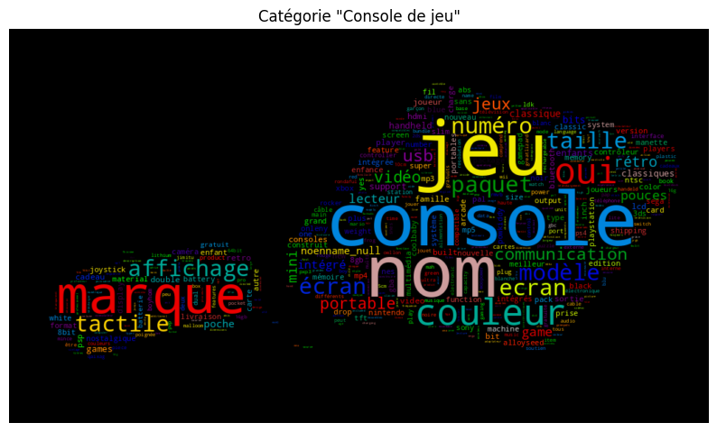
    


```python
# Génération du nuage de mots
image = ensureImageCompatibleWithWC(plt.imread('assets/images/manette_xbox.jpg'))

categorie_specifique = 'Jeu occasion'

if categorie_specifique in word_counts_by_category:
    # Génération du nuage de mots pour la catégorie
    wordcloud = WordCloud(width=800, height=800, max_words=1000,mask = image, background_color='#E0E0E0',
                          colormap="nipy_spectral").generate_from_frequencies(word_counts_by_category[categorie_specifique])

    # Affichage du nuage de mots
    plt.figure(figsize=(10, 10))
    plt.imshow(wordcloud, interpolation='bilinear')
    plt.axis("off")
    plt.title(f'Catégorie "{categorie_specifique}"')
    plt.show()
```


    
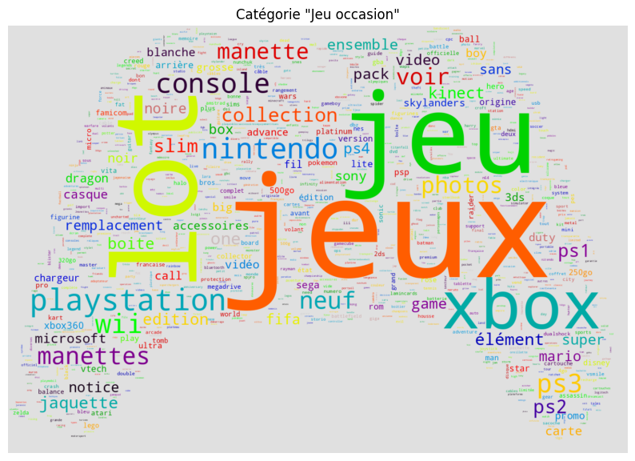
    


## Les images

Pour diminuer un peu la taille du fichier fourni, nous avons refait un fichier image.zip ne contenant que les images du sous-dossier image_train du fichier original (n'ayant pas besoin du sous dossier image_test). C'est de ce fichier dont on va partir.

Le code suivant permet d'extraire le zip stocké sur google drive sur le stockage local de l'environnement d'execution de google colab. C'est la méthode que nous avons adopté après avoir testé l'accès au dossier image via un google drive monté dans l'environnement de colab qui était extrêmement lent.

Si on execute le notebook sur une machine locale, on se contente d'opérer directement sur le dossier **data/images** qui contient la même chose que **images.zip**


```python
if 'google.colab' in sys.modules:
    image_path = "/tmp/rakuten-images"
    image_dir = Path(image_path)
    if image_dir.exists():
        print("images already imported from drive")
    else:
        print("extracting images from drive into colab's session storage... (about 1 min)")
        with zipfile.ZipFile("data/images.zip","r") as images_zip:
            images_zip.extractall(image_path)
        image_path = image_path + "/images"
else:
    image_path = "data/images"
```

    extracting images from drive into colab's session storage... (about 1 min)


On a déjà pu constater qu'il ne manquait pas d'image au niveau du Dataframe puisque la colonne **imageid** ne contient aucune valeurs manquantes. Pour l'avoir vérifié, on sait également que cette colonne ne contient pas de doublons. En revanche, on ignore les informations suivantes:

1. Est-ce que tous les fichiers d'images correspondant au Dataframe sont bien présents ?
2. Est-ce que toutes les images font la même taille ? Un coup d'oeil manuel semble indiquer que oui mais ça mérite d'être vérifié.
3. Beaucoup d'images semblent être une petite image entourée de beaucoup de blanc. Il faudrait analyser ça et éventuellement prendre des mesures correctives.

C'est à ces questions que nous allons tenter de répondre

Commençons par créer une fonction **find_inner_img_box** qui va nous permettre de calculer la bounding box de l'image centrale entourée de blanc


```python
def find_inner_img_box(img):
	"""
	Return the bounding box of inner image.	This is usefull
	for images that are surronded by a big blank area

	Args:
		img: RGB image as an np.array

	Returns:
		Bounding box of inner image as a tuple (top,left,bottom,right)
		or None if image if all blank
	"""

	#top
	for top in range(img.shape[0]):
		if (img[top] != 255).any():
			break

	if top == img.shape[0]-1:
		#img is all blank so return None
		return None

	#bottom
	for bottom in range(img.shape[0]-1,top,-1):
		if (img[bottom] != 255).any():
			break
	#left
	for left in range(img.shape[1]):
		if (img[top:bottom+1,left] != 255).any():
			break
	#right
	for right in range(img.shape[1]-1,left,-1):
		if (img[top:bottom+1,right] != 255).any():
			break
	return (top,left,bottom,right)

```

Nous allons appliquer cette fonction sur toutes les images et stocker la bounding box dans **df**.

Au passage, nous allons également vérifier la taille des images et si elles sont bien toutes présentes. On vérifie également que l'image n'est pas vide


```python
if not Path(output_dir+"/images.csv").exists():
  print("Compute image infos")
  top,left,bottom,right = [],[],[],[]
  img_width,img_height = [],[]
  blank_img = []

  for i in tqdm(range(df.shape[0])):
    row = df.iloc[i]
    img_file = "image_"+str(row["imageid"])+"_product_"+str(row["productid"])+".jpg"
    img = cv2.imread(image_path+"/"+img_file,cv2.IMREAD_COLOR)
    img_width.append(img.shape[1])
    img_height.append(img.shape[0])
    box = find_inner_img_box(img)
    if box == None:
      blank_img.append(True)
      top.append(0)
      left.append(0)
      bottom.append(img.shape[0]-1)
      right.append(img.shape[1]-1)
    else:
      blank_img.append(False)
      top.append(box[0])
      left.append(box[1])
      bottom.append(box[2])
      right.append(box[3])
else:
  print("Load image infos from",output_dir+"/images.csv")
  df_img = pd.read_csv(output_dir+"/images.csv",index_col=0)
  top,left,bottom,right = df_img["innerimagetop"],df_img["innerimageleft"],df_img["innerimagebottom"],df_img["innerimageright"]
  img_width,img_height = df_img["imagewidth"],df_img["imageheight"]
  blank_img = df_img["imageempty"]


```

    Load image infos from output/data-exploration/images.csv


Le code s'est exécuté jusqu'au bout sans erreur, ça nous apporte deja une information capitale. Chaque observation tirée de **df** a bien un fichier image correspondant

Stockons le résultat dans **df**


```python
df["imageempty"] = blank_img
df["imagewidth"] = img_width
df["imageheight"] = img_width
df["innerimagetop"] = top
df["innerimageleft"] = left
df["innerimagebottom"] = bottom
df["innerimageright"] = right

display(df.head())
```


  <div id="df-0bf3fa37-c417-453c-8169-c402fad48113" class="colab-df-container">
    <div>
<style scoped>
    .dataframe tbody tr th:only-of-type {
        vertical-align: middle;
    }

    .dataframe tbody tr th {
        vertical-align: top;
    }

    .dataframe thead th {
        text-align: right;
    }
</style>
<table border="1" class="dataframe">
  <thead>
    <tr style="text-align: right;">
      <th></th>
      <th>designation</th>
      <th>description</th>
      <th>productid</th>
      <th>imageid</th>
      <th>prdtypecode</th>
      <th>categorie</th>
      <th>text</th>
      <th>lang</th>
      <th>mots_designation</th>
      <th>mots_text</th>
      <th>innerimageratio</th>
      <th>imageempty</th>
      <th>imagewidth</th>
      <th>imageheight</th>
      <th>innerimagetop</th>
      <th>innerimageleft</th>
      <th>innerimagebottom</th>
      <th>innerimageright</th>
    </tr>
    <tr>
      <th>index</th>
      <th></th>
      <th></th>
      <th></th>
      <th></th>
      <th></th>
      <th></th>
      <th></th>
      <th></th>
      <th></th>
      <th></th>
      <th></th>
      <th></th>
      <th></th>
      <th></th>
      <th></th>
      <th></th>
      <th></th>
      <th></th>
    </tr>
  </thead>
  <tbody>
    <tr>
      <th>0</th>
      <td>Olivia: Personalisiertes Notizbuch / 150 Seite...</td>
      <td></td>
      <td>3804725264</td>
      <td>1263597046</td>
      <td>10</td>
      <td>Livre occasion</td>
      <td>Olivia: Personalisiertes Notizbuch / 150 Seite...</td>
      <td>de</td>
      <td>[seiten, personalisiertes, design, din, olivia...</td>
      <td>[seiten, personalisiertes, design, din, olivia...</td>
      <td>0.418</td>
      <td>False</td>
      <td>500</td>
      <td>500</td>
      <td>143</td>
      <td>175</td>
      <td>352</td>
      <td>320</td>
    </tr>
    <tr>
      <th>1</th>
      <td>Journal Des Arts (Le) N° 133 Du 28/09/2001 - L...</td>
      <td></td>
      <td>436067568</td>
      <td>1008141237</td>
      <td>2280</td>
      <td>Revues et journaux</td>
      <td>Journal Des Arts (Le) N° 133 Du 28/09/2001 - L...</td>
      <td>fr</td>
      <td>[art, paris, barrere, fete, journal, encheres,...</td>
      <td>[art, paris, barrere, fete, journal, encheres,...</td>
      <td>0.546</td>
      <td>False</td>
      <td>500</td>
      <td>500</td>
      <td>111</td>
      <td>159</td>
      <td>384</td>
      <td>352</td>
    </tr>
    <tr>
      <th>2</th>
      <td>Grand Stylet Ergonomique Bleu Gamepad Nintendo...</td>
      <td>PILOT STYLE Touch Pen de marque Speedlink est ...</td>
      <td>201115110</td>
      <td>938777978</td>
      <td>50</td>
      <td>Accessoire Console</td>
      <td>Grand Stylet Ergonomique Bleu Gamepad Nintendo...</td>
      <td>fr</td>
      <td>[nintendo, bleu, gamepad, wii, style, speedlin...</td>
      <td>[pointe, écran, bonus, wii, fabricant, très, p...</td>
      <td>0.738</td>
      <td>False</td>
      <td>500</td>
      <td>500</td>
      <td>63</td>
      <td>72</td>
      <td>432</td>
      <td>432</td>
    </tr>
    <tr>
      <th>3</th>
      <td>Peluche Donald - Europe - Disneyland 2000 (Mar...</td>
      <td></td>
      <td>50418756</td>
      <td>457047496</td>
      <td>1280</td>
      <td>Jouet enfant, déguisement</td>
      <td>Peluche Donald - Europe - Disneyland 2000 (Mar...</td>
      <td>de</td>
      <td>[disneyland, europe, peluche, marionnette, don...</td>
      <td>[disneyland, europe, peluche, marionnette, don...</td>
      <td>0.800</td>
      <td>False</td>
      <td>500</td>
      <td>500</td>
      <td>47</td>
      <td>79</td>
      <td>447</td>
      <td>416</td>
    </tr>
    <tr>
      <th>4</th>
      <td>La Guerre Des Tuques</td>
      <td>Luc a des idées de grandeur. Il veut organiser...</td>
      <td>278535884</td>
      <td>1077757786</td>
      <td>2705</td>
      <td>Livre neuf</td>
      <td>La Guerre Des Tuques - Luc a des idées de gran...</td>
      <td>fr</td>
      <td>[guerre, tuques]</td>
      <td>[veut, idées, luc, jeu, chambarde, sophie, tou...</td>
      <td>0.608</td>
      <td>False</td>
      <td>500</td>
      <td>500</td>
      <td>95</td>
      <td>159</td>
      <td>399</td>
      <td>352</td>
    </tr>
  </tbody>
</table>
</div>
    <div class="colab-df-buttons">

  <div class="colab-df-container">
    <button class="colab-df-convert" onclick="convertToInteractive('df-0bf3fa37-c417-453c-8169-c402fad48113')"
            title="Convert this dataframe to an interactive table."
            style="display:none;">

  <svg xmlns="http://www.w3.org/2000/svg" height="24px" viewBox="0 -960 960 960">
    <path d="M120-120v-720h720v720H120Zm60-500h600v-160H180v160Zm220 220h160v-160H400v160Zm0 220h160v-160H400v160ZM180-400h160v-160H180v160Zm440 0h160v-160H620v160ZM180-180h160v-160H180v160Zm440 0h160v-160H620v160Z"/>
  </svg>
    </button>

  <style>
    .colab-df-container {
      display:flex;
      gap: 12px;
    }

    .colab-df-convert {
      background-color: #E8F0FE;
      border: none;
      border-radius: 50%;
      cursor: pointer;
      display: none;
      fill: #1967D2;
      height: 32px;
      padding: 0 0 0 0;
      width: 32px;
    }

    .colab-df-convert:hover {
      background-color: #E2EBFA;
      box-shadow: 0px 1px 2px rgba(60, 64, 67, 0.3), 0px 1px 3px 1px rgba(60, 64, 67, 0.15);
      fill: #174EA6;
    }

    .colab-df-buttons div {
      margin-bottom: 4px;
    }

    [theme=dark] .colab-df-convert {
      background-color: #3B4455;
      fill: #D2E3FC;
    }

    [theme=dark] .colab-df-convert:hover {
      background-color: #434B5C;
      box-shadow: 0px 1px 3px 1px rgba(0, 0, 0, 0.15);
      filter: drop-shadow(0px 1px 2px rgba(0, 0, 0, 0.3));
      fill: #FFFFFF;
    }
  </style>

    <script>
      const buttonEl =
        document.querySelector('#df-0bf3fa37-c417-453c-8169-c402fad48113 button.colab-df-convert');
      buttonEl.style.display =
        google.colab.kernel.accessAllowed ? 'block' : 'none';

      async function convertToInteractive(key) {
        const element = document.querySelector('#df-0bf3fa37-c417-453c-8169-c402fad48113');
        const dataTable =
          await google.colab.kernel.invokeFunction('convertToInteractive',
                                                    [key], {});
        if (!dataTable) return;

        const docLinkHtml = 'Like what you see? Visit the ' +
          '<a target="_blank" href=https://colab.research.google.com/notebooks/data_table.ipynb>data table notebook</a>'
          + ' to learn more about interactive tables.';
        element.innerHTML = '';
        dataTable['output_type'] = 'display_data';
        await google.colab.output.renderOutput(dataTable, element);
        const docLink = document.createElement('div');
        docLink.innerHTML = docLinkHtml;
        element.appendChild(docLink);
      }
    </script>
  </div>


<div id="df-21bb03ca-3613-4ceb-a21b-aec57234fd1f">
  <button class="colab-df-quickchart" onclick="quickchart('df-21bb03ca-3613-4ceb-a21b-aec57234fd1f')"
            title="Suggest charts"
            style="display:none;">

<svg xmlns="http://www.w3.org/2000/svg" height="24px"viewBox="0 0 24 24"
     width="24px">
    <g>
        <path d="M19 3H5c-1.1 0-2 .9-2 2v14c0 1.1.9 2 2 2h14c1.1 0 2-.9 2-2V5c0-1.1-.9-2-2-2zM9 17H7v-7h2v7zm4 0h-2V7h2v10zm4 0h-2v-4h2v4z"/>
    </g>
</svg>
  </button>

<style>
  .colab-df-quickchart {
      --bg-color: #E8F0FE;
      --fill-color: #1967D2;
      --hover-bg-color: #E2EBFA;
      --hover-fill-color: #174EA6;
      --disabled-fill-color: #AAA;
      --disabled-bg-color: #DDD;
  }

  [theme=dark] .colab-df-quickchart {
      --bg-color: #3B4455;
      --fill-color: #D2E3FC;
      --hover-bg-color: #434B5C;
      --hover-fill-color: #FFFFFF;
      --disabled-bg-color: #3B4455;
      --disabled-fill-color: #666;
  }

  .colab-df-quickchart {
    background-color: var(--bg-color);
    border: none;
    border-radius: 50%;
    cursor: pointer;
    display: none;
    fill: var(--fill-color);
    height: 32px;
    padding: 0;
    width: 32px;
  }

  .colab-df-quickchart:hover {
    background-color: var(--hover-bg-color);
    box-shadow: 0 1px 2px rgba(60, 64, 67, 0.3), 0 1px 3px 1px rgba(60, 64, 67, 0.15);
    fill: var(--button-hover-fill-color);
  }

  .colab-df-quickchart-complete:disabled,
  .colab-df-quickchart-complete:disabled:hover {
    background-color: var(--disabled-bg-color);
    fill: var(--disabled-fill-color);
    box-shadow: none;
  }

  .colab-df-spinner {
    border: 2px solid var(--fill-color);
    border-color: transparent;
    border-bottom-color: var(--fill-color);
    animation:
      spin 1s steps(1) infinite;
  }

  @keyframes spin {
    0% {
      border-color: transparent;
      border-bottom-color: var(--fill-color);
      border-left-color: var(--fill-color);
    }
    20% {
      border-color: transparent;
      border-left-color: var(--fill-color);
      border-top-color: var(--fill-color);
    }
    30% {
      border-color: transparent;
      border-left-color: var(--fill-color);
      border-top-color: var(--fill-color);
      border-right-color: var(--fill-color);
    }
    40% {
      border-color: transparent;
      border-right-color: var(--fill-color);
      border-top-color: var(--fill-color);
    }
    60% {
      border-color: transparent;
      border-right-color: var(--fill-color);
    }
    80% {
      border-color: transparent;
      border-right-color: var(--fill-color);
      border-bottom-color: var(--fill-color);
    }
    90% {
      border-color: transparent;
      border-bottom-color: var(--fill-color);
    }
  }
</style>

  <script>
    async function quickchart(key) {
      const quickchartButtonEl =
        document.querySelector('#' + key + ' button');
      quickchartButtonEl.disabled = true;  // To prevent multiple clicks.
      quickchartButtonEl.classList.add('colab-df-spinner');
      try {
        const charts = await google.colab.kernel.invokeFunction(
            'suggestCharts', [key], {});
      } catch (error) {
        console.error('Error during call to suggestCharts:', error);
      }
      quickchartButtonEl.classList.remove('colab-df-spinner');
      quickchartButtonEl.classList.add('colab-df-quickchart-complete');
    }
    (() => {
      let quickchartButtonEl =
        document.querySelector('#df-21bb03ca-3613-4ceb-a21b-aec57234fd1f button');
      quickchartButtonEl.style.display =
        google.colab.kernel.accessAllowed ? 'block' : 'none';
    })();
  </script>
</div>
    </div>
  </div>


Affichons le nombre d'images vides


```python
df[df["imageempty"]].shape[0]
```


    4


Seul 4 images sont vides

Vérifions maintenant que toutes les images ont bien une taille de 500x500


```python
df[(df["imagewidth"]==500) & (df["imageheight"]==500)].shape[0] == df.shape[0]
```


    True


C'est bien le cas

Nous allons afficher maintenant quelques exemples d'images avec leur bounding box tirés au hazard. En titre, on affichera la variable **imageid**.

Commençons par créer une fonction qui affiche une image avec sa bounding box


```python
def plot_img_with_box(row):
  img_file = "image_"+str(row["imageid"])+"_product_"+str(row["productid"])+".jpg"
  img = cv2.imread(image_path+"/"+img_file,cv2.IMREAD_COLOR)
  img = cv2.cvtColor(img,cv2.COLOR_BGR2RGB)

  plt.imshow(img)
  x = [row["innerimageleft"],row["innerimageright"],row["innerimageright"],row["innerimageleft"],row["innerimageleft"]]
  y = [row["innerimagetop"],row["innerimagetop"],row["innerimagebottom"],row["innerimagebottom"],row["innerimagetop"]]
  plt.plot(x,y,"r--")
  plt.xticks([])
  plt.yticks([])
```


```python

plt.figure(figsize=(10,10))

random.seed(random_state)
for i in range(9):
  index = random.randint(0,df.shape[0]-1)
  row = df.iloc[index]
  plt.subplot(3,3,i+1)
  plot_img_with_box(row)
  plt.title(row["imageid"])

plt.show()


```


    

    


On remarque que parfois le bounding box ne semble pas serrer au plus prés. C'est du au fait que certains pixels blancs n'ont pas une valeur exacte de 255.

Toutefois, globalement l'algorithme semble fonctionner.

Intéressons nous aux images très réduites dont on parlait. Pour cela on va calculer le ratio entre les dimensions de l'image intérieure et de l'image totale. Si on prend en compte la dimension la plus grande de l'image intérieure ça nous permet d'anticiper un facteur de zoom possible qui permettrait de l'agrandir sans pour autant la déformer.


```python
innerimagewidth = df['innerimageright'] - df['innerimageleft']
innerimageheight = df['innerimagebottom'] - df['innerimagetop']
innerimagewidthratio = innerimagewidth/500
innerimageheightratio = innerimageheight/500
df['innerimageratio'] = np.max([innerimagewidthratio,innerimageheightratio],axis=0)

```

Affichons les 6 images internes les plus petites


```python
smallest_imgs = df.sort_values("innerimageratio").head(6)
plt.figure(figsize=(10,5))
i=1
for index,row in smallest_imgs.iterrows():
  plt.subplot(2,3,i)
  plot_img_with_box(row)
  plt.title("ratio=%.2f" % row["innerimageratio"])
  i+=1

plt.show()
```


    
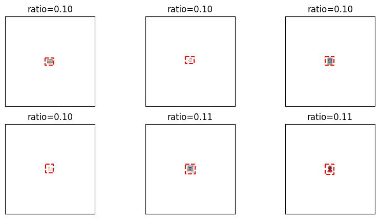
    


Pour ce faire une idée de la proportion d'images qui gagneraient à être zoomées, affichons un graphique montrant la distribution cumulée des ratios.


```python

sns.displot(df['innerimageratio'],kind="kde",cumulative=True)
plt.title("Cumulative distribution of inner image ratios")
plt.show()
```


    
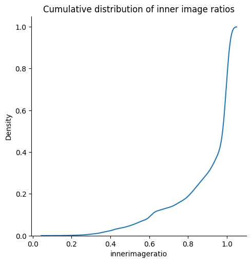
    


Environ 20% des images couvrent moins de 80% de la surface totale.

Tentons de determiner visuellement en dessous de quel ratio, il faudrait zoomer une image.


```python
plt.figure(figsize=(10,8))
i=1
for max_ratio in np.arange(0.1,1.0,0.1):
  row = df[(df['innerimageratio'] > (max_ratio-0.1)) & (df['innerimageratio'] <= max_ratio)]\
    .sort_values('innerimageratio').iloc[0]
  plt.subplot(3,3,i)
  i+=1
  plot_img_with_box(row)
  plt.title("ratio=%.2f" % row['innerimageratio'])

plt.show()

```


    
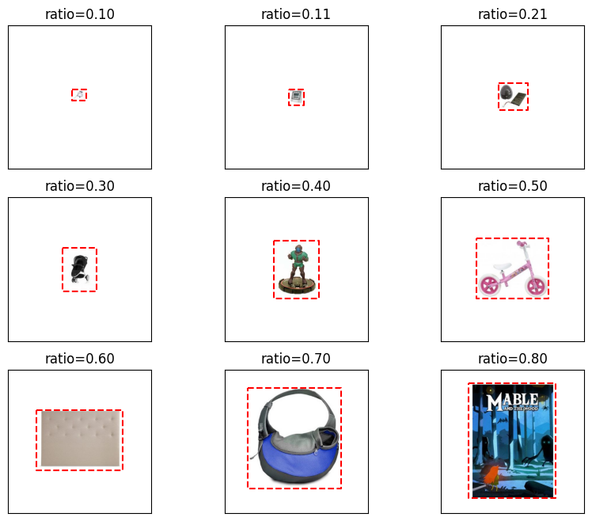
    


En dessous de 0.5-0.6, cela semble vital de zoomer les images. Toutefois, on peut se dire qu'on a pas grand chose à perdre à zoomer toutes les images avec un ratio inférieur ou égal à 0.8

Copions les colonnes que nous avons ajouté dans **df** dans un nouveau Dataframe **df_img**. On va enregistrer ce Dataframe dans un csv. Ca nous servira dans un futur notebook pour le preprocessing des images


```python
img_cols = [
"imageempty",
"imagewidth",
"imageheight",
"innerimagetop",
"innerimageleft",
"innerimagebottom",
"innerimageright"
]
df_img = df[img_cols]
df = df.drop(img_cols,axis=1)
df_img.to_csv(output_dir + "/images.csv")
```

# Enregistrement du fichier avec pre-processing

Nous allons enregistrer le fichier avec les modifications effectuées au cours de ce notebook. C'est ce fichier qui nous servira pour la suite.

Tout d'abord effectuons un peu de nettoyage des colonnes additionnelles que nous avons ajouté pour faciliter l'exploration des données.


```python
df = df.drop(['nom_fichier','mots_text','mots_designation','categorie'],axis=1)
```

C'est la variable **text** résultant de la concaténation de **designation** et **description** que nous allons utiliser dans les modélisations. On peut donc supprimer les variables d'origines.


```python
df = df.drop(['designation','description'],axis=1)
```

Maintenant le fichier nettoyé, on peut l'enregistrer


```python
Path(output_dir).mkdir(parents=True, exist_ok=True)
df.to_csv(output_dir + "/X_train_pre.csv")
```

* TODO: choisir une langue unique pour le code (anglais?)
